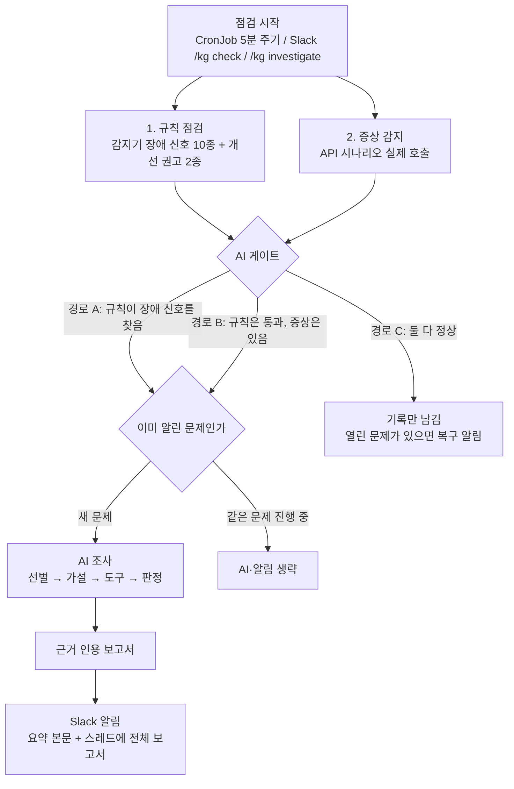
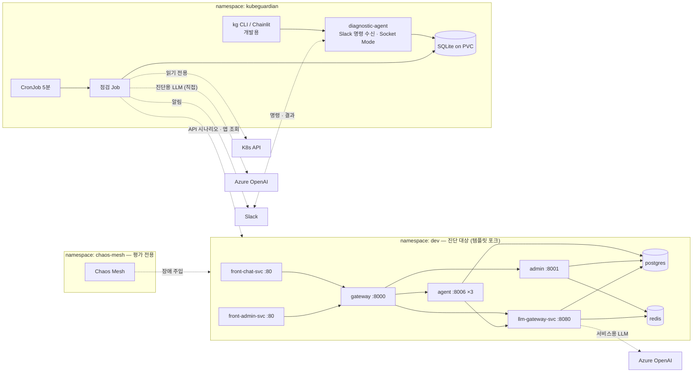
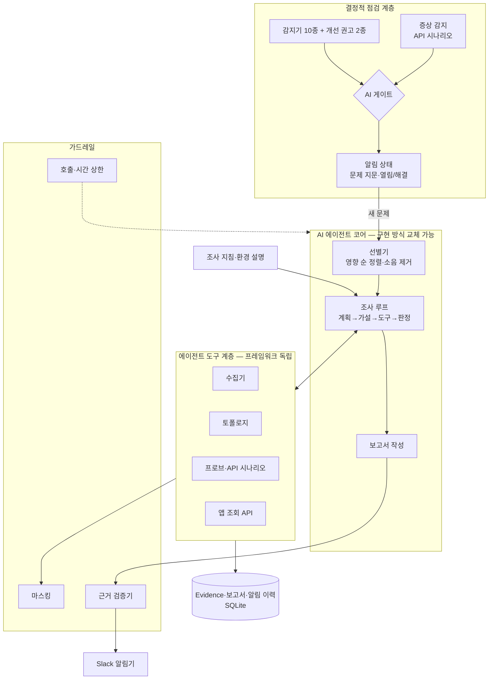

# KubeGuardian AI — 프로젝트 기획서

> **AI 기반 Kubernetes 서비스 환경 진단 Agent**
> *Agentic Kubernetes Service Diagnosis Agent*

| 항목 | 내용 |
|---|---|
| 유형 | 사내 과제 / PoC |
| **1차 목적** | **Kubernetes 장애 분석 역량 + 에이전트 정량 평가 역량 함양** |
| 2차 목적 | 템플릿 기반 AI 서비스용 진단 에이전트 PoC |
| 인원·기간 | 1인 · 8주 · **주 10~15시간** |
| 기준 서비스 | [agent-template-apps-lite](https://github.com/orgs/agent-template-apps-lite/repositories) 포크 (앱 6개) |
| 실행 환경 | minikube (단일 노드) + Chaos Mesh |
| LLM | 진단 에이전트·진단 대상 서비스 모두 Azure OpenAI (경로는 분리) |
| 사용 방식 | **Slack 하나로 사용**: 5분 주기 자동 점검 → 이상 시 AI 조사 → 알림 (주), Slack 명령으로 즉시 점검·증상 조사 (보조) |
| 문서 버전 | v3.0 (2026-10-04) — 주 10~15시간 기준 범위 조정 (변경 이력은 §17) |
| 관련 산출물 | [역량·기술 스택](산출물/01-역량및기술스택확인.md), [문제 정의·서비스 기획](산출물/02-문제정의및서비스기획.md), [시나리오](산출물/03-시나리오수립.md) |

---

## 1. 한 줄 설명

템플릿 기반 AI 서비스가 올라간 Kubernetes 환경을 **5분마다 규칙으로 점검**하고, 규칙이 문제를 찾았거나 **규칙은 통과했는데 실제로는 서비스가 안 될 때** AI 에이전트가 조사에 들어가 **무엇이 중요한지 골라내고 원인을 근거와 함께 설명한 보고서를 Slack으로 보내는** 진단 에이전트.

### 1.1 프로젝트의 1차 목적: 학습

실무에서 LangGraph·DeepAgents 기반 에이전트와 RAG를 이미 구축해 봤으므로, 이번 프로젝트는 **부족한 두 영역**에 집중한다.

| 학습 영역 | 이 프로젝트에서 얻는 것 | 어디서 |
|---|---|---|
| **K8s 리소스 모델** | Deployment·ReplicaSet·Pod·Service·EndpointSlice의 관계를 코드로 따라가 봄 | 수집기·토폴로지, 감지기 |
| **K8s 네트워킹** | Service 라우팅, Pod 직접 호출, 포트 매핑, 서비스 간 통신 차단 | 감지기 S01~S04, 시나리오 B1·C2 |
| **K8s 설정·배포** | ConfigMap·Secret 참조, 이미지, 롤아웃 | 감지기 C01·P03, 시나리오 A3·C5 |
| **K8s 운영 기능** | CronJob(주기 실행·중복 실행 방지), PVC, RBAC 최소 권한 | 주기 점검, 진단 에이전트 권한 |
| **K8s 장애 재현** | CRD 기반 도구(Chaos Mesh)로 장애 주입 | 평가 환경 |
| **에이전트 정량 평가** | 정답 파일 설계, 지표 정의, 자동 채점 러너, 기준 조건 대비 비교, 실패 사례 분석 | 평가 체계 (§9) |
| 에이전트 설계 심화 | 가설 → 도구 검증 → 판정 루프, 근거 인용 강제, 호출 상한 | 에이전트 코어 (§6) |
| 에이전트 기술 비교 | 구현 방식, 지침 주입, MCP, Code Mode 등을 같은 지표로 비교 | 비교 실험 (§10) |

**학습 산출물**: 주간 학습 노트(주 1건, "어떤 K8s 개념이 어떻게 장애가 되고 어떤 신호로 보이는가"), 설계 결정 기록(ADR 3건 이상).

## 2. 배경과 문제

### 2.1 MSA 구조의 운영 부담

요즘 서비스는 화면, 요청 중계, 핵심 로직, 인증, 외부 연동을 각각 독립된 서비스로 나누는 MSA 구조가 일반적이다. 서비스 하나를 운영하려면 여러 레포·이미지, 여러 Pod와 Service, 공유 설정(ConfigMap·Secret)·DB·캐시를 함께 관리해야 한다. 조각끼리 네트워크로 호출하기 때문에 **한 곳의 문제가 다른 곳의 증상으로** 나타난다.

### 2.2 우리 팀의 예: AI 서비스 템플릿

우리 팀은 MSA 구조의 템플릿 agent-template-apps-lite를 만들어 사용한다. 구조는 `front-chat / front-admin → gateway → agent / admin / llm-gateway → PostgreSQL · Redis · Azure OpenAI`이고, 앱 6개가 별도 레포, 배포 설정은 shared-infra 레포에 있다. 직접 구축·운영한 **SK Inc. PR 보도자료 자동화 서비스**도 이 템플릿에서 출발해 AWS EKS에서 운영 중이다. 운영에서 겪은 장애는 대부분 다음 유형이었다.

- **보이지 않음**: Pod는 Running·Ready인데 서비스가 안 된다.
- **멀리 있음**: gateway에서 502가 났는데 원인은 llm-gateway의 할당량, 또는 Redis다.
- **너무 많음**: 경고·이벤트·재시작 기록이 쌓여 있지만 대부분 지금 장애와 무관하다.

운영 사례: 공유 ConfigMap을 여러 레포가 덮어써서 생긴 장애, agent 메모리 512Mi에서 OOMKilled, gateway 504 타임아웃, `create_all`이 ALTER를 하지 않아 생긴 스키마 드리프트. 모두 **kubectl 한 번으로는 원인이 보이지 않았던** 사례다.

### 2.3 템플릿 자체의 구조적 약점 (배경)

| # | 관찰 | 결과 |
|---|---|---|
| T1 | `shared-infra/kubernetes` 매니페스트에 `AGENT_SERVICE_URL` 등 서비스 주소 설정이 없음. gateway 코드 기본값은 `http://localhost:*` | 원본 그대로 배포하면 gateway가 하위 서비스를 못 찾음 |
| T2 | readinessProbe가 모두 tcpSocket(포트 연결)만 봄. `/health`는 의존성 확인 없이 고정 응답 | 앱이 500을 내도 Ready로 표시 → "보이지 않음"의 원인 |
| T3 | 이미지 tag 고정(`0.0.1`) + `imagePullPolicy: Always` | 같은 tag에 다른 이미지가 공존 가능 |
| T4 | 모든 앱이 공용 ConfigMap·Secret을 공유 | 공용 설정 하나의 변경이 전 서비스에 파급 |

T1은 템플릿을 고쳐서 해결할 문제라 **문제 정의의 중심이 아니다.** 데모 시나리오(A5)로만 쓴다. T2·T4는 "보이지 않음"·"멀리 있음"이 생기는 구조적 이유다.

### 2.4 핵심 문제

상태를 보여주는 도구(kubectl, 대시보드)는 있다. 하지만 **"지금 서비스가 안 되는지, 수많은 신호 중 무엇이 원인인지"를 알아내는 일**은 사용자 문의가 온 뒤에 숙련자가 수작업으로 한다. 특히 증상과 원인이 다른 서비스에 있고 K8s 상태는 정상인 장애는 규칙만으로 자동화하기 어렵다.

## 3. 핵심 방향: 주기 점검 + 규칙 우선 + AI 조사

### 3.1 원칙

> **5분마다 규칙으로 먼저 점검한다. AI는 (1) 규칙이 문제를 찾았을 때, (2) 규칙은 통과했는데 증상이 있을 때만 들어간다. 결과는 Slack으로 알린다.**



| 경로 | 조건 | AI가 하는 일 | 예 |
|---|---|---|---|
| **A. 규칙 적발** | 감지기가 장애 신호를 냄 | 여러 신호 중 무엇이 중요한지 **선별**하고, 신호를 연결해 원인과 영향을 설명 | Service selector 오타 + 그로 인한 채팅 실패 |
| **B. 규칙 사각지대** | 감지기는 통과했지만 증상 감지가 이상을 봤거나 사용자가 증상을 입력함 | 규칙이 모르는 원인을 **가설로 탐색** | Pod는 전부 정상인데 채팅이 실패 (원인: LLM 할당량) |
| C. 정상 | 둘 다 없음 | 호출하지 않음 | — |

- **개선 권고**(tcpSocket만 쓰는 probe, limits 미설정 등)는 게이트를 열지 않는다. 보고서의 "개선 권고"로만 표시한다.
- **경로 B가 AI가 가장 필요한 곳이다.** 증상 감지는 결정적 코드지만, 원인을 찾는 일은 규칙으로 할 수 없다.

| 역할 | 담당 |
|---|---|
| 주기 실행 | Kubernetes CronJob |
| 명백한 이상 확정 | 결정적 코드 (감지기) |
| "무언가 잘못됐다" 감지 | 결정적 코드 (증상 감지) + 사용자 입력 |
| AI 조사 여부·중복 여부 결정 | 결정적 코드 (게이트, 알림 상태) |
| 무엇이 중요한가, 왜 그런가 | **AI 에이전트** |
| 사실 수집 | 결정적 코드 (에이전트 도구) |
| 신뢰성 보장 | 결정적 코드 (근거 검증, 마스킹, 읽기 전용, 호출 상한) |

### 3.2 이렇게 나누는 이유

- **비용**: 5분마다 돌아도 정상이면 LLM을 부르지 않는다. 같은 문제가 계속되는 동안에도 다시 부르지 않는다.
- **예측 가능성**: 규칙으로 확정되는 것은 항상 같은 답을 낸다.
- **평가**: AI의 역할이 "규칙이 찾은 것의 정리"(A)와 "사각지대 탐색"(B)으로 나뉘어 따로 측정할 수 있다.

### 3.3 AI를 믿을 수 있게 만드는 장치

1. **사실은 도구에서만 나온다.** 모든 사실은 도구 호출 결과(evidence)로 저장되고 id를 가진다.
2. **모든 사실 문장은 근거를 인용한다.** 근거 검증기가 코드로 확인하고, 인용이 없으면 "추정"으로 강등한다.
3. **보고서 하나로 판단이 끝난다.** 배제한 가설과 이유, 확인한 범위와 확인하지 못한 것을 함께 쓴다.
4. **읽기 전용.** 에이전트는 클러스터를 바꿀 수 없다 (RBAC로 강제).
5. **정답 기반 평가.** 장애를 주입하고 정답과 비교해 정확도를 수치로 공개한다.

## 4. 목표와 비목표

### 4.1 목표

**학습 목표 (1차)**
1. K8s 리소스·네트워킹·설정·운영 기능(CronJob, RBAC)을 **진단 코드와 장애 재현으로** 익힌다 (§1.1).
2. **정답 기반 평가 체계**를 설계·자동화하고, 기준 조건 대비로 효과를 숫자로 보고한다.
3. 에이전트 기술을 **같은 시나리오·같은 지표로 비교**하고 선택 근거를 남긴다 (§10).

**기능 목표 (2차)**
1. **주기 점검** — 5분마다 감지기와 증상 감지를 실행하고, 장애 신호와 개선 권고를 구분한다.
2. **AI 조사·검증** — 게이트가 열리면 선별 → 가설 → 도구 검증 → 근거 인용 보고서를 만든다.
3. **Slack 알림** — 새 문제는 한 번만 알리고, 해결되면 복구 알림을 보낸다.
4. **Slack 명령** — 배포 직후 즉시 점검(`/kg check`), 증상 입력 조사(`/kg investigate 증상`). 결과는 명령 메시지의 스레드로 받는다.

### 4.2 비목표

| 항목 | 이유 / 처리 |
|---|---|
| **조치 에이전트** (승인 후 실행, 자동 실행) | 진단 정확도 우선, 안전, 평가 명확성. 조사 보고서를 입력으로 받는 **다음 단계 과제** |
| 보고서 후속 질문(대화) | 보고서 하나로 판단이 끝나도록 만드는 데 집중 |
| 변경 검증 (배포 전후 diff, 영향 범위 재검증) | 별도 제품 수준의 범위 |
| 제품용 웹 화면 (React) | 운영자는 Slack 하나로 알림·명령·보고서를 처리 |
| 부하·시간 의존 장애 (L4) | 메트릭 샘플러·추세 센서·부하 도구가 필요해 범위가 큼 |
| 멀티 클러스터, 실제 AKS·EKS 적용 | PoC 범위 밖 |
| Prometheus·서비스 메시 등 관측 스택 | 자체 경량 수집으로 대체 |
| 범용 애드온 배포, 원본 템플릿 기여 | **비전으로만 유지** (§12) |
| 과거 조사 기억(Memory) | 후속 과제 |

## 5. 기준 환경

### 5.1 구성



- 다중 Pod 시나리오(B1)를 위해 agent는 replicas 3으로 둔다.
- 리소스 예산: `minikube start --cpus=4 --memory=10g`
- 진단 에이전트는 진단 대상 llm-gateway를 거치지 않고 Azure OpenAI를 **직접** 호출한다. llm-gateway가 고장 나도 진단할 수 있어야 하기 때문이다.
- **diagnostic-agent**는 항상 떠 있는 Deployment(replicas 1)로, Slack 명령을 받아 점검·조사를 실행한다. Socket Mode는 Slack 쪽으로 연결을 먼저 여는 방식이라 공개 URL이 없는 minikube에서도 명령을 받을 수 있다.
- 주기 점검 Job과 diagnostic-agent, 개발용 CLI·Chainlit은 같은 코드·같은 SQLite(PVC)를 쓴다.

### 5.2 템플릿 포크와 수정 항목

| ID | 수정 | 이유 |
|---|---|---|
| F1 | K8s 매니페스트에 서비스 주소 설정 추가 (`AGENT_SERVICE_URL` 등) | T1 수정. 없으면 정상 기준선을 만들 수 없음. 제거하면 A5 시나리오 |
| F2 | agent 검색을 선택 기능으로 (검색 설정이 없으면 건너뜀) | Azure AI Search 미사용. 없으면 채팅이 동작하지 않음 |
| F5 | 테스트 사용자 시드 | API 시나리오(로그인 → 채팅) 실행 |
| F6 | minikube용 postgres·redis 매니페스트, 로컬 이미지 overlay | 원본은 Azure PG·Redis를 가리킴 |
| F7 | 버전 2 이미지 (DB 컬럼 추가) | C5(스키마 드리프트) 시나리오 전용 |

### 5.3 장애 주입

| 도구 | 용도 |
|---|---|
| **Chaos Mesh** | HTTPChaos(특정 Pod HTTP 오류), NetworkChaos(서비스 간 통신 차단) |
| kubectl / kustomize overlay | K8s 구성 장애: selector, 이미지, 서비스 주소 |
| 앱 API | 앱 설정 장애: llm-gateway 할당량 |

## 6. 에이전트 아키텍처

### 6.1 구성



**계층을 나누는 이유**: 감지기·증상 감지·도구·가드레일은 **어떤 에이전트 프레임워크에도 묶이지 않는 일반 Python 모듈**로 만든다. 에이전트 코어만 구현 방식에 따라 바뀐다. 그래야 비교 실험(§10)을 같은 도구·같은 시나리오로 할 수 있다.

- 기본 구현은 **LangGraph**(실무 숙련 도구)로 하고, 직접 구현한 도구 호출 루프와 비교한다 (§10 실험 1).
- API·앱 구조는 템플릿 backend-agent 규약(`app/api`, `app/service`, `app/core`)을 따른다.
- 에이전트 실행은 **Phoenix**로 추적한다 (OpenTelemetry GenAI 표준 속성).

### 6.2 흐름

**주기 점검** (CronJob, 5분)
1. 감지기와 증상 감지 실행 (결정적)
2. 게이트 판정. 경로 C면 기록만 남기고, 열린 문제가 있으면 해결로 표시하고 **복구 알림**
3. 경로 A·B면 **문제 지문**(§6.6)을 계산해, 이미 열린 문제와 같으면 AI·알림 생략
4. 새 문제면 신호판(원시 신호를 서비스별로 묶은 것)을 만들어 AI 조사
5. 에이전트가 사용자 영향 순으로 **선별**하고, 상위 최대 3건을 조사 (각 도구 호출 ≤ 8회). 경로 B면 증상에서 토폴로지를 따라 역추적하는 가설부터 세움
6. 보고서 작성 → 근거 검증 → **Slack 알림**(요약 본문 + 스레드에 전체 보고서)

**배포 직후 점검** (Slack `/kg check`): "점검을 시작합니다" 메시지를 채널에 올리고 1~5를 실행한 뒤, 결과를 그 메시지의 스레드로 보낸다. 문제 지문이 이미 열려 있어도 사용자가 요청했으므로 결과를 보여준다.

**증상 입력 조사** (Slack `/kg investigate 증상`): 사용자 증상 = 경로 B로 게이트가 바로 열림 → "조사를 시작합니다" 메시지 → **조사 계획을 먼저 스레드에 올림** → 가설 최대 3개 → 도구로 검증 → 보고서를 같은 스레드에.

같은 기능을 개발·디버깅용 CLI(`kg check`, `kg investigate`)로도 실행할 수 있다.

### 6.3 에이전트 도구 (7종)

모든 도구는 읽기 전용이다. 결과는 evidence로 저장되고 id를 반환한다. 신호판은 도구가 아니라 조사 시작 시 입력으로 준다.

| 도구 | 설명 |
|---|---|
| `get_topology(service?, direction?)` | 서비스 호출 관계, 상·하위 서비스 |
| `get_resource(kind, name? \| selector?)` | 정규화된 spec·status (필드 선별), Pod 목록 |
| `get_pod_logs(pod, previous, tail≤200, grep?)` | 마스킹된 로그 |
| `get_events(subject, since)` | 이벤트 (마스킹) |
| `probe(target, path, via=service\|pod, times=1..10)` | HTTP 호출. Service 경유 반복 호출, Pod 직접 호출 |
| `run_api_scenario(name)` | API 시나리오 (로그인 → 채팅 등) |
| `query_app_api(service, endpoint)` | **허용 목록의 GET API만** (llm-gateway 상태·할당량 등) |

### 6.4 Evidence와 보고서 모델

```yaml
Evidence:
  id: ev-0042
  kind: resource | event | log_excerpt | probe_result | app_api | detector
  subject: dev/Pod/agent-7c9f-x2k
  collected_at: 2026-10-20T10:12:03+09:00
  source: "GET /api/v1/namespaces/dev/pods/agent-7c9f-x2k"
  data: {...}   # 마스킹 후

Issue (요약 항목):
  rank: 1
  title: "채팅 실패 — llm-gateway 할당량 소진"
  impact: core_path_broken | partial_users | latent_risk | improvement
  confidence: high | medium | low
  evidence_ids: [ev-12, ev-15, ev-3]

Report (조사 보고서):
  conclusion, confidence, impact_scope
  evidence: [...]
  hypotheses: [{statement, status: supported|refuted|inconclusive, reason, evidence_ids}]
  checked_scope: {checked: [...], not_checked: [...]}
  actions: [...]          # 권장 조치 (실행할 명령 수준, 자동 실행 안 함)
  verification: "..."     # 재검증 방법
```

### 6.5 신뢰성 장치

| 장치 | 내용 |
|---|---|
| 근거 검증기 | 사실 문장마다 유효한 evidence id를 1개 이상 인용해야 함. 아니면 "추정"으로 강등 또는 제거 |
| 출력 파싱 | 구조화 출력 스키마로 파싱. 코드펜스·비정형·null 응답 방어 |
| 상한 | 조사 1건: 도구 ≤ 20회·150초. 요약 전체: ≤ 300초. 상한 도달 시 부분 결과 + "조사 미완" 표시 |
| 결정성 | temperature 0, 평가 시 3회 반복 |
| 마스킹 | 로그·**이벤트 메시지**·env에서 `password|secret|token|key|Bearer|://user:pass@` 치환. Secret 값은 수집하지 않음. **Slack으로 보내는 내용에도 동일하게 적용** |
| 읽기 전용 | RBAC `get/list/watch`만. `query_app_api`는 GET·허용 목록만 |

### 6.6 주기 점검과 알림

| 항목 | 설계 |
|---|---|
| 주기 실행 | Kubernetes CronJob `*/5 * * * *`, `concurrencyPolicy: Forbid` (이전 점검이 끝나지 않았으면 다음 점검을 건너뜀), `startingDeadlineSeconds` 설정 |
| 문제 지문 | AI 호출 전에 결정적 신호로 계산: (경로, 적발된 감지기 ID 목록, 실패한 API 시나리오 단계, 대상 서비스). 같은 지문이 열려 있으면 같은 문제로 봄 |
| 알림 상태 | SQLite에 지문별 `open / resolved`, 최초 감지 시각, Slack 메시지 ID 저장 |
| 새 문제 | AI 조사 → Slack 채널에 요약 메시지 → 그 메시지의 스레드에 전체 보고서 |
| 진행 중 | 같은 지문이면 AI 조사·알림 생략 (LLM 비용·알림 피로 방지) |
| 해결 | 경로 C로 바뀌면 `resolved`로 바꾸고 복구 알림 1회 (장애 지속 시간 포함) |
| 발송 방식 | Slack 봇 토큰(`chat:write`)으로 `chat.postMessage` 호출. 스레드 답글에는 원 메시지 ID(`ts`)가 필요해 Incoming Webhook은 쓰지 않음 |
| 명령 수신 | Slack 앱의 슬래시 명령(`/kg check`, `/kg investigate`, `/kg evidence`)을 **Socket Mode**로 받음 (`slack_bolt`). 3초 안에 접수 응답을 보내고, 점검·조사는 비동기로 실행 |
| 실행 권한 | 설정 파일의 허용 채널·허용 사용자만 명령 실행. 같은 사용자의 조사는 동시에 1건 |

### 6.7 조사 지침과 환경 설명

AI의 일반 지식으로는 **그 환경의 사정**을 모른다. 운영자의 요령을 문서로 넘겨준다.

| 층 | 예 |
|---|---|
| 템플릿 공통 지침 | "gateway가 하위 호출에 실패하면 서비스 주소 env가 `localhost`인지 먼저 확인", "Ready인데 500이면 readinessProbe가 tcpSocket인지 확인" |
| 템플릿 환경 설명 | 서비스 구성, 공유 ConfigMap·Secret 구조, llm-gateway 할당량·상태 API 위치 |

지침은 장애 유형별 문서로 나눠 둔다. 전체를 프롬프트에 넣는 방식과 필요한 것만 불러오는 방식(Skills)의 비교는 §10 실험 2.

## 7. 규칙 점검과 증상 감지 (결정적 코드)

### 7.1 토폴로지

- env의 `*_SERVICE_URL`·`*_URL` 값을 파싱해 Service·port와 매칭 → `declared` / `unresolved`(없는 Service·`localhost`) / `inferred`(에이전트 추정)
- Service → Deployment → ReplicaSet → Pod 계층 (selector·ownerReferences)

### 7.2 감지기

카테고리 접두사 + 번호로 ID를 붙인다. 이번 범위는 **MVP 시나리오를 잡는 데 필요한 것과 기본 상태 확인**만 둔다.

| ID | 감지 | 판정 근거 | 성격 | 관련 시나리오 |
|---|---|---|---|---|
| **N01** | 노드 NotReady | `Node.status.conditions` Ready ≠ True | 상태 | 기본 |
| **P03** | 이미지 받기 실패 | `ErrImagePull`·`ImagePullBackOff`·`InvalidImageName` | 상태 | A3 |
| **P06** | CrashLoop / 재시작 ≥3회·30분 | `CrashLoopBackOff`, `restartCount` 증가분 | 시간 | E1 (미끼) |
| **P07** | OOMKilled | `lastState.terminated.reason = OOMKilled` | 상태 | 기본 |
| **W01** | 가용 replicas 부족 | `spec.replicas` > `status.availableReplicas` | 상태 | A3 |
| **S01** | selector에 맞는 Pod 0 | `Service.spec.selector` ↔ Pod 라벨 | 선언 | A1 |
| **S02** | EndpointSlice Ready 0 / 일부 | `endpoints[].conditions.ready` | 상태 | A1 |
| **S03** | targetPort ↔ containerPort 불일치 | Service `targetPort` ↔ 컨테이너 `ports` | 선언 | 기본 |
| **S04** | env URL이 없는 Service·`localhost`를 가리킴 | `*_SERVICE_URL`·`*_URL` ↔ Service 목록 | 선언 | A5 |
| **C01** | 참조한 ConfigMap·Secret 또는 키가 없음 | `envFrom`·`valueFrom`·volume 참조 ↔ 실제 객체·키 | 선언 | 기본 |
| H01 | readinessProbe 없음·tcpSocket만 | 컨테이너 probe 설정 | 선언 | 개선 권고 (H0) |
| H02 | requests·limits 미설정 | 컨테이너 `resources` | 선언 | 개선 권고 (H0) |

- **신호 등급**: 장애 신호(게이트를 연다) = N·P·W·S·C / 개선 권고(게이트를 열지 않음) = H
- **성격**: 상태 = 현재 status로 판정 / 선언 = spec만 보고 판정 (트래픽이 없어도 잡힘) / 시간 = 일정 기간의 변화로 판정
- 이전 버전(v2.3)의 나머지 감지기(N02·N03, P01·P02·P04·P05·P08·P09, W02, S05, C02~C04, H03)는 **확장 후보**로 둔다.

### 7.3 증상 감지

| 감지 | 이상 판정 (게이트 경로 B) |
|---|---|
| API 시나리오 | 설정한 호출 순서(기본: 로그인 → 채팅) 중 하나라도 실패하거나 제한 시간 초과 |
| 사용자 입력 | Slack `/kg investigate 증상` (항상 경로 B) |

- 평가 시나리오 C5(특정 API만 500)를 위해 해당 API를 호출 순서에 포함한다.
- L7 프로브 반복 호출·Pod 직접 호출은 증상 감지가 아니라 **에이전트 도구**(`probe`)로 둔다. 그래서 B1(Pod 1개만 오류)은 주기 점검이 놓칠 수 있고, 증상 입력으로 조사한다.

### 7.4 수집

| 수집 | 내용 |
|---|---|
| 리소스 | Deployment·RS·Pod·Service·EndpointSlice·ConfigMap·Secret(메타데이터만)·Node |
| 로그·이벤트 | 현재·이전 컨테이너 로그, 네임스페이스 이벤트 (마스킹) |
| 앱 조회 | llm-gateway 상태·할당량 등 허용 목록 GET |

## 8. 장애 시나리오

### 8.1 난이도 체계

| 레벨 | 정의 | 규칙만으로 |
|---|---|---|
| L1 | 신호 하나로 원인 확정 | 가능 |
| L2 | 여러 신호를 연결해야 함 | 일부 가능 |
| L3 | **증상과 원인이 다른 서비스에 있음**, K8s는 정상 | 어려움 |
| L4 | 부하·시간에 따라 나타남 | 거의 불가 — **이번 범위 제외** |
| L5 | 복합 원인 또는 미끼 신호 | 불가 |

**기준선 H0 (정상 + 개선 권고)**: 포크 정상 배포. 템플릿 고유의 경고(tcpSocket probe 등)는 **일부러 남겨 둔다.** 이것들이 개선 권고로만 분류되고 **알림이 발송되지 않는지** 확인한다.

### 8.2 MVP 시나리오 (8개 + H0)

| ID | Lv | 사용자 증상 | 실제 원인 | 주입 | AI 진입 | 사용자 시나리오 |
|---|---|---|---|---|---|---|
| A1 | L1 | agent 관련 기능 전부 실패 | Service selector 오타 | Service 수정 | A (S01·S02) | SC-002 |
| A3 | L1 | 신규 배포가 뜨지 않음 | 없는 이미지 tag | 이미지 변경 | A (P03·W01) | SC-002 |
| A5 | L1 | 모든 API 502 | 서비스 주소 설정 누락 (원본 템플릿 상태 = T1, 데모용) | F1 제거 | A (S04) | SC-002 |
| B1 | L2 | 요청의 약 1/3 실패 | agent Pod 1개만 HTTP 500 | HTTPChaos (Pod 1개) | B (사용자 입력) | SC-003 |
| C1 | L3 | 채팅 실패 (gateway 502) | **llm-gateway 할당량 소진 → 429** | 할당량 하향 | B (API 시나리오) | SC-001 |
| C2 | L3 | 로그인 불가, Pod 전부 Ready | **admin → Redis 연결 차단** | NetworkChaos (admin↔redis) | B (API 시나리오) | SC-001 |
| C5 | L3 | 특정 API만 500 | **스키마 드리프트** (v2가 컬럼 추가, `create_all`은 ALTER 안 함) | F7 v2 배포 | B (API 시나리오) | SC-001 |
| E1 | L5 | 로그인 불가 | C2 + **이전의 무해한 재시작 기록이 미끼** | C2 + 과거 재시작 | A + B (미끼는 P06) | SC-001 |
| H0 | — | 없음 | 정상 (개선 권고만) | — | C (알림 없음) | SC-001 |

- **C1·C2·C5·E1**은 K8s 상태만으로 원인이 드러나지 않는 시나리오다(`k8s_visible: false`). KPI "원인 규명 커버리지"의 측정 대상이다.
- 각 시나리오는 `scenarios/<ID>/{inject.sh, reset.sh, verify_symptom.sh, expected.yaml, README.md}`로 구성한다. `expected.yaml`에는 정답 원인, 영향 서비스, 기대 요약 1순위, `k8s_visible`을 적는다.

### 8.3 확장 후보 (여유 시)

| ID | Lv | 내용 |
|---|---|---|
| A2 | L1 | targetPort 불일치 |
| B2 | L2 | 신규 ReplicaSet만 잘못된 env (롤아웃 정체) |
| C3 | L3 | Pod 1개 시계 어긋남 → 토큰 만료 판정 |
| C4 | L3 | 짧은 `PROXY_TIMEOUT` + 긴 스트리밍 응답 |

L4 시나리오(CPU 제한 연쇄 타임아웃, 점진적 메모리 증가, 재시도 폭주, 커넥션 풀 고갈)는 메트릭 샘플러가 필요해 이번 범위에서 제외한다.

## 9. 평가

평가 대상은 진단 대상 서비스가 아니라 **진단 에이전트 자체**다.

### 9.1 비교 조건

같은 시나리오를 두 조건으로 실행해 비교한다. 시나리오마다 3회 반복한다.

| 조건 | 설명 |
|---|---|
| ① 기준 조건 | 규칙 점검 + 증상 감지만. 결과를 심각도 순으로 나열 (AI 없음) |
| ② 비교 조건 | ① + AI 조사 (조사 지침 포함) |

기대하는 그림:
- 경로 A(L1): ①도 원인을 가리키지만, ②는 여러 신호 중 핵심을 고르고 영향을 설명한다.
- 경로 B(L3 이상): ①은 "API가 실패함"까지만 말하고 원인은 모른다. **②가 원인을 찾는 비율이 AI의 핵심 가치**다.

### 9.2 KPI

| KPI | 목표 | 측정 |
|---|---|---|
| **원인 규명 커버리지** (헤드라인) | ≥ 60% | `k8s_visible: false` 시나리오(C1·C2·C5·E1) 중 보고서 1순위 원인이 정답인 비율 |
| 원인 정확도 | ≥ 70% | 전체 시나리오에서 보고서 1순위 원인이 정답인 비율 |
| **장애 감지 시간** | 주기(5분) + 2분 이내 | 장애 주입 시각 → Slack 알림 발송 시각 (C1·C2·C5·E1) |
| 확인 항목 감소율 | ≥ 90% | 1 − (요약의 중요 문제 수 / 신호판의 원시 신호 수) |
| 잘못된 알림 | 0건 | H0에서 주기 점검 4시간(48회) 연속 실행 중 발송된 알림 수 |
| 근거 일치율 | ≥ 90% (잠정) | 인용된 근거가 실제로 문장을 뒷받침하는 비율. 보고서 10건을 본인 검토 |
| AI 조사 시간·비용 | 중앙값 ≤ 120초, ≤ 10만 토큰 (잠정) | 평가 러너 자동 기록 |

**목표치의 근거**
- 장애 감지 시간: 장애가 점검 직후에 생기면 다음 점검까지 최대 5분, 그 뒤 AI 조사(잠정 120초)를 거쳐 알림이 나간다.
- 조사 시간·비용: 도구 호출 상한 20회 × LLM 판단 1회 3~6초, 입력 2천~5천 토큰으로 역산한 상한값이다. **W3에 실측해 다시 정한다.**
- 근거 일치율: 샘플 10건 중 1건 정도의 어긋남까지 허용. 근거 인용 자체는 검증기가 강제하므로(항상 100%) 지표로 쓰지 않는다.

**사람의 진단 시간은 측정하지 않는다.** 시나리오를 설계한 본인이 진단하면 증상만 보고 어떤 시나리오인지 알아보게 되어 진단 능력이 아니라 기억을 재게 된다. 대신 "사람이 하던 일 중 얼마나 대신했나"를 원인 규명 커버리지와 확인 항목 감소율로 측정한다. (기존 v2.3의 블라인드 자가 진단은 폐지)

### 9.3 평가 러너

- `make eval S=<ID>`: 주입 → 증상 확인(`verify_symptom.sh`, 증상이 안 나면 무효) → 점검·게이트·AI → 채점 → 원복
- `make eval`: 전체 시나리오 × 2조건 × 3회, `eval/report.md`에 레벨별·경로별 결과표 생성
- 평가 중 Slack 알림은 평가 전용 채널로 보내고, 발송 시각은 알림 이력(SQLite)에서 읽는다.
- 프롬프트·지침을 바꾸면 전체 eval로 회귀를 확인한다.

**지침 쪽 과적합 방지**: 시나리오를 설계한 사람이 조사 지침도 쓰므로, 지침이 특정 시나리오의 정답을 그대로 담지 않도록 장애 유형 단위로 쓴다. 지침을 쓸 때 보지 않은 확장 후보 시나리오 1~2개를 마지막에 한 번 돌려 차이를 확인한다.

## 10. 비교 실험

에이전트 기술을 **같은 시나리오·같은 지표로 비교**해 효과를 숫자로 남긴다. 평가 러너를 그대로 쓰므로 추가 비용은 각 기술의 구현 부분이다. 일정 여유에 따라 위에서부터 진행하며, 몇 번까지 할지는 실행 계획서에서 정한다.

| # | 비교 대상 | 비교 내용 | 비용 |
|---|---|---|---|
| 1 | 에이전트 구현 방식 | LangGraph vs 직접 구현한 도구 호출 루프 — 정확도, 토큰, 코드량, 상한 강제의 용이성 | 중 |
| 2 | 조사 지침 주입 방식 | 지침 전체 주입 vs 필요한 지침만 불러오기(Skills 방식) — 정확도, 토큰 | 하 |
| 3 | 도구 연결 방식 | 함수 직접 호출 vs MCP 서버 경유 — 외부 에이전트(Claude Code 등)에서 같은 도구 재사용 | 하 |
| 4 | 보고서 채점 방식 | 본인 채점 vs LLM-as-judge — 일치도. 일치하면 근거 일치율 측정을 LLM으로 대체 | 하 |
| 5 | 도구 호출 방식 | 도구 개별 호출 vs Code Mode(코드를 써서 K8s Agent Sandbox에서 실행) — 정확도, 토큰, 호출 수. 샌드박스는 SA 토큰 미마운트, NetworkPolicy로 도구 서버 외 통신 차단 | 상 |
| 6 | 외부 벤치마크 | 자체 시나리오 vs ITBench(IBM 공개 SRE 벤치마크) — 실행 가능성 확인 후 일부 과제 실행, 불가하면 채점 방식만 적용 | 상 |
| 7 | 에이전트 운영 방식 | CronJob + API 서버 배포 vs kagent(CNCF) CRD 기반 에이전트 — 설계 비교 ADR만 | 하 |

## 11. 사용 화면

| 화면 | 용도 |
|---|---|
| **Slack** (운영자용) | 이상 알림(요약 본문 + 스레드에 전체 보고서), 복구 알림, 명령 `/kg check`·`/kg investigate 증상`·`/kg evidence <번호>` |
| CLI (개발용) | `kg check`, `kg investigate`, `kg report <ID>`, `kg evidence <ID>` — Slack 명령과 같은 기능 |
| 개발용 화면 (Chainlit) | 에이전트 개발·디버깅. 조사 단계, 도구 호출, 근거 원문 확인 |
| 실행 추적 (Phoenix) | LLM 호출·도구 호출·토큰 추적 |

제품용 웹 화면(React)은 만들지 않는다. 메시지 형식과 명령 규칙은 [UI 정의서](04-ui-spec.md)에 정의한다.

## 12. 비전: 범용 애드온

이번 PoC 범위는 아니지만, 최종적으로는 템플릿으로 새 서비스를 시작할 때 함께 설치하는 **진단 애드온**(`infra-kubeguardian`)을 지향한다. 이를 위해 이번에도 아래 원칙은 지킨다.

- 진단 대상의 서비스 이름·포트·API 시나리오를 코드가 아니라 설정 파일로 받는다.

```yaml
# kubeguardian.yaml
target:
  namespace: dev
schedule: "*/5 * * * *"
llm:
  provider: azure_openai
  deployment: <진단용 배포명>
topology:
  url_env_patterns: ["*_SERVICE_URL", "*_URL"]
api_scenarios:
  - name: chat
    steps:
      - login: {via: gateway, path: /api/v1/auth/login, account_secret: kg-test-user}
      - call:  {via: gateway, path: /api/v1/agent/invoke, expect: 200, timeout_s: 60}
app_apis:            # query_app_api 허용 목록 (GET만)
  llm-gateway: [/api/v1/health, /api/v1/quota]
slack:
  alert_channel: "#kubeguardian-alerts"
  bot_token_secret: kg-slack-bot        # 메시지 발송
  app_token_secret: kg-slack-app        # Socket Mode 명령 수신
  allowed_channels: ["#kubeguardian-alerts", "#pr-service-ops"]
  allowed_users: ["@운영자"]
knowledge:
  runbooks: [builtin:template, ./runbooks/]
  environment: ./environment.md
```

- 템플릿이 따르면 진단 품질이 올라가는 규약(서비스 주소 명시, 의존성을 확인하는 `/health/ready`, 버전 노출)은 PoC 결과와 함께 제안만 한다.

## 13. 보안·권한

- 전용 ServiceAccount `kubeguardian` + 최소 권한 ClusterRole (`get/list/watch`만)
  - core: pods, pods/log, events, services, endpoints, configmaps, nodes, namespaces
  - `discovery.k8s.io`: endpointslices · `apps`: deployments, replicasets
  - secrets: metadata-only 요청으로만 사용. RBAC상 값 읽기가 가능하다는 잔여 위험은 문서화
- `query_app_api`: GET + 허용 목록만. 테스트 계정은 Secret으로 주입
- Slack 봇 토큰·앱 토큰은 Secret으로 주입. 권한은 `chat:write`, `commands`, Socket Mode 연결(`connections:write`)만
- Slack 명령은 허용 채널·허용 사용자만 실행. 명령도 조회만 하므로 클러스터를 바꿀 수 없음
- 외부 통신은 Azure OpenAI와 Slack API만. 로그·이벤트·설정은 마스킹 후 전송 (Slack 포함)
- Chaos Mesh는 평가 환경 전용
- 사내 SSL 프록시 대비 CA 번들 주입

## 14. 기술 스택

| 영역 | 선택 | 이유 |
|---|---|---|
| 앱·API | Python 3.12, FastAPI, Pydantic | 실무 주력 스택, 템플릿 backend-agent와 같은 구조 |
| 패키지·테스트 | uv, pytest, ruff | 레포 셋업에서 결정 |
| 에이전트 코어 | LangGraph (기본), 직접 구현 루프 (비교) | 실무 숙련 도구. 도구 계층은 프레임워크 독립 |
| LLM | Azure OpenAI, 구조화 출력 | 사내 표준. 진단 대상 llm-gateway와 경로 분리 |
| K8s 접근 | `kubernetes` 공식 클라이언트 | in-cluster config |
| 주기 실행 | Kubernetes CronJob | 별도 스케줄러 없이 클러스터 기능 사용, K8s 학습 범위 |
| 알림·명령 | Slack 앱 (`slack_bolt`, 봇 토큰 + Socket Mode) | 팀 메신저 하나로 알림·명령·보고서. 공개 URL 없이 명령 수신 |
| 저장소 | SQLite on PVC | 근거·보고서·알림 이력. 단일 노드라 CronJob Pod와 공유 가능 |
| 추적 | Phoenix + OpenTelemetry GenAI 표준 속성 | 실무 경험, 템플릿 표준(infra-phoenix) |
| 화면 | Slack (운영자), CLI·Chainlit (개발용) | 제품 웹 화면 없음 |
| 장애 주입 | Chaos Mesh + kustomize overlay | Pod 단위 장애를 코드 수정 없이 |
| 비교 실험용 | MCP Python SDK, K8s Agent Sandbox, ITBench | §10 |

## 15. 리스크와 대응

| 리스크 | 영향 | 대응 |
|---|---|---|
| 주 10~15시간으로 범위 초과 | 일정 지연 | MVP 시나리오 8개 고정, 비교 실험은 우선순위순으로 여유 시에만. 확장 후보는 마지막 |
| 에이전트 선별이 L1에서도 흔들림 | 방향 전체의 전제가 흔들림 | 에이전트 골격 완성 직후 L1으로 조기 검증. 실패 시 신호판 구조·프롬프트부터 개선 |
| 주기 점검의 오탐 | 잘못된 알림 → 신뢰 하락 | H0에서 4시간 연속 실행해 잘못된 알림 0건 확인 후 기준 확정 |
| 같은 문제로 5분마다 AI 호출 | LLM 비용·알림 피로 | 문제 지문으로 진행 중 문제는 AI·알림 생략 (§6.6) |
| AI 조사가 5분을 넘김 | 점검 중복 실행 | CronJob `concurrencyPolicy: Forbid`, 조사 상한 150초·요약 300초 |
| Slack 앱 생성 승인(메시지·명령·Socket Mode 권한)·사내망 통신 제한 | 알림·명령 불가 | W1에 Azure OpenAI 연결 확인과 함께 점검. 막히면 알림은 파일·로그로 대체하고 평가는 알림 이력으로 진행 |
| 클러스터 안에서 Azure OpenAI 연결 실패 (사내 SSL) | 환경 구축 지연 | W1 첫날 연결 스파이크, CA 주입 |
| 템플릿 선택 의존성(Milvus, MinIO 등) 없이 앱이 안 뜸 | 환경 구축 지연 | W1에 의존성별 기동 확인, 필요하면 포크에서 선택화 (F2와 같은 방식) |
| minikube 자원 부족 | 불안정 | 10GB 할당, 비교 실험용 샌드박스는 해당 실험 때만 기동 |
| LLM 결과 편차 | 지표 흔들림 | temperature 0, 3회 반복, 구조화 출력 |
| 앱 층 시나리오(C1 등) 재현 불안정 | 평가 신뢰도 | inject 후 증상 확인 스크립트, 증상이 안 나면 무효 처리 |
| 지침이 평가 시나리오에 과적합 | 정확도 과대평가 | 장애 유형 단위로 지침 작성, 지침 작성 시 보지 않은 시나리오로 확인 (§9.3) |
| 민감정보 외부 전송 | 보안 | 마스킹(이벤트·Slack 포함), Secret 값 미수집, 필드 화이트리스트 |

## 16. 외부 서비스 대비 포지션

K8sGPT, HolmesGPT, Komodor(Klaudia), Azure SRE Agent, Kiali 비교는 [03-market-analysis.md](03-market-analysis.md) 참고.

- **차별점**
  1. **규칙 + 사각지대 탐색**: 규칙으로 확정되는 것은 규칙으로, 규칙이 통과하는데 증상이 있을 때 AI가 원인을 탐색. 정상일 때는 LLM 비용 0
  2. **선언 기반 관계 검증**: 트래픽이 없어도 서비스 주소·포트 선언의 불일치를 잡음
  3. **템플릿을 아는 지침**: 운영 사례에서 나온 함정을 기본 지식으로 담음
  4. **정답 기반 평가**: 난이도별 장애 주입 + 기준 조건 대비 비교
- **HolmesGPT와의 관계**: HolmesGPT도 도구 호출 + runbook으로 K8s를 조사한다. 이번 프로젝트는 학습이 1차 목적이라 직접 구현하되, 위 차별점 1·2(규칙 우선 게이트, 선언 기반 검증)가 HolmesGPT에 runbook만 붙이는 방식과 다른 지점이다.

## 17. 결정 이력

| 날짜 | 결정 | 이유 |
|---|---|---|
| 09-28 | 사내 PoC, 1인 8주 | — |
| 09-28 | 진단용 LLM은 Azure OpenAI 직접 | 진단 대상 llm-gateway 장애 시에도 진단 가능해야 함 |
| 09-28 | 자동 조치는 비목표 | 진단 정확도 우선, 안전, 평가 명확성 |
| 09-28 | 진단 대상 = 템플릿 앱 6개 | 범용성 |
| 09-28 | Pod 단위 장애는 Chaos Mesh | 템플릿 코드 오염 방지 |
| 09-28 | Azure AI Search 미사용, 관련 장애 제외 | 범위 축소 |
| 09-28 | 규칙 우선 + AI 조사 하이브리드 (v2.1) | 정상 시 비용·예측 가능성, AI 역할 명확화 |
| 09-28 | 감지기를 카테고리 ID(N·P·W·S·C·H)로 재편 | 규칙을 카테고리로 이해·관리 |
| 09-29 | 업무 효율 KPI, 블라인드 자가 진단 (v2.2) | 업무 효율화 입증 |
| 09-29 | 최신 에이전트 기술 도입 (v2.3) | 2026년 기술을 직접 도입·검증 |
| 09-29 | 추적은 Phoenix 유지 | 템플릿 표준, minikube 자원 부담 |
| 10-04 | **투입 시간을 주 10~15시간으로 확정, 범위 조정 (v3.0)** | 기존 계획이 풀타임 기준이라 약 3배 초과 |
| 10-04 | 1차 목적을 K8s 장애 분석 + 정량 평가 역량으로 변경 | 에이전트 개발(LangGraph·DeepAgents·RAG)은 실무 경험 보유 |
| 10-04 | 문제 정의의 중심을 L3(K8s로 원인이 안 보이는 장애)로 이동, 템플릿 결함은 배경·데모로 | 템플릿 결함은 고칠 문제라 진단 도구의 근거로 약함 |
| 10-04 | **주 사용 방식을 5분 주기 점검 + Slack 알림으로 변경** | 사용자 문의 전에 운영자가 먼저 알아야 함. 정상 시 LLM 비용 0 구조와 맞음 |
| 10-04 | 변경 검증, 보고서 후속 질문, React 제품 화면, L4 시나리오 제외 | 주 10~15시간 범위. 보고서 하나로 판단이 끝나도록 집중 |
| 10-04 | 조치는 조치 에이전트로서 다음 단계 과제 | 조사 보고서를 입력으로 받는 구조 |
| 10-04 | 시나리오 16 → 8개 + H0, 감지기 26 → 10종 + 개선 권고 2종, 도구 13 → 7종 | MVP 시나리오 기준으로 역산 |
| 10-04 | 블라인드 자가 진단 폐지, KPI를 기준 조건(규칙만) 대비로 재구성 | 설계자 본인 측정은 기억을 반영, 표본·비용 문제 |
| 10-04 | 신기술(MCP, Code Mode, ITBench, LLM-as-judge, Skills, kagent)은 비교 실험으로 분리 | 핵심 기능과 분리해 우선순위순으로 진행 |
| 10-04 | 범용 애드온·템플릿 기여는 비전으로만 | PoC 범위 밖 |
| 10-04 | Slack 알림은 웹훅이 아니라 봇 토큰 | 스레드 답글에 원 메시지 ID 필요 |
| 10-06 | **증상 입력·즉시 점검도 Slack 명령으로** (`/kg check`, `/kg investigate`), CLI는 개발용 | 알림을 받는 곳과 조사를 맡기는 곳을 하나로. 문의도 대개 Slack으로 옴. Socket Mode라 공개 URL 불필요 |

---

## 별첨 A. 용어 정리

### 진단 대상과 구조

| 용어 | 뜻 | 예시 |
|---|---|---|
| 진단 대상 환경 | 에이전트가 조사하는 minikube 위의 서비스 묶음 | `dev` 네임스페이스의 템플릿 앱 6개 + postgres·redis |
| 토폴로지 | "어느 서비스가 어느 서비스를 호출하는가"를 그린 연결 지도. 설정의 URL 값과 실제 Service를 맞춰서 만든다 | `AGENT_SERVICE_URL=http://agent:8006` → gateway가 agent를 호출 |
| declared / unresolved / inferred 엣지 | 설정 URL이 실제 Service와 맞는 연결 / 없는 Service·`localhost`를 가리키는 연결 / 에이전트가 로그 등에서 추정한 연결 | 원본 템플릿의 gateway → `localhost:8006`은 unresolved |

### Kubernetes 기본 용어

| 용어 | 뜻 |
|---|---|
| Deployment / ReplicaSet | "이 컨테이너를 N개 띄워라"라는 선언 / Deployment의 특정 버전에 해당하는 Pod 묶음 |
| Service / EndpointSlice | Pod 여러 개 앞에 붙는 고정 이름·주소. 라벨(selector)로 대상 Pod를 고른다 / Service가 실제로 트래픽을 보내는 Pod 주소 목록과 Ready 여부 |
| readinessProbe | "이 Pod가 요청을 받을 준비가 됐는가"를 Kubernetes가 주기적으로 확인하는 설정 |
| ConfigMap / Secret | 컨테이너에 주입하는 설정값 / 비밀값. 환경변수로 주입된 값은 Pod가 재시작될 때만 반영된다 |
| CronJob | 정해진 주기마다 Job(일회성 Pod)을 만들어 실행하는 리소스 |
| OOMKilled | 컨테이너가 메모리 limit을 넘어 강제 종료된 상태 |

### 에이전트

| 용어 | 뜻 | 예시 |
|---|---|---|
| AI 게이트 | 규칙 점검과 증상 감지 결과를 보고 AI 조사를 시작할지 정하는 결정적 판정 | — |
| 경로 A / B / C | A: 규칙이 장애 신호를 찾아 AI 진입 / B: 규칙은 통과했지만 증상이 있어 AI 진입 / C: 둘 다 없어 AI 미호출 | C1(할당량)은 경로 B |
| 문제 지문 | 같은 문제인지 판단하기 위해 결정적 신호로 만든 식별값. 같은 지문이 열려 있으면 AI·알림을 생략 | (B, [], chat 단계 실패, llm-gateway) |
| 신호 / 신호판 | 감지기·이벤트·재시작 등에서 나온 원시 관찰 하나 / 이를 서비스별로 모은 것. 조사 시작 시 에이전트에 입력 | "agent Pod 재시작 3회" |
| 선별 | 수많은 신호 중 무엇이 중요한지 우선순위를 정하고 소음을 걸러내는 일 | — |
| 도구 | 에이전트가 사실을 얻기 위해 호출하는 읽기 전용 기능 | `get_pod_logs`, `probe` |
| Evidence (근거) | 도구가 수집한 사실 한 건. 고유 id, 출처, 수집 시각을 가진다 | `ev-42`: agent-x2k lastState=OOMKilled |
| 가설 | 원인 후보. 지지 / 배제 / 판단 보류로 판정한다 | "llm-gateway 할당량 소진" |
| 근거 검증기 | 사실 문장이 실제 evidence id를 인용했는지 코드로 확인하는 장치 | — |
| 조사 지침 (runbook) | 증상·장애 유형별로 "무엇을 확인하고 어떤 조건이면 배제하는지" 적어 주는 짧은 매뉴얼 | "Ready인데 500이면 probe 방식을 먼저 확인" |

### 감지와 평가

| 용어 | 뜻 |
|---|---|
| 감지기 (규칙) | 정해진 조건을 코드로 검사하는 부분. 장애 신호(N·P·W·S·C)와 개선 권고(H)로 나뉜다 |
| 증상 감지 | "규칙은 통과했지만 서비스가 안 됨"을 잡는 결정적 검사. API 시나리오를 실제로 호출한다 |
| API 시나리오 | 사용자 흐름을 흉내 낸 연속 호출 (로그인 → 채팅) |
| 장애 주입 / 정답 파일 | 원인을 미리 아는 장애를 일부러 만들어 넣는 것 / 시나리오마다 적어 둔 정답 원인·영향 서비스·기대 1순위 (`expected.yaml`) |
| 난이도 L1~L5 | 원인을 찾기 위해 필요한 추론의 깊이 (§8.1) |
| 기준 조건 / 비교 조건 | 규칙 점검 + 증상 감지만 / 여기에 AI 조사를 더한 것 |
| 원인 규명 커버리지 | K8s 상태만으로 원인이 드러나지 않는 시나리오 중 원인을 맞힌 비율 |
| 확인 항목 감소율 | 사람이 직접 봐야 할 원시 신호가 요약의 중요 문제 몇 건으로 줄었는지 |
| 장애 감지 시간 | 장애 주입부터 Slack 알림 발송까지의 시간 |
| 근거 일치율 | 인용된 근거가 실제로 그 문장을 뒷받침하는 비율 |
| LLM-as-judge | LLM이 루브릭에 따라 보고서를 채점하는 것. 사람 채점과 일치도를 먼저 확인하고 쓴다 |
| ADR | Architecture Decision Record. 설계 결정과 그 이유를 짧게 남기는 문서 |
