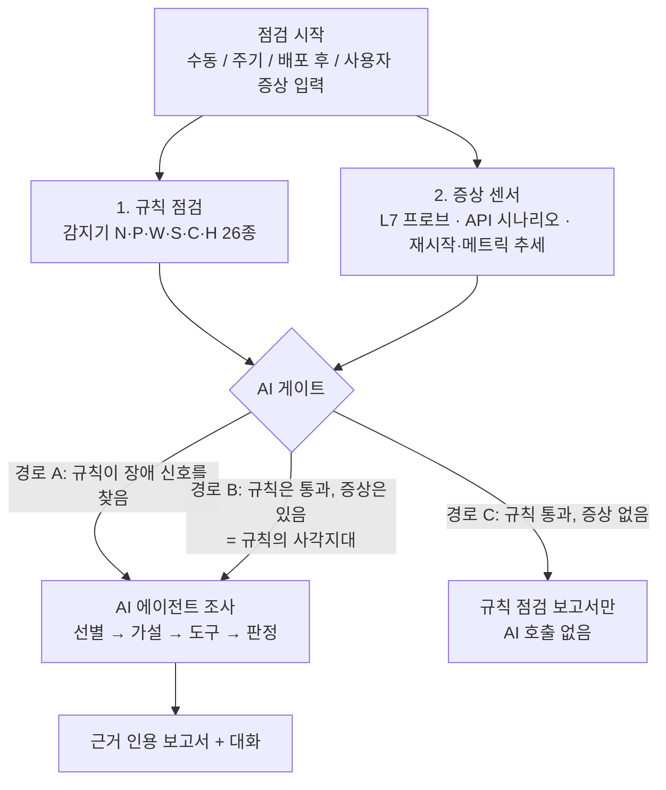
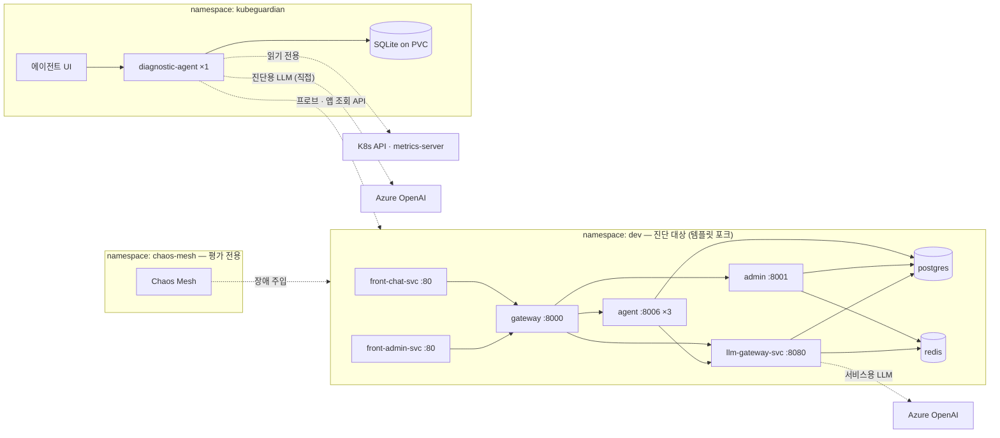
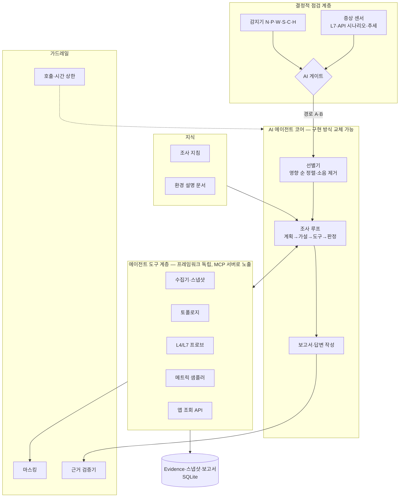

# KubeGuardian AI — 프로젝트 기획서

> **AI 기반 Kubernetes 서비스 환경 구성·개시·변경 검증 Agent**
> *Agentic Kubernetes Environment & Service Validator*

| 항목 | 내용 |
|---|---|
| 유형 | 사내 과제 / PoC |
| **1차 목적** | **Kubernetes 이해도 향상 + AI 에이전트 개발 역량 함양** |
| 2차 목적 | 템플릿 기반 서비스용 진단 에이전트 PoC |
| 인원·기간 | 1인 · 8주 |
| 기준 서비스 | [agent-template-apps-lite](https://github.com/orgs/agent-template-apps-lite/repositories) 포크 (앱 6개) |
| 실행 환경 | minikube (단일 노드) + Chaos Mesh |
| LLM | 진단 에이전트·진단 대상 서비스 모두 Azure OpenAI (경로는 분리) |
| 최종 형태 | 템플릿으로 새 서비스를 시작할 때 함께 설치하는 **범용 진단 애드온** |
| 문서 버전 | v2.3 (2026-09-29) — 최신 에이전트 기술 도입: MCP 도구 서버, Code Mode + K8s Agent Sandbox, ITBench, LLM-as-judge, Skills 방식 지침, OTel 계측 (v2.2: 업무 효율 KPI / v2.1: 규칙 우선 + AI 조사 하이브리드, 에이전트 프레임워크 비한정, 학습 목적 명시) |

---

## 1. 한 줄 설명

템플릿 기반 AI 서비스가 올라간 Kubernetes 환경을 **규칙으로 먼저 점검**하고, 규칙이 문제를 찾았거나 **규칙은 통과했는데 실제로는 문제가 있을 때** AI 에이전트가 조사에 들어가 **무엇이 중요한지 골라내고 원인을 근거와 함께 설명하는** 진단 에이전트.

### 1.1 프로젝트의 1차 목적: 학습

이 프로젝트의 가장 큰 목표는 결과물 자체보다 **Kubernetes에 대한 이해도 상승**과 **AI 에이전트 개발 능력 함양**이다. 설계의 여러 선택이 이 목적을 따른다.

| 학습 영역 | 이 프로젝트에서 얻는 것 | 어디서 |
|---|---|---|
| K8s 리소스 모델 | Deployment·ReplicaSet·Pod·Service·EndpointSlice의 관계를 코드로 따라가 봄 | 수집기·토폴로지 (W2) |
| K8s 네트워킹 | Service 라우팅, DNS, Pod 직접 호출, 포트 매핑 | 프로브, A1·A2·B1 |
| K8s 설정 전파 | ConfigMap·Secret이 Pod에 반영되는 시점, 롤아웃 | A5, B2, 변경 검증 |
| K8s 자원·런타임 | requests/limits, OOMKilled, CPU throttling, probe 동작 | D1, D2, 감지기 |
| K8s 보안 | ServiceAccount, RBAC 최소 권한 설계 | 진단 에이전트 권한 (W2) |
| K8s 확장 | CRD 기반 도구(Chaos Mesh) 운용, metrics API | 장애 주입, 메트릭 샘플러 |
| K8s 격리 실행 | Agent Sandbox CRD로 에이전트가 쓴 코드를 격리 실행, NetworkPolicy·ServiceAccount 토큰 차단 | Code Mode (W6, §7.8) |
| 에이전트 설계 | 도구 설계, 루프 제어, 상한, 구조화 출력, 근거 인용 | W3~W5 |
| 에이전트 프레임워크 | 여러 구현 방식을 직접 비교하고 선택 | W3 스파이크 |
| 에이전트 프로토콜·실행 패턴 | MCP로 도구 계층 노출, 도구를 하나씩 부르는 방식과 Code Mode 비교 | W3, W6~W7 |
| 에이전트 운영 모델 | kagent(CNCF)의 CRD 기반 에이전트 운영 방식을 참고해 애드온 설계와 비교 | W8 ADR |
| 에이전트 평가 | 정답 기반 평가 체계, 조건 비교, 회귀 확인, LLM-as-judge, 공개 벤치마크(ITBench) | W7 |
| 컨텍스트 엔지니어링 | 조사 지침·환경 설명이 결과에 미치는 영향 측정, Skills 방식(필요할 때만 불러오기) 지침 | W5, 3단 비교 |
| 에이전트 관측 | OpenTelemetry GenAI 표준으로 계측해 Phoenix로 추적 | W3 |

**학습 산출물**: 주간 학습 노트(시나리오별로 "어떤 K8s 개념이 어떻게 장애가 되는가"), 설계 결정 기록(ADR), 프레임워크 비교 기록.

## 2. 배경과 문제

### 2.1 템플릿 기반 서비스의 운영 현실

agent-template-apps-lite는 `front-chat / front-admin → gateway → agent / admin / llm-gateway → PostgreSQL · Redis · Azure OpenAI` 구조의 AI 서비스 템플릿이다. Inc-PR 등 실제 서비스가 이 템플릿에서 출발했다. 운영에서 겪은 장애는 대부분 다음 유형이었다.

- **Kubernetes는 전부 정상인데 서비스가 안 된다.** Pod는 Running·Ready인데 채팅이 실패한다.
- **증상이 난 곳과 원인이 있는 곳이 멀다.** gateway에서 502가 났는데 원인은 llm-gateway의 할당량, 또는 Redis다.
- **신호는 많은데 무엇이 중요한지 모른다.** 경고·이벤트·재시작 기록이 쌓여 있지만 대부분 지금 장애와 무관하다.

### 2.2 템플릿 자체에서 확인한 구조적 약점 (코드·매니페스트 확인)

| # | 관찰 | 결과 |
|---|---|---|
| T1 | `shared-infra/kubernetes` 매니페스트에 `AGENT_SERVICE_URL` 등 **서비스 주소 설정이 없음**. gateway 코드 기본값은 `http://localhost:*` (docker-compose에만 설정) | 원본 그대로 클러스터에 배포하면 gateway가 하위 서비스를 못 찾음 |
| T2 | 확인한 Deployment의 readinessProbe가 모두 **tcpSocket(포트 연결)만** 봄. gateway·agent의 `/health`는 의존성 확인 없이 고정 응답 | 앱이 500을 내도 Ready로 표시 |
| T3 | 이미지 tag 고정(`0.0.1`) + `imagePullPolicy: Always` | 같은 tag에 다른 이미지가 공존해도 tag로 구분 불가 |
| T4 | 모든 앱이 `infra-config`·`common-config`·`common-secret`을 공유 (MASTER_KEY 포함) | 공용 설정 하나의 변경이 전 서비스에 파급 |
| T5 | gateway `PROXY_TIMEOUT=60`, 재시도 2회. agent CPU limit 300m | 느린 LLM 응답·부하에서 연쇄 타임아웃 여지 |

### 2.3 운영 사례 (Inc-PR, 문제의식의 출처)

공유 ConfigMap을 여러 레포가 덮어써서 생긴 장애, agent 메모리 512Mi에서 OOMKilled, gateway 504 타임아웃, `create_all`이 ALTER를 하지 않아 생긴 스키마 드리프트, 스트리밍 응답 버퍼링. 모두 **kubectl 한 번으로는 원인이 보이지 않았던** 사례다. 장애 시나리오 설계에 반영했다(§9).

### 2.4 핵심 문제

상태를 보여주는 도구(kubectl, 대시보드)는 있다. 하지만 **"수많은 신호 중 지금 중요한 것이 무엇이고, 왜 그런가"를 찾아내는 일**은 숙련자가 수작업으로 한다. 이 일은 규칙만으로 자동화하기 어렵다. 증상과 원인이 다른 서비스에 있거나, 여러 신호를 연결해야 하거나, 소음 속에서 골라내야 하기 때문이다.

## 3. 핵심 방향: 규칙 우선 + AI 조사

### 3.1 원칙

> **규칙으로 먼저 점검한다. AI는 (1) 규칙이 문제를 찾았을 때, (2) 규칙은 통과했는데 실제로 문제가 있을 때 들어간다.**



| 경로 | 조건 | AI가 하는 일 | 예 |
|---|---|---|---|
| **A. 규칙 적발** | 감지기가 **장애 신호**(critical·warning)를 냄 | 여러 신호 중 무엇이 중요한지 **선별**하고, 신호를 연결해 원인과 영향을 설명 | selector 불일치 + 그로 인한 502 |
| **B. 규칙 사각지대** | 감지기는 통과했지만 **증상 센서가 이상**을 보거나 사용자가 증상을 입력함 | 규칙이 모르는 원인을 **가설로 탐색** | Pod는 전부 정상인데 채팅이 실패 (원인: LLM 할당량) |
| C. 정상 | 둘 다 없음 | 호출하지 않음 | — |

- **개선 권고**(tcpSocket만 쓰는 probe, limits 미설정 등)는 장애 신호가 아니므로 게이트를 열지 않는다. 규칙 보고서의 "개선 권고"로만 표시한다.
- 경로 B가 이 프로젝트에서 AI가 가장 필요한 곳이다. 증상 센서는 결정적 코드지만, **원인을 찾는 일은 규칙으로 할 수 없다.**

| 역할 | 담당 |
|---|---|
| 명백한 이상 확정 (규칙 점검) | 결정적 코드 (감지기) |
| "무언가 잘못됐다" 감지 (증상) | 결정적 코드 (증상 센서) + 사용자 입력 |
| AI 조사 여부 결정 | 결정적 코드 (게이트) |
| 무엇이 중요한가 (선별) | **AI 에이전트** |
| 왜 그런가 (조사) | **AI 에이전트** |
| 설명·대화, 변경의 의미 판단 | **AI 에이전트** |
| 사실 수집 | 결정적 코드 (에이전트 도구) |
| 신뢰성 보장 | 결정적 코드 (근거 검증, 마스킹, 읽기 전용, 호출 상한) |

### 3.2 이렇게 나누는 이유

- **비용과 예측 가능성**: 정상일 때 LLM을 부르지 않는다. 규칙으로 확정되는 것은 항상 같은 답을 낸다.
- **AI의 역할이 분명해진다**: AI는 "규칙이 찾은 것을 정리"(경로 A)하고 "규칙이 못 찾는 것을 탐색"(경로 B)한다. 평가도 두 경로를 나눠 측정할 수 있다.
- **학습 측면**: 규칙을 직접 써 보면서 K8s 개념을 익히고, 규칙의 한계가 드러나는 지점에서 에이전트 설계를 익힌다.

### 3.3 AI를 믿을 수 있게 만드는 장치

특히 경로 B는 규칙이 뒷받침하지 않는 영역이라 "AI가 지어낸 것 아닌가"라는 질문에 답해야 한다.

1. **사실은 도구에서만 나온다.** 모든 사실은 도구 호출 결과(evidence)로 저장되고 id를 가진다.
2. **모든 사실 문장은 근거를 인용한다.** 근거 검증기가 코드로 확인하고, 인용이 없으면 "추정"으로 강등한다.
3. **읽기 전용.** 에이전트는 클러스터를 바꿀 수 없다 (RBAC로 강제).
4. **정답 기반 평가.** 장애를 주입하고 정답과 비교해 정확도를 수치로 공개한다.

## 4. 목표와 비목표

### 4.1 목표

**학습 목표 (1차)**
1. K8s 리소스·네트워킹·설정 전파·자원·RBAC를 **진단 코드와 장애 재현으로** 익힌다 (§1.1).
2. 에이전트의 도구 설계, 루프 제어, 컨텍스트 설계, 평가를 **직접 구현하고 측정**한다.
3. 에이전트 구현 방식을 둘 이상 **직접 비교해 보고** 선택 근거를 남긴다.
4. 2026년 에이전트 기술(MCP Code Mode + K8s Agent Sandbox, 공개 SRE 벤치마크 ITBench)을 **도입하고 효과를 eval로 검증**한다.

**기능 목표 (2차)**
1. **규칙 점검** — 감지기로 구성·상태 오류를 확정하고, 장애 신호와 개선 권고를 구분한다.
2. **증상 감지** — L7 프로브, 핵심 API 시나리오, 추세 센서로 "규칙은 통과했지만 무언가 잘못됨"을 잡는다.
3. **AI 조사** — 게이트가 열리면 선별 → 가설 → 도구 검증 → 근거 인용 보고서를 만든다.
4. **대화** — 보고서에 대한 후속 질문에 근거를 인용해 답한다.
5. **변경 검증** — 변경 전후를 비교하고 영향받는 서비스를 재검증한다. 문제가 보이면 AI 조사로 넘긴다.
6. **범용 애드온** — 템플릿으로 시작하는 어떤 서비스에도 설정 파일 하나로 붙인다.
7. **템플릿 개선 기여** — 포크에서 검증한 개선을 원본 템플릿에 기여한다.

### 4.2 비목표

- **자동 조치** — 권장 조치와 재검증 방법만 제시한다. 클러스터를 변경하지 않는다.
- 멀티 클러스터, 실제 AKS 운영 클러스터 적용
- Prometheus·서비스 메시 등 관측 스택 구축 (자체 경량 수집으로 대체)
- 진단 에이전트 다중 replica 운영
- 과거 조사 학습(memory) — 후속 과제

## 5. 사용 방식

| 모드 | 트리거 | 흐름 | 산출물 |
|---|---|---|---|
| **점검** | 수동 / 주기 / 배포 직후 | 규칙 + 증상 센서 → 게이트 → (열리면) AI 선별·조사 | 정상이면 규칙 보고서, 이상이면 "지금 중요한 것" 브리핑 |
| **증상 조사** | 사용자가 "gateway에서 502가 나" 입력 | 사용자 증상 = 경로 B로 게이트가 바로 열림 → AI 조사 | 조사 보고서 (8개 섹션) |
| **변경 검증** | "방금 배포 괜찮아?" / CLI `kg verify` | 스냅샷 diff + 영향 범위 재검증 (결정적) → 이상 시 AI 조사 | 변경 판정 + 영향 범위 |
| **대화** | AI 결과 화면에서 후속 질문 | 기존 근거 재사용 + 필요 시 추가 도구 호출 | 근거 인용 답변 |

**예시 — 점검 결과: 경로 C (정상)**

> ✅ 규칙 26개 통과, 증상 센서 이상 없음. AI 조사는 수행하지 않았습니다.
> 개선 권고 3건: readinessProbe가 포트 연결만 확인 (6개 서비스) …

**예시 — 점검 결과: 경로 B (규칙 통과 + 증상), AI 브리핑**

> 규칙 점검은 모두 통과했지만 채팅 API 시나리오가 실패해 AI 조사를 시작했습니다.
>
> **지금 중요한 것 2건** (신호 47개 중)
> 1. 🔴 **채팅이 실패하고 있습니다** (확신도 높음) — front-chat → gateway → agent → llm-gateway 경로에서 llm-gateway가 429를 반환합니다 [ev-12]. llm-gateway 할당량 API 기준 오늘 사용량이 한도의 100%입니다 [ev-15]. Pod는 모두 정상입니다 [ev-3].
> 2. 🟠 **agent Pod 1개가 10분마다 재시작합니다** (확신도 중간) — 메모리 사용량이 계속 늘다가 OOMKilled됩니다 [ev-21, ev-22]. 현재 사용자 영향은 제한적입니다.
>
> 참고: readinessProbe가 포트 연결만 확인하는 문제가 6개 서비스에 있습니다. 지금 장애와는 무관한 **개선 권고**로 분류했습니다.

## 6. 기준 환경

### 6.1 구성



- 다중 Pod 시나리오를 위해 agent는 replicas 3, gateway는 2로 둔다.
- 리소스 예산: `minikube start --cpus=4 --memory=10g`
- 진단 에이전트는 Inc-PR llm-gateway를 거치지 않고 Azure OpenAI를 **직접** 호출한다. 진단 대상 llm-gateway가 고장 나도 진단할 수 있어야 하기 때문이다.

### 6.2 템플릿 포크와 수정 항목

템플릿을 포크해 아래만 수정한다. 개발이 끝나면 기여할 항목은 원본 템플릿에 PR로 올린다.

| ID | 수정 | 이유 | 원본 기여 |
|---|---|---|---|
| F1 | K8s 매니페스트에 서비스 주소 설정 추가 (`AGENT_SERVICE_URL` 등) | T1 결함 수정. 없으면 정상 기준선을 만들 수 없음 | ✅ |
| F2 | agent 검색을 선택 기능으로 (검색 설정 없으면 건너뜀) | AI Search 미사용 결정. 현재는 RAG 호출마다 검색을 부름 | ✅ |
| F3 | `/health/ready` 추가 (DB·Redis·하위 서비스 확인). readinessProbe 전환은 설정으로 선택 | T2 개선. 개선 전 상태도 재현 가능해야 함 | ✅ (진단 친화 규약) |
| F4 | 버전 정보 노출 (`APP_VERSION` env + `/health` 응답에 포함) | 신·구 버전 식별 | ✅ (진단 친화 규약) |
| F5 | 테스트 사용자 시드 | 핵심 API 시나리오(로그인 → 채팅) 실행 | 선택 |
| F6 | minikube용 postgres·redis 매니페스트, 로컬 이미지 설정 overlay | 원본은 Azure PG·Redis를 가리킴 | ✅ (`kubernetes/local/` overlay) |
| F7 | 버전 2 이미지 (컬럼 추가, 응답 필드 변경) | 스키마 드리프트·버전 비호환 시나리오 | ❌ 평가 전용 |

### 6.3 장애 주입과 부하

| 도구 | 용도 |
|---|---|
| **Chaos Mesh** | Pod 단위 장애: HTTPChaos(특정 Pod HTTP 오류·지연), StressChaos(CPU·메모리 압박), TimeChaos(시계 어긋남), NetworkChaos, DNSChaos |
| kubectl / kustomize overlay | K8s 구성 장애: selector, 포트, 이미지, ConfigMap, Secret |
| 앱 API | 앱 설정 장애: llm-gateway 할당량 등 |
| k6 | 부하가 있어야 나타나는 장애용 부하 발생 |

## 7. 에이전트 아키텍처

### 7.1 구성



**계층을 나누는 이유**: 감지기·증상 센서·도구·가드레일은 **어떤 에이전트 프레임워크에도 묶이지 않는 일반 Python 모듈**로 만든다(타입이 지정된 함수, 결과는 evidence). 에이전트 코어만 프레임워크에 따라 바뀐다. 이렇게 해야 여러 구현 방식을 같은 도구·같은 시나리오로 비교할 수 있다.

- 도구 계층은 **MCP 서버**로 노출한다. 우리 에이전트도 MCP로 도구를 쓰고, Claude Code 같은 외부 에이전트도 같은 진단 도구를 쓸 수 있다. Code Mode(§7.8)도 이 서버를 통해 도구를 부른다.
- API·앱 구조는 템플릿 backend-agent 규약(`app/api`, `app/service`, `app/core`)을 따른다.
- LLM은 llm-gateway를 거치지 않고 Azure OpenAI를 직접 호출한다.
- 에이전트 실행은 **OpenTelemetry GenAI 표준 속성**으로 계측해 Phoenix로 보낸다. 추적 도구를 바꿀 때 전송 대상만 바꾸면 되게 하기 위해서다.

### 7.2 에이전트 구현 방식 — W3 스파이크로 결정

특정 프레임워크로 한정하지 않는다. W3 초반에 **같은 도구와 같은 L1 시나리오 2개(A1, A5)로** 후보를 직접 구현해 보고 선택한다. L3는 경로 B(증상 센서, W4)가 있어야 돌릴 수 있으므로 스파이크에서 제외한다. 선택 근거는 ADR로 남긴다.

| 후보 | 특징 | 학습 포인트 |
|---|---|---|
| **LangGraph** | 상태 그래프로 흐름(게이트 → 선별 → 조사 → 작성)을 명시적으로 설계. 템플릿 backend-agent와 같은 스택 | 흐름 제어, 상태 설계, 체크포인트 |
| **DeepAgents** | 계획(todo)·하위 에이전트·파일 시스템 기반 컨텍스트를 기본 제공 | 계획형 에이전트, 하위 에이전트 분리 (예: 가설마다 하위 조사) |
| **직접 구현한 도구 호출 루프** | SDK의 tool calling만으로 약 200줄 | 에이전트 루프의 원리, 상한·재시도·파싱을 직접 통제 |
| (선택) OpenAI Agents SDK 등 | handoff·guardrail 내장 | 프레임워크 간 설계 철학 비교 |

**비교 기준**: 선별·원인 정확도, 토큰·시간, 상한과 근거 인용 강제의 용이성, 코드량, 디버깅·추적 용이성(Phoenix 등 연동).

**참고 모델: kagent (CNCF Sandbox)** — 에이전트를 CRD로 정의하고 GitOps·RBAC로 운영하며, 도구 서버(kmcp)와 트래픽 관리(agentgateway)를 분리하는 구조다. 구현 후보로 도입하지는 않고, 도구 계층 분리와 애드온 배포 형태(§12)를 설계할 때 참고한다. W8에 "FastAPI Deployment 방식 vs CRD 에이전트 방식" 비교를 ADR로 남긴다.

### 7.3 흐름

**점검 → AI 조사** (경로 A·B)
1. 감지기와 증상 센서 실행 (결정적)
2. 게이트 판정: 장애 신호가 있거나(A) 증상이 있으면(B) AI 조사 시작. 경로와 트리거 신호를 에이전트에 함께 전달
3. **신호판(signal board)** 구성: 원시 신호 수십 개를 서비스별로 묶음
4. 에이전트가 **선별**: 사용자 영향(핵심 경로 장애 → 일부 사용자 → 잠재 위험 → 개선 권고), 신호 간 연관성, 조사 지침의 배제 조건으로 우선순위 결정
5. 상위 최대 3건을 조사 (각 도구 호출 ≤ 8회). 경로 B이면 증상에서 역추적하는 가설부터 세움
6. 브리핑 작성: 중요 문제 + 영향 + 근거 + 확신도

**증상 조사** (사용자 입력 = 경로 B)
1. 증상 해석 → **조사 계획을 먼저 출력** (UI에 그대로 표시)
2. 가설 최대 3개 → 도구로 검증 → 지지 / 배제 / 판단 보류
3. 보고서 8개 섹션 작성 → 근거 검증기 통과

**변경 검증**
1. before·after 스냅샷 diff + 토폴로지 기반 영향 범위 + 해당 범위 재검증 (결정적)
2. 규칙·재검증이 모두 통과하면 "안전" 판정으로 종료 (AI 호출 없음)
3. 이상이 있으면 diff와 실패 결과를 들고 AI 조사로 넘김 → 변경의 의미 해석 ("포트가 바뀌었는데 호출하는 쪽 주소는 그대로") + 판정: 주의 / 위험

### 7.4 에이전트 도구

모든 도구는 읽기 전용이다. 결과는 evidence로 저장되고 id를 반환한다. 도구는 MCP 서버로 노출한다 (§7.1).

| 도구 | 설명 |
|---|---|
| `get_signal_board()` | 감지기·프로브·이벤트·재시작·메트릭 추세 요약 |
| `get_topology(service?, direction?)` | 의존 그래프, 상·하위 서비스 |
| `get_resource(kind, name)` | 정규화된 spec·status (필드 선별 변환기 적용) |
| `list_pods(selector)` | Pod 목록 + 요약 상태 |
| `compare_pods(a, b)` | 노드·이미지 digest·env 해시·리소스·재시작 차이 |
| `get_pod_logs(pod, previous, tail≤200, grep?)` | 마스킹된 로그 |
| `get_events(subject, since)` | 이벤트 (마스킹) |
| `get_metric_series(pod, metric, window)` | 메트릭 샘플러의 시계열 (CPU·메모리) |
| `probe(target, path, via=service\|pod)` | L4·L7 프로브 재실행 |
| `run_api_scenario(name)` | 핵심 API 시나리오 (로그인 → 채팅 등) |
| `query_app_api(service, endpoint)` | **허용 목록의 GET API만** (예: llm-gateway health·quota·audit log) |
| `get_snapshot_diff(before, after, subject?)` | 변경 diff |
| `search_runbook(query)` | 조사 지침·환경 설명 검색 |

### 7.5 Evidence 모델

```yaml
Evidence:
  id: ev-0042
  kind: pod_status | event | log_excerpt | probe_result | metric_series | app_api | config_diff | detector
  subject: dev/Pod/agent-7c9f-x2k
  collected_at: 2026-10-20T10:12:03+09:00
  source: "GET /api/v1/namespaces/dev/pods/agent-7c9f-x2k"
  data: {...}   # 마스킹 후

Issue (브리핑 항목):
  rank: 1
  title: "채팅 실패 — llm-gateway 할당량 소진"
  impact: core_path_broken | partial_users | latent_risk | improvement
  confidence: high | medium | low
  evidence_ids: [ev-12, ev-15, ev-3]

Hypothesis (조사):
  statement: "..."
  status: supported | refuted | inconclusive
  evidence_ids: [...]
```

### 7.6 신뢰성 장치

| 장치 | 내용 |
|---|---|
| 근거 검증기 | 사실 문장마다 유효한 evidence id를 1개 이상 인용해야 함. 아니면 "추정"으로 강등 또는 제거 |
| 출력 파싱 | 구조화 출력 스키마로 파싱. 코드펜스·비정형·null 응답 방어 |
| 상한 | 조사 1건: 도구 ≤ 20회·150초. 브리핑: 전체 ≤ 300초. 상한 도달 시 부분 결과 + "조사 미완" 표시 |
| 결정성 | temperature 0, 평가 시 3회 반복 |
| 마스킹 | 로그·**이벤트 메시지**·env에서 `password|secret|token|key|Bearer|://user:pass@` 치환. Secret 값은 수집하지 않음 |
| 읽기 전용 | RBAC `get/list/watch`만. `query_app_api`는 GET·허용 목록만 |

### 7.7 조사 지침과 환경 설명

AI의 일반 지식으로는 **그 환경의 사정**을 모른다. 운영자의 요령을 문서로 넘겨준다.

| 층 | 제공 | 예 |
|---|---|---|
| 템플릿 공통 지침 | 애드온 기본 포함 | "gateway가 하위 호출에 실패하면 서비스 주소 env가 `localhost`인지 먼저 확인", "Ready인데 500이면 readinessProbe가 tcpSocket인지 확인" |
| 템플릿 환경 설명 | 애드온 기본 포함 | 서비스 구성, 공유 ConfigMap·Secret 구조, llm-gateway 할당량·health API 위치 |
| 프로젝트별 지침 | 도입 프로젝트가 추가 | Inc-PR이라면 "infra-config를 여러 레포가 배포함" |

**Skills 방식 구성**: 조사 지침은 증상·장애 유형별 문서로 나누고, 각 문서에 한 줄 설명을 붙인다. 에이전트는 설명 목록만 먼저 보고 필요한 지침만 불러온다. 지침 전체를 프롬프트에 넣는 방식과 정확도·토큰을 eval로 비교한다 (W5).

### 7.8 Code Mode 실험 (도구 호출 방식 비교)

**Code Mode**는 에이전트가 도구를 한 번에 하나씩 호출하는 대신, 여러 도구를 부르는 짧은 Python 코드를 써서 샌드박스에서 실행하는 방식이다. 예를 들어 "agent Pod 3개의 로그를 각각 grep해서 오류가 있는 Pod만 추려라"를 코드 한 번으로 처리한다. 토큰과 왕복 횟수가 줄어든다는 보고가 있어, 이 프로젝트의 시나리오로 직접 검증한다.

| 항목 | 내용 |
|---|---|
| 실행 위치 | **K8s Agent Sandbox**(SIG Apps의 Sandbox CRD)로 만든 격리 Pod |
| 도구 접근 | 샌드박스 안의 코드는 MCP 서버(§7.1)를 통해서만 도구를 부른다. 도구가 읽기 전용이므로 코드도 읽기 전용 범위를 벗어나지 못한다 |
| 읽기 전용 보장 | ServiceAccount 토큰 미마운트, NetworkPolicy로 K8s API·외부 인터넷 차단(MCP 서버만 허용), 실행 시간·메모리 상한 |
| 근거 모델 | 코드 안에서 부른 도구 결과도 evidence로 저장되고 id를 가진다. 근거 검증기는 그대로 적용 |
| 상한 | 도구 호출 상한(§7.6)은 코드 안의 호출까지 합산 |
| 비교 | 같은 에이전트에서 도구 호출 방식만 바꿔 원인 Top-1, 토큰, 시간, 도구 호출 수를 비교 (W7) |

샌드박스 권한 설계와 결과는 ADR로 남긴다. 효과가 없거나 일정이 부족하면 L1~L3 일부 시나리오 비교로 축소한다.

## 8. 규칙 점검과 증상 센서 (결정적 코드)

규칙으로 확정되는 문제는 여기서 확정한다. 여기서 나온 신호가 AI 게이트를 열지 결정하고, 게이트가 열리면 에이전트의 입력이 된다.

### 8.1 토폴로지

- env의 `*_SERVICE_URL`·`*_URL` 값을 파싱해 Service·port와 매칭 → `declared` / `unresolved`(없는 Service·`localhost`) / `inferred`(에이전트 추정)
- Service → Deployment → ReplicaSet → Pod 계층 (selector·ownerReferences)
- 파싱 규약은 `kubeguardian.yaml`에서 확장 가능

### 8.2 감지기 목록

감지기는 **무엇을 보는가(카테고리)**로 나누고, ID는 카테고리 접두사 + 번호로 붙인다. 카테고리 안에서는 문제가 일어나는 순서(Pod는 기동 단계 순)로 번호를 매긴다.

| 카테고리 | 범위 | 신호 등급 |
|---|---|---|
| **N** 노드·클러스터 | 노드 상태, 클러스터 시스템 구성요소 | 장애 신호 |
| **P** Pod 기동·실행 | 스케줄링 → 이미지 → 컨테이너 생성 → init → 실행 → Ready → 축출 | 장애 신호 |
| **W** 워크로드 | Deployment·StatefulSet의 가용 수, 롤아웃 | 장애 신호 |
| **S** 서비스 연결 | Service ↔ Pod ↔ env URL 선언의 정합성 | 장애 신호 |
| **C** 설정·버전 일관성 | ConfigMap·Secret 참조, 이미지 버전, 설정 전파 | 장애 신호 |
| **H** 모범 사례·보안 | probe, 자원 설정, 권한 | **개선 권고** (게이트를 열지 않음) |

**판정 성격**: 상태 = 현재 status로 판정 / 선언 = spec만 보고 판정 (리소스 간 교차 대조 포함, 트래픽이 없어도 잡힘) / 시간 = 일정 기간의 변화로 판정 (샘플링·스냅샷 필요)

| ID | 감지 | 판정 근거 | 성격 |
|---|---|---|---|
| **N01** | 노드 NotReady | `Node.status.conditions` Ready ≠ True | 상태 |
| **N02** | 노드 자원 압박 | `MemoryPressure`·`DiskPressure`·`PIDPressure` = True | 상태 |
| **N03** | 클러스터 DNS 비정상 | kube-system CoreDNS Pod Ready 0 / 일부 | 상태 |
| **P01** | 스케줄 실패 (자원 부족·taint 등) | Pod `Pending` + `PodScheduled=False`, 이벤트 `FailedScheduling` | 상태 |
| **P02** | PVC Pending | `PVC.status.phase = Pending` | 상태 |
| **P03** | 이미지 받기 실패 | `ErrImagePull`·`ImagePullBackOff`·`InvalidImageName` | 상태 |
| **P04** | 볼륨 마운트 실패 | 이벤트 `FailedMount`, `ContainerCreating` 정체 | 상태 |
| **P05** | init 컨테이너 실패 | `initContainerStatuses` 종료 코드 ≠ 0, `Init:CrashLoopBackOff` | 상태 |
| **P06** | CrashLoop / 재시작 ≥3회·30분 | `CrashLoopBackOff`, `restartCount` 증가분 | 시간 |
| **P07** | OOMKilled | `lastState.terminated.reason = OOMKilled` | 상태 |
| **P08** | Running인데 NotReady 지속 | Pod `Ready=False`가 `lastTransitionTime` 기준 N분 이상, 이벤트 `Unhealthy` | 시간 |
| **P09** | 축출 (Evicted) | Pod `Failed` + reason `Evicted` | 상태 |
| **W01** | 가용 replicas 부족 | Deployment·StatefulSet `spec.replicas` > `status.availableReplicas` | 상태 |
| **W02** | 롤아웃 정체 | `Progressing` 조건 reason `ProgressDeadlineExceeded` | 상태 |
| **S01** | selector에 맞는 Pod 0 | `Service.spec.selector` ↔ Pod 라벨 | 선언 |
| **S02** | EndpointSlice Ready 0 / 일부 | `endpoints[].conditions.ready` | 상태 |
| **S03** | targetPort ↔ containerPort 불일치 | Service `targetPort` ↔ 컨테이너 `ports` | 선언 |
| **S04** | env URL이 없는 Service·`localhost`를 가리킴 | `*_SERVICE_URL`·`*_URL` ↔ Service 목록 (토폴로지 unresolved) | 선언 |
| **S05** | env URL 포트 ↔ Service 포트 불일치 | URL 포트 ↔ `Service.spec.ports[].port` | 선언 |
| **C01** | 참조한 ConfigMap·Secret 또는 키가 없음 | `envFrom`·`valueFrom`·volume 참조 ↔ 실제 객체·키 (Pod에서는 `CreateContainerConfigError`) | 선언 |
| **C02** | 같은 워크로드의 Pod 간 이미지 digest 불일치 | `containerStatuses[].imageID` 비교 | 상태 |
| **C03** | 설정 잠복: ConfigMap 변경 후 재시작 안 된 Pod | ConfigMap 변경 시각(스냅샷) ↔ Pod 시작 시각 | 시간 |
| **C04** | 같은 ConfigMap을 복수 주체가 적용 | `metadata.managedFields`의 manager 등 | 선언 |
| **H01** | readinessProbe 없음·tcpSocket만·liveness 없음 | 컨테이너 probe 설정 | 선언 |
| **H02** | requests·limits 미설정 | 컨테이너 `resources` | 선언 |
| **H03** | ServiceAccount가 cluster-admin에 바인딩 | (Cluster)RoleBinding ↔ SA | 선언 |

**신호 등급**: 장애 신호(게이트를 연다) = N·P·W·S·C / **개선 권고**(게이트를 열지 않음) = H

### 8.3 증상 센서 — "규칙은 통과했지만 무언가 잘못됨"

| 센서 | 이상 판정 (게이트 경로 B) |
|---|---|
| 핵심 API 시나리오 | 로그인 → 채팅 → 스트리밍 중 하나라도 실패하거나 제한 시간 초과 |
| L7 프로브 | Service 경유 10회 중 오류 ≥ 1회, 또는 Pod 직접 호출 실패 |
| 지연 | 경로별 응답 시간이 기준선의 3배 초과, 또는 `PROXY_TIMEOUT`의 80% 초과 |
| 추세 | 메모리 30분 선형 증가, CPU가 limit에 지속 도달, 재시작 증가 |
| 앱 자가 보고 | llm-gateway health 비정상, quota 90% 이상 |
| 사용자 입력 | 증상 조사 요청 (항상 경로 B) |

### 8.4 기타 수집

| 수집 | 내용 |
|---|---|
| 메트릭 샘플러 | metrics-server를 15초 주기로 읽어 30분 링버퍼 보관 (추세 센서와 에이전트 도구가 공유) |
| 앱 조회 | llm-gateway health·quota·audit log 등 허용 목록 GET |
| 스냅샷 | Deployment·RS·Service·EndpointSlice·ConfigMap·PVC·Secret(메타데이터)를 정규화해 저장 |

## 9. 장애 시나리오

### 9.1 난이도 체계

| 레벨 | 정의 | 규칙만으로 |
|---|---|---|
| L1 | 신호 하나로 원인 확정 | 가능 |
| L2 | 여러 신호를 연결해야 함 | 일부 가능 |
| L3 | **증상과 원인이 다른 서비스에 있음**, K8s는 정상 | 어려움 |
| L4 | 부하·시간에 따라 나타남 | 거의 불가 |
| L5 | 복합 원인 또는 미끼 신호 | 불가 |

**기준선 환경**
- **H0 (정상 + 개선 권고)**: 포크 정상 배포. 템플릿 고유의 경고(tcpSocket probe, liveness 없음 등)는 **일부러 남겨 둔다**. 이것들이 개선 권고로만 분류되고 **AI 게이트가 열리지 않는지**(경로 C) 확인한다.

### 9.2 MVP 시나리오 (16개)

**AI 진입** 열: A = 규칙이 적발해 AI가 선별·설명 / B = 규칙은 통과, 증상 센서가 잡아 AI가 원인 탐색

| ID | Lv | 층 | 사용자 증상 | 실제 원인 | 주입 | AI 진입 |
|---|---|---|---|---|---|---|
| A1 | L1 | K8s 구성 | agent API 전부 실패 | Service selector 오타 | Service 수정 | A (S01) |
| A2 | L1 | K8s 구성 | admin 연결 거부 | targetPort 불일치 | Service 수정 | A (S03) |
| A3 | L1 | K8s 구성 | 신규 배포 안 뜸 | 없는 이미지 tag | 이미지 변경 | A (P03) |
| A4 | L1 | K8s 구성 | postgres 기동 안 됨 | PVC Pending (없는 storageClass) | PVC 수정 | A (P02) |
| A5 | L1 | K8s 구성 | 모든 API 502 | **서비스 주소 설정 누락 → gateway가 `localhost` 호출 (원본 템플릿 상태 = T1)** | F1 제거 | A (S04) |
| B1 | L2 | 런타임 | 요청의 약 1/3 실패 | agent Pod 1개만 HTTP 500 | HTTPChaos (Pod 1개) | **B** (Pod 직접 프로브) |
| B2 | L2 | 배포 과정 | 배포 후 일부 오류, 롤아웃 멈춤 | 신규 ReplicaSet만 잘못된 env | 롤아웃 | A (W02, P06) |
| B3 | L2 | 배포 과정 | 가끔 응답 형식이 다름 | 같은 tag에 다른 이미지 공존 | 재빌드 후 Pod 1개 교체 | A (C02) |
| C1 | L3 | 외부 의존 | 채팅 실패 (gateway 502) | **llm-gateway 할당량 소진 → 429** | 할당량 하향 | **B** (API 시나리오, quota) |
| C2 | L3 | 외부 의존 | 로그인 불가, Pod 전부 Ready | **admin → Redis 연결 차단 → 인증 검증 실패** | NetworkChaos (admin↔redis) | **B** (API 시나리오) |
| C3 | L3 | 런타임 | 일부 요청만 인증 실패 | **Pod 1개 시계 어긋남 → 토큰 만료 판정** | TimeChaos (Pod 1개) | **B** (L7 간헐 오류) |
| C4 | L3 | 앱 동작 | 일반 응답은 되는데 스트리밍만 끊김 | 짧은 `PROXY_TIMEOUT` + 긴 스트리밍 응답 | gateway env 변경 | **B** (스트리밍 시나리오) |
| C5 | L3 | 배포 과정 | 특정 API만 500 | **스키마 드리프트** (v2가 컬럼 추가, `create_all`은 ALTER 안 함) | F7 v2 배포 | **B** (API 시나리오) |
| D1 | L4 | 런타임 | 부하 시 느려지다 504 | agent CPU 제한 → gateway 타임아웃 연쇄 | StressChaos(CPU) + k6 | **B** (지연, CPU 추세) |
| D2 | L4 | 런타임 | 몇 분마다 Pod 1개 재시작 | 점진적 메모리 증가 → OOMKilled | StressChaos(메모리 점증) | B → A (추세 → P07) |
| E1 | L5 | 복합 | 로그인 불가 | C2. **이전의 무해한 재시작 기록이 미끼** | C2 + 과거 재시작 | A + B (미끼는 P06) |

경로 A 7개, 경로 B 7개, 혼합 2개. **L3 이상은 모두 규칙이 통과하는 시나리오**라서 AI의 원인 탐색 능력을 따로 측정할 수 있다.

### 9.3 여유 시 진행

| ID | Lv | 내용 |
|---|---|---|
| X1 | L3 | llm-gateway DB의 LLM 배포 설정 오류 → 특정 모델만 실패 (K8s 흔적 없음) |
| X2 | L4 | gateway 재시도 폭주 (느린 agent + 재시도 2회 + 부하) |
| X3 | L4 | DB 커넥션 풀 고갈 (`DB_POOL_SIZE=5` + 스트리밍 장기 점유) |
| X4 | L4 | 신·구 버전 비호환 (롤아웃 중에만 간헐 오류) |
| X5 | L4 | 간헐적 DNS 실패 (DNSChaos) |
| X6 | L3 | 서비스 간 `MASTER_KEY` 불일치 → 복호화 실패 *(암호화 데이터의 서비스 간 공유 방식 확인 필요)* |
| X7 | L5 | 1시간 전 ConfigMap 변경(설정 잠복) + 오늘 롤아웃이 트리거 |

**제외**: Azure AI Search 관련 장애 (미사용 결정)

각 시나리오는 `scenarios/<ID>/{inject.sh, reset.sh, expected.yaml, README.md}`로 구성한다. `expected.yaml`에는 정답 원인, 영향 서비스, 기대 브리핑 1순위, K8s 상태만으로 원인이 보이는지(`k8s_visible`, 시나리오 작성 시 kubectl로 확인)를 적는다.

## 10. 평가 — 업무 효율과 에이전트 품질

평가 대상은 진단 대상 서비스가 아니라 **진단 에이전트 자체**다. 평가는 두 층으로 나눈다.

- **업무 효율 KPI (§10.1)**: 사람이 하는 진단 일이 얼마나 줄었는가. 결과 보고의 헤드라인이다.
- **에이전트 품질 지표 (§10.2)**: 에이전트가 맞는 답을 내는가. 업무 효율 KPI를 믿을 수 있게 하는 전제 조건이다.

### 10.1 업무 효율 KPI

| KPI | 정의 | 계산 | 측정 |
|---|---|---|---|
| **K1 원인 도달 시간 단축률** | 증상을 받은 시점부터 정답 원인을 제시할 때까지의 시간을 수동 진단과 KubeGuardian으로 비교 | (T_수동 − T_도구) / T_수동, 레벨별 중앙값. 수동이 30분 안에 못 찾은 건은 T_수동 = 30분으로 계산하고 "최소 X%"로 표기 | 블라인드 자가 진단 약 10건 (§10.1.1) |
| **K2 제한 시간 내 해결률** | 30분 안에 정답 원인에 도달한 비율 | 도달 건수 / 실행 건수, 수동·도구 각각 | 블라인드 자가 진단 약 10건 (§10.1.1) |
| **K3 신호 압축률** | 사람이 봐야 할 항목이 줄어든 정도. 원시 신호에는 사실이지만 지금 장애와 무관한 항목(소음)이 섞여 있다 | 1 − (브리핑의 중요 이슈 수 / 신호판의 원시 신호 수). 예: 47개 → 2건이면 95.7% | eval 자동, 경로 A·B 시나리오 전체 × 3회 |
| 보조: 원인 규명 커버리지 | K8s 상태(`kubectl get`·`describe`·events)만으로 원인이 드러나지 않는 시나리오 중 KubeGuardian이 원인을 맞힌 비율. K2를 전체 시나리오로 뒷받침한다 | `expected.yaml`의 `k8s_visible: false` 시나리오 중 원인 Top-1 적중 비율 | eval 자동 |

#### 10.1.1 블라인드 자가 진단 (K1·K2 수동 기준선)

1인 과제이고 과거 장애의 진단 시간 기록이 없으므로, 수동 기준선은 본인이 직접 측정한다. 무엇을 주입했는지 모르게 해서 편향을 줄인다.

1. `make blind`가 시나리오 풀(MVP 시나리오 + H0)에서 무작위로 하나를 골라 주입하고, 무엇을 골랐는지 숨긴다. 대상 Pod·서비스를 바꿀 수 있는 시나리오는 대상도 무작위로 고른다.
2. 사용자 증상 문장만 보고 타이머를 시작한다. kubectl·curl만으로 진단하고, 원인을 기록하면 멈춘다. 30분이 지나면 미해결로 처리한다.
3. KubeGuardian은 같은 주입 상태에서 같은 증상으로 백그라운드 실행해 시간과 결과만 기록한다. 결과는 본인 진단이 끝난 뒤에 연다.
4. 레벨별 2~3건, 총 약 10건. 여러 날에 나눠 실행한다. H0가 뽑히면 K1·K2에서 제외한다.

**해석**: 본인은 시나리오 설계자라서 수동 진단 시간은 실제 운영자보다 짧은 **하한**이다. 따라서 K1·K2는 KubeGuardian에 불리한 보수적 추정이며, 보고서에 "설계자 본인 기준"임을 명시한다. 표본이 작으므로 평균 대신 중앙값과 사례별 표로 보고하고, 통계적 유의성은 주장하지 않는다.

### 10.2 에이전트 품질 지표 (KPI의 전제 조건)

| 지표 | 정의 | 목표 |
|---|---|---|
| **게이트 정확도** | H0에서 AI 미호출 + 장애 시나리오에서 AI 호출 | H0 미호출 100%, 장애 시 호출 ≥ 95% |
| **선별 정확도** | AI 브리핑 1순위 문제 = 주입한 장애 | L1–L2 ≥ 90%, L3 ≥ 70%, L4–L5 ≥ 50% |
| **원인 Top-1 / Top-3** | 조사 보고서 1순위 원인 / 상위 3개 가설 안에 정답. **경로 A·B를 나눠 보고** | Top-1 ≥ 70%, Top-3 ≥ 85% |
| 근거 인용률 | 사실 문장 중 유효 evidence 인용 비율 | 100% (검증기가 강제) |
| 도움 정도 | 보고서 루브릭 평가 (원인 명확성·조치 실행 가능성·근거 충분성, 각 1–5). **LLM-as-judge**로 채점하고, 본인이 직접 채점한 10건과 일치도를 먼저 확인한 뒤 사용 | 평균 ≥ 4 |
| 시간 | 규칙 점검 p50 ≤ 20s, AI 조사 p50 ≤ 120s | |
| 비용 | AI 조사 1회 토큰 | ≤ 100k |

### 10.3 비교 조건 (3단)

| 조건 | 설명 |
|---|---|
| ① 규칙 + 증상 센서만 | 감지기·증상 결과를 심각도 순으로 나열 (AI 없음) |
| ② + AI 조사 | 조사 지침 없이 |
| ③ + AI 조사 + 조사 지침 | 최종 형태 |

각 조건에서 시나리오마다 3회 반복하고, **레벨별·경로별로 보고**한다. 기대하는 그림은 다음과 같다.
- 경로 A(L1·L2): ①도 원인을 가리키지만, ②·③은 여러 신호 중 핵심을 고르고 영향을 설명한다.
- 경로 B(L3 이상): ①은 "API가 실패함"까지만 말하고 원인은 모른다. **②·③이 원인을 찾는 비율이 AI의 핵심 가치**다.
- ③이 ②보다 원인 정확도와 미끼 회피(E1)에서 낫다.

### 10.4 에이전트 구현 방식 비교 (학습 목표)

W3 스파이크에서 후보 2개 이상을 같은 도구·같은 시나리오(L1 2개: A1, A5)로 비교한다. §7.2의 비교 기준을 표로 남긴다. 여유가 있으면 W7에 선택하지 않은 방식으로 MVP 전체 eval을 한 번 더 돌려 비교를 보강한다.

### 10.5 학습 성과

| 산출물 | 기준 |
|---|---|
| 주간 학습 노트 | 시나리오마다 "관련 K8s 개념 → 왜 장애가 되나 → 어떤 신호로 보이나"를 정리 (16개) |
| ADR | 게이트 설계, 프레임워크 선택, 도구 경계, 근거 모델, Code Mode 샌드박스 권한, kagent 비교 등 주요 결정 5건 이상 |
| 회고 | 규칙이 통하지 않은 지점, 에이전트가 틀린 사례와 원인 분석 |

### 10.6 외부 벤치마크: ITBench

자체 시나리오는 직접 설계했기 때문에 "내가 만든 시험"이라는 한계가 있다. 이를 보완하기 위해 IBM의 공개 SRE 벤치마크 **ITBench**(Kubernetes 장애 근본 원인 분석)로도 평가한다. 2026-05 공개된 ITBench-AA 기준으로 최상위 모델도 50% 미만인, 포화되지 않은 벤치마크다.

| 단계 | 내용 |
|---|---|
| 실행 가능성 확인 (W1, 반나절) | 과제 환경의 자원 요구량과 minikube 호환 여부 확인 |
| 가능하면 (W7) | ITBench SRE 과제 일부를 KubeGuardian으로 풀고 점수를 공개 리더보드 수치와 함께 보고 |
| 불가하면 (W7) | ITBench 채점 방식(정답 원인 엔티티를 모두 맞혀야 점수, 오답을 섞으면 정밀도만큼 감점)을 자체 시나리오에 적용해 원인 Top-1과 함께 보고 |

## 11. UI

점검 결과와 AI 조사를 한 화면에서 이어 보는 **워크스페이스**다. 상세는 [04-ui-spec.md](04-ui-spec.md).

- 첫 화면 = 점검 결과 + 증상 입력창
  - 정상(경로 C): "규칙 26개 통과, 증상 없음" + 개선 권고
  - 이상(경로 A·B): 게이트가 열린 이유 + AI 브리핑 "지금 중요한 것"
- AI 결과마다 근거 칩 → 원문 드로어, 조사 계획·가설 타임라인, 후속 질문 대화
- 토폴로지·Pod 비교·변경 타임라인은 보조 뷰로 제공
- 개발 단계에서는 Chainlit 개발용 화면(W3~), CLI, Phoenix 추적으로 에이전트 동작을 확인하고, 제품 화면은 W5부터 만든다
- **제품 화면은 범위를 축소한다** (신기술 실험 시간 확보). 어느 화면을 남길지는 별도로 정리한다

## 12. 범용 애드온 설계

### 12.1 배포 형태

- PoC 완료 후 템플릿 조직의 애드온 레포 **`infra-kubeguardian`**으로 정리한다. 기존 `infra-*` 레포처럼 `deploy/`, 설치 스크립트, README를 갖춘다.
- 설치: `kubectl apply -k` 한 번 + `kubeguardian.yaml` 작성 + Azure OpenAI Secret 등록

### 12.2 설정 파일

```yaml
# kubeguardian.yaml
target:
  namespace: dev
llm:
  provider: azure_openai
  deployment: <진단용 배포명>
topology:
  url_env_patterns: ["*_SERVICE_URL", "*_URL"]
api_scenarios:
  - name: chat
    steps:
      - login: {via: gateway, path: /api/v1/auth/login, account_secret: kg-test-user}
      - call:  {via: gateway, path: /api/v1/agent/invoke, expect: 200, timeout_s: 60}
app_apis:            # query_app_api 허용 목록 (GET만)
  llm-gateway: [/api/v1/health, /api/v1/quota]
knowledge:
  runbooks: [builtin:template, ./runbooks/]
  environment: ./environment.md
```

### 12.3 진단 친화 규약 (템플릿 기여 대상)

템플릿이 따르면 진단 품질이 올라가는 약속이다. 규약을 따르지 않는 서비스도 기본 진단은 된다.

| 규약 | 효과 |
|---|---|
| 서비스 주소를 K8s 매니페스트에 명시 (F1) | 토폴로지 정확도, 배포 직후 장애 방지 |
| `/health/ready`가 의존성 확인 (F3) | Ready가 실제 서비스 가능 여부를 반영 |
| 버전 노출 (F4) | 신·구 버전 식별 |
| 구조화 로그 + trace_id (후속) | 서비스 간 요청 추적 |

## 13. 보안·권한

- 전용 ServiceAccount `kubeguardian` + 최소 권한 ClusterRole (`get/list/watch`만)
  - core: pods, pods/log, events, services, endpoints, configmaps, persistentvolumeclaims, persistentvolumes, nodes, namespaces, serviceaccounts
  - `discovery.k8s.io`: endpointslices · `apps`: deployments, replicasets, statefulsets
  - `rbac.authorization.k8s.io`: rolebindings, clusterrolebindings · `metrics.k8s.io`: pods, nodes
  - secrets: `list`를 metadata-only 요청으로만 사용. RBAC상 값 읽기가 가능하다는 잔여 위험은 문서화
- `query_app_api`: GET + 허용 목록만. 테스트 계정은 Secret으로 주입
- Code Mode 샌드박스(§7.8): ServiceAccount 토큰 미마운트, NetworkPolicy로 MCP 서버 외 통신 차단, 실행 시간·메모리 상한. 에이전트가 쓴 코드가 읽기 전용 원칙을 우회하지 못하게 한다
- Chaos Mesh는 평가 환경 전용. 애드온 배포물에 포함하지 않음
- 로그·이벤트·설정은 마스킹 후 Azure OpenAI로 전송. 사내 SSL 프록시 대비 CA 번들 주입

## 14. 기술 스택

| 영역 | 선택 | 이유 |
|---|---|---|
| 앱·API | Python 3.12, FastAPI | 템플릿 backend-agent와 같은 구조 |
| 에이전트 코어 | **W3 스파이크로 결정** (LangGraph / DeepAgents / 직접 루프 등) | 학습 목표. 도구 계층은 프레임워크 독립 |
| LLM | Azure OpenAI, 구조화 출력 | 사내 표준. 진단 대상 llm-gateway와 경로 분리 |
| 추적 | Phoenix (템플릿 infra-phoenix) + OpenTelemetry GenAI 표준 계측 | 에이전트 실행 추적·디버깅. 프레임워크 비교에도 사용. 템플릿 표준이고 minikube 자원 부담이 작음. 표준 계측으로 추적 도구 교체 비용 최소화 |
| 도구 프로토콜 | MCP (Python SDK) | 도구 계층을 표준으로 노출. 외부 에이전트 재사용, Code Mode의 도구 접근 경로 |
| 코드 실행 격리 | K8s Agent Sandbox (SIG Apps Sandbox CRD) | Code Mode 코드를 클러스터 안에서 격리 실행 |
| 평가 | 자체 eval 러너 + LLM-as-judge + ITBench | 정답 기반 평가, 루브릭 자동 채점, 외부 벤치마크 비교 |
| K8s 접근 | `kubernetes` 공식 클라이언트 | in-cluster config |
| 저장소 | SQLite on PVC | 단일 replica |
| 제품 화면 | React 18 · TypeScript · Vite · Tailwind · shadcn/ui, SSE | 템플릿 frontend와 같은 스택. 별도 앱으로 배포 (진단 대상과 분리) |
| 개발용 화면 | Chainlit | 에이전트 디버깅·스파이크 비교. 프레임워크 무관 |
| 장애 주입 | Chaos Mesh + kustomize overlay | Pod 단위 장애를 코드 수정 없이 |
| 부하 | k6 | 단일 바이너리, 스크립트 간단 |

## 15. 리스크와 대응

| 리스크 | 영향 | 대응 |
|---|---|---|
| 에이전트 선별이 L1에서도 흔들림 | 방향 전체의 전제가 흔들림 | **W3에 조기 검증**(M2). 실패 시 신호판 구조·프롬프트를 먼저 개선 |
| 프레임워크 비교에 시간을 과하게 씀 | 일정 지연 | 스파이크는 **2일 타임박스**, 시나리오 2개로 한정. 결론이 안 나면 직접 루프로 시작 |
| 증상 센서 기준이 너무 민감·둔감 | 게이트 오작동 (불필요한 AI 호출 / 놓침) | H0에서 1시간 연속 실행해 오탐 0 확인 후 기준 확정 |
| LLM 결과 편차 | 지표 흔들림 | temperature 0, 3회 반복, 구조화 출력 |
| 클러스터 안에서 Azure OpenAI 연결 실패 (사내 SSL) | 환경 구축 지연 | W1 첫날 연결 스파이크, CA 주입 |
| 템플릿 `.env`의 선택 의존성(Milvus, MinIO, Phoenix, Naver, Notion 키) 없이 앱이 기동 안 됨 | 환경 구축 지연 | W1에 의존성별 기동 확인. 필수로 묶여 있으면 포크에서 선택화 (F2와 같은 방식) |
| minikube 자원 부족 (앱 6 + DB + Chaos Mesh) | 불안정 | 10GB 할당, 부하 시나리오는 단독 실행 |
| 앱 층 시나리오(C1·C4 등) 재현 불안정 | 평가 신뢰도 | inject 후 증상 확인 단계를 스크립트에 포함 (증상이 안 나면 무효 처리) |
| 1인 8주 범위 | 일정 초과 | MVP 16개 고정, X 목록은 여유 시에만. 제품 화면 범위 축소. Code Mode는 필요 시 L1~L3 일부 비교로 축소 |
| ITBench 환경이 minikube 자원 안에서 돌지 않음 | 외부 벤치마크 비교 불가 | W1에 반나절 확인. 불가하면 채점 방식만 자체 시나리오에 적용 (§10.6) |
| Code Mode 코드가 읽기 전용 원칙을 우회 | 클러스터 변경 위험 | 샌드박스에 K8s 자격 증명 없음, MCP 서버 외 통신 차단. W6에 우회 시도 테스트로 확인 |
| LLM-as-judge 채점이 사람 판단과 어긋남 | 도움 정도 지표 신뢰도 하락 | 본인 채점 10건과 일치도 확인. 낮으면 루브릭 기준을 구체화하거나 본인 채점으로 대체 |
| Agent Sandbox 추가로 minikube 자원 부족 | 불안정 | 샌드박스는 Code Mode 평가 시에만 기동, 부하 시나리오와 동시 실행하지 않음 |
| 민감정보 외부 전송 | 보안 | 마스킹(이벤트 포함), Secret 미수집, 필드 화이트리스트 |

## 16. 외부 서비스 대비 포지션

K8sGPT, HolmesGPT, Komodor(Klaudia), Azure SRE Agent, Kiali 비교는 [03-market-analysis.md](03-market-analysis.md) 참고.

- **차별점**
  1. **규칙 + 사각지대 탐색**: 규칙으로 확정되는 것은 규칙으로, 규칙이 통과하는데 증상이 있는 경우에 AI가 원인을 탐색. 결과는 "지금 중요한 것" 순으로 제시
  2. **선언 기반 관계 검증**: 트래픽이 없어도 서비스 주소·포트 선언의 불일치를 체인 단위로 잡음
  3. **템플릿 동반 애드온**: 템플릿 규약을 알고 들어가는 기본 지침 + 진단 친화 규약
  4. **정답 기반 평가**: 난이도별 장애 주입 + 3단 비교
- **Azure SRE Agent와의 관계**: 대체가 아니라 보완. 지침·시나리오 세트는 향후 Skills·평가 세트로 이식 가능

## 17. 결정 이력

| 날짜 | 결정 | 이유 |
|---|---|---|
| 09-28 | 사내 PoC, 1인 8주 | — |
| 09-28 | 진단용 LLM은 Azure OpenAI 직접 | 진단 대상 llm-gateway 장애 시에도 진단 가능해야 함 |
| 09-28 | 자동 조치는 비목표 | 진단 정확도 우선, 안전, 평가 명확성 |
| 09-28 | 진단 대상 = 템플릿 앱 6개 (Inc-PR은 문제의식 출처로만) | 범용성 |
| 09-28 | 진단 대상 서비스도 실제 Azure OpenAI 사용 | 현실성, LLM 장애 시나리오 가능 |
| 09-28 | Pod 단위 장애는 Chaos Mesh | 템플릿 코드 오염 방지, 재사용성 |
| 09-28 | 템플릿 포크 후 개발, 완료 시 원본 기여 | 원본 안정성 유지 |
| 09-28 | Azure AI Search 미사용, 관련 장애 제외 | 범위 축소 |
| 09-28 | 시나리오를 난이도 L1–L5로 재구성 (16개) | 규칙만으로 풀리는 시나리오로는 AI 가치를 증명할 수 없음 |
| 09-28 | AI 에이전트 중심으로 방향 전환 (v2.0) | 목적은 중요한 문제를 찾아내고 도움을 받는 것 |
| 09-28 | **규칙 우선 + AI 조사 하이브리드** (v2.1): 규칙 적발 시(경로 A)와 규칙 통과·증상 존재 시(경로 B)에 AI 진입 | 정상 시 비용·예측 가능성 확보, AI 역할을 규칙의 정리와 사각지대 탐색으로 명확화 |
| 09-28 | **에이전트 프레임워크 비한정**, W3 스파이크로 결정 | 1차 목적이 K8s 이해와 에이전트 개발 역량 함양 |
| 09-28 | **감지기를 카테고리 ID(N·P·W·S·C·H)로 재편**, 노드·Pod 기동 기본 규칙 추가 (18 → 26종) | 규칙을 카테고리로 이해·관리. Pod 기동 단계(스케줄·마운트·init·Ready·축출)와 노드 상태 누락 보완 |
| 09-29 | **업무 효율 KPI 3종**(원인 도달 시간 단축률, 제한 시간 내 해결률, 신호 압축률)을 평가 헤드라인으로 추가. 수동 기준선은 **블라인드 자가 진단**으로 측정 (v2.2) | 업무 효율화 입증 필요. 1인 과제라 동료 대상 실험이 어렵고 과거 장애 진단 시간 기록이 없음 |
| 09-29 | **최신 에이전트 기술 도입** (v2.3): MCP 도구 서버, LLM-as-judge, Skills 방식 지침, Code Mode + K8s Agent Sandbox, ITBench. kagent는 설계 참고 모델 | 50% 수준의 지식을 100%로 끌어올리는 것에 더해 2026년 기술을 직접 도입·검증. 기존 eval 자산으로 효과를 수치 비교할 수 있음 |
| 09-29 | 추적은 **Phoenix 유지** + OpenTelemetry GenAI 표준 계측 (Langfuse 검토 후 기각) | 템플릿 표준(infra-phoenix), minikube 자원 부담. Langfuse는 구성 요소가 많음 |
| 09-29 | 루브릭 평가를 **LLM-as-judge**로 전환 | 1인 과제라 동료 평가 인원 확보가 어려움 |
| 09-29 | **제품 화면 범위 축소** (구체안은 별도 정리) | 신기술 실험 시간 확보 |

---

## 별첨 A. 용어 정리

### 진단 대상과 구조

| 용어 | 뜻 | 예시 |
|---|---|---|
| 진단 대상 환경 | 에이전트가 조사하는 minikube 위의 서비스 묶음 | `dev` 네임스페이스의 템플릿 앱 6개 + postgres·redis |
| 템플릿 포크 | 원본 템플릿을 복제해 PoC용으로 수정한 사본 | F1~F7 수정 |
| 토폴로지 | "어느 서비스가 어느 서비스를 호출하는가"를 그린 연결 지도. 설정의 URL 값과 실제 Service를 맞춰서 만든다 | `AGENT_SERVICE_URL=http://agent:8006` → gateway가 agent를 호출 |
| 엣지 | 토폴로지에서 두 서비스를 잇는 선 하나 | gateway → agent |
| declared 엣지 | 설정의 URL이 실제 Service·포트와 맞는 연결 | `http://agent:8006`에 대응하는 `agent` Service가 존재 |
| unresolved 엣지 | 설정의 URL이 없는 Service나 `localhost`를 가리키는 연결. 그 자체로 문제 신호 | 원본 템플릿의 gateway → `localhost:8006` |
| inferred 엣지 | 설정에는 없고 에이전트가 로그 등에서 추정한 연결. 단독 판정 근거로 쓰지 않는다 | — |
| 영향 범위 | 어떤 리소스가 바뀌었을 때 다시 확인해야 할 서비스들 | agent 포트 변경 → gateway → front-chat |

### Kubernetes 기본 용어

| 용어 | 뜻 |
|---|---|
| Deployment | "이 컨테이너를 N개 띄워라"라는 선언. 버전 교체(롤아웃)를 관리한다 |
| ReplicaSet | Deployment의 특정 버전에 해당하는 Pod 묶음. 롤아웃 중에는 구·신 두 개가 공존한다 |
| Service | Pod 여러 개 앞에 붙는 고정 이름·주소. 라벨(selector)로 대상 Pod를 고른다 |
| EndpointSlice | Service가 실제로 트래픽을 보내는 Pod 주소 목록과 각 Pod의 Ready 여부 |
| readinessProbe | "이 Pod가 요청을 받을 준비가 됐는가"를 Kubernetes가 주기적으로 확인하는 설정 |
| ConfigMap / Secret | 컨테이너에 주입하는 설정값 / 비밀값. 환경변수로 주입된 값은 **Pod가 재시작될 때만** 반영된다 |
| 이미지 digest | 이미지 내용의 고유 해시. tag가 같아도 내용이 다르면 digest가 다르다 |
| OOMKilled | 컨테이너가 메모리 limit을 넘어 강제 종료된 상태 |

### 에이전트

| 용어 | 뜻 | 예시 |
|---|---|---|
| AI 게이트 | 규칙 점검과 증상 센서 결과를 보고 AI 조사를 시작할지 정하는 결정적 판정 | — |
| 경로 A / B / C | A: 규칙이 장애 신호를 찾아 AI 진입 / B: 규칙은 통과했지만 증상이 있어 AI 진입 (규칙의 사각지대) / C: 둘 다 없어 AI 미호출 | C2(Redis 차단)는 경로 B |
| 브리핑 | 게이트가 열렸을 때 AI가 "지금 중요한 것"을 영향 순으로 정리한 결과 | "지금 중요한 것 2건 (신호 47개 중)" |
| 선별 (Triage) | 수많은 신호 중 무엇이 중요한지 우선순위를 정하고 소음을 걸러내는 일 | — |
| 신호 / 신호판 | 감지기·프로브·이벤트·메트릭 등에서 나온 원시 관찰 하나 / 이를 서비스별로 모은 것 | "agent Pod 재시작 3회" |
| 소음 | 사실이지만 지금 장애와 무관한 신호. 개선 권고로 분리한다 | 모든 서비스의 tcpSocket probe |
| 조사 | 증상에서 출발해 가설을 세우고 도구로 확인해 원인을 좁히는 과정 | — |
| 도구 | 에이전트가 사실을 얻기 위해 호출하는 읽기 전용 기능 | `get_pod_logs`, `probe` |
| Evidence (근거) | 도구가 수집한 사실 한 건. 고유 id, 출처, 수집 시각을 가진다 | `ev-42`: agent-x2k lastState=OOMKilled |
| 가설 | 에이전트가 세운 원인 후보. 지지 / 배제 / 판단 보류로 판정한다 | "llm-gateway 할당량 소진" |
| 확신도 | 에이전트가 판정에 붙이는 높음·중간·낮음 | — |
| 근거 검증기 | 사실 문장이 실제 evidence id를 인용했는지 코드로 확인하는 장치 | — |
| 조사 지침 (runbook) | 증상·신호별로 "무엇을 확인하고 어떤 조건이면 배제하는지" 적어 에이전트에게 주는 짧은 매뉴얼 | "Ready인데 500이면 probe 방식을 먼저 확인" |
| 환경 설명 문서 | 진단 대상의 구성과 알려진 함정을 한 페이지로 정리한 문서 | "모든 앱이 infra-config를 공유" |
| MCP | Model Context Protocol. 에이전트와 도구를 잇는 표준 프로토콜. 도구를 MCP 서버로 노출하면 어떤 에이전트든 같은 도구를 쓸 수 있다 | 진단 도구 MCP 서버 |
| Code Mode | 도구를 하나씩 호출하는 대신, 에이전트가 여러 도구를 부르는 코드를 써서 샌드박스에서 실행하는 방식 | Pod 3개 로그를 한 번에 grep |
| Agent Sandbox | 에이전트가 쓴 코드를 격리 실행하기 위한 Kubernetes Sandbox CRD (SIG Apps) | Code Mode 실행 Pod |
| Skills 방식 지침 | 지침을 주제별 문서로 나누고 한 줄 설명만 먼저 보여준 뒤, 필요한 것만 불러오게 하는 구성 | "Ready인데 500" 지침만 로드 |
| kagent | 에이전트를 Kubernetes CRD로 정의·운영하는 CNCF Sandbox 프로젝트. 이 프로젝트에서는 설계 참고 모델 | — |

### 감지와 검증

| 용어 | 뜻 | 예시 |
|---|---|---|
| 감지기 (규칙) | 정해진 조건을 코드로 검사하는 부분 (N·P·W·S·C·H 카테고리, §8.2). 규칙으로 확정되는 문제는 여기서 확정한다 | "selector에 맞는 Pod 0개" |
| 장애 신호 / 개선 권고 | 감지기 결과의 두 등급. 장애 신호만 AI 게이트를 연다 | S01은 장애 신호, H01(tcpSocket probe)은 개선 권고 |
| 증상 센서 | "규칙은 통과했지만 무언가 잘못됨"을 잡는 결정적 검사. 원인은 모르고 이상만 감지한다 | 채팅 API 시나리오 실패, 메모리 선형 증가 |
| L4 프로브 | 포트에 연결만 되는지 확인 (TCP) | 8006 포트가 열려 있음 |
| L7 프로브 | 실제 HTTP 요청으로 응답 코드·시간까지 확인 | `GET /health/ready` → 200, 45ms |
| 핵심 API 시나리오 | 사용자 흐름을 흉내 낸 연속 호출 | 로그인 → 채팅 → 스트리밍 |
| Service 경유 / Pod 직접 호출 | Service 이름으로 부르면 여러 Pod 중 하나로 분산되고, Pod IP로 부르면 그 Pod만 확인된다 | Service 경유 성공 + Pod C 직접 실패 → 부분 장애 |
| 부분 장애 | 서비스 전체는 응답하지만 일부 Pod만 실패하는 상태 | — |
| 설정 잠복 | ConfigMap은 바뀌었는데 Pod가 재시작되지 않아 옛 값으로 동작하는 상태. 재시작 순간 장애가 드러난다 | C03 |
| 스냅샷 | 특정 시점의 리소스 설정 사본. 변경 전후 비교의 기준 | 배포 전 10:02 스냅샷 |
| 메트릭 샘플러 | CPU·메모리 값을 짧은 주기로 모아 추세를 보게 하는 경량 수집기 | 15초 주기, 30분 보관 |

### 평가

| 용어 | 뜻 |
|---|---|
| 평가 | 진단 대상 서비스가 아니라 **진단 에이전트 자체**가 문제를 찾고 원인을 맞히는지 채점하는 것 |
| 장애 시나리오 / 장애 주입 | 원인을 미리 아는 장애를 일부러 만들어 넣는 것 |
| 정답 파일 (`expected.yaml`) | 시나리오마다 미리 적어 둔 정답 원인·영향 서비스·기대 브리핑 1순위 |
| 난이도 L1~L5 | 원인을 찾기 위해 필요한 추론의 깊이. L3부터 증상과 원인이 다른 곳에 있다 |
| 선별 정확도 | 브리핑 1순위 문제가 주입한 장애와 일치하는 비율 (핵심 지표) |
| 원인 Top-1 / Top-3 | 보고서 1순위 원인 / 상위 3개 가설 안에 정답이 있는 비율 |
| 소음 억제 | 정상 환경(H0)에서 장애가 아닌 것을 장애로 올리지 않는 능력 |
| 3단 비교 | 규칙+증상 센서만 / +AI 조사 / +AI 조사+조사 지침 조건을 같은 시나리오로 비교하는 것 |
| 업무 효율 KPI | 사람의 진단 일이 얼마나 줄었는지 보는 헤드라인 지표. 원인 도달 시간 단축률, 제한 시간 내 해결률, 신호 압축률 (§10.1) |
| 신호 압축률 | 사람이 봐야 할 항목이 줄어든 정도. 원시 신호 47개를 중요 이슈 2건으로 줄였다면 95.7% |
| 블라인드 자가 진단 | 스크립트가 무작위로 고른 장애를 무엇인지 모르는 상태에서 본인이 kubectl로 진단하고 시간을 재는 것. 수동 기준선의 하한으로 쓴다 |
| 원인 규명 커버리지 | K8s 상태만으로 원인이 드러나지 않는 시나리오 중 KubeGuardian이 원인을 맞힌 비율 |
| LLM-as-judge | 사람 대신 LLM이 루브릭에 따라 보고서를 채점하는 것. 사람 채점과 일치도를 먼저 확인하고 쓴다 |
| ITBench | IBM의 공개 SRE 에이전트 벤치마크. Kubernetes 장애의 근본 원인을 맞히는 과제로 구성된다 |
| 게이트 정확도 | 정상일 때 AI를 부르지 않고, 장애일 때 AI를 부르는 비율 |
| 스파이크 | 결정을 위해 짧게 시간을 정해 두고 해 보는 실험 구현 (W3 프레임워크 비교) |
| ADR | Architecture Decision Record. 설계 결정과 그 이유를 짧게 남기는 문서 |
| Chaos Mesh | Kubernetes에서 Pod 단위 장애(HTTP 오류, CPU·메모리 압박, 시계 어긋남 등)를 선언으로 주입하는 오픈소스 도구 |
