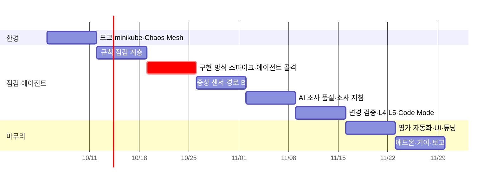

# KubeGuardian AI — 실행 계획서

> 기획서: [01-project-proposal.md](01-project-proposal.md) (v2.3 — 규칙 우선 + AI 조사, 프레임워크 비한정, 학습 목적, 업무 효율 KPI, 최신 에이전트 기술 도입)
> 1인 · 8주. 각 주는 **종료 조건(Exit)**을 만족해야 다음 주로 넘어간다.

## 0. 계획의 원칙

1. **규칙 → 게이트 → AI 순서로 쌓는다.** 규칙 점검을 먼저 세우고(W2), 그 위에 AI 게이트와 에이전트 골격을 올린다(W3). 증상 센서는 경로 B를 열기 위해 W4에 붙인다.
2. **에이전트를 늦게 붙이지 않는다.** W3에 최소 도구로 AI 조사가 도는 상태를 만든다. 방향 검증(M2)을 일찍 하기 위해서다.
3. **시나리오가 곧 테스트다.** 기능을 만들 때마다 해당 시나리오로 채점한다. 시나리오는 `expected.yaml`부터 쓴다.
4. **배운 것을 매주 남긴다.** 1차 목적이 학습이므로, 주간 학습 노트와 ADR은 산출물이다.
5. **개발용 가시성은 앞에, 제품 화면 다듬기는 뒤에.** 에이전트가 무엇을 했는지는 처음부터 볼 수 있어야 한다.
   - 실행 추적: Phoenix (W1) + OpenTelemetry GenAI 표준 계측 (W3)
   - 명령줄: CLI (W2~)
   - 개발용 화면: Chainlit (W3~)
   - 제품 화면: 템플릿과 같은 React 스택으로 W5부터 점진 구현. **범위 축소 예정** (남길 화면은 별도 정리 후 이 계획에 반영)
6. **신기술은 eval로 검증한다.** MCP, Code Mode, Skills 방식 지침, ITBench 모두 기존 방식과 같은 시나리오로 비교해 효과를 수치로 남긴다.

---

## 1. 레포 구성

### 1.1 템플릿 포크

템플릿 조직의 앱 레포 6개와 `shared-infra`를 개인·PoC 조직으로 포크한다. 수정은 기획서 §6.2의 F1~F7에 한정한다.

| 포크 레포 | 수정 |
|---|---|
| shared-infra | F1 서비스 주소, F6 `kubernetes/local/` overlay (postgres·redis·로컬 이미지), F3 probe 전환 옵션 |
| backend-agent | F2 검색 선택화, F3 `/health/ready`, F4 버전 노출, F7 v2 (컬럼 추가) |
| backend-gateway · backend-llm-gateway | F3, F4 |
| backend-admin | F3, F4, F5 테스트 사용자 시드 |
| frontend | 없음 (빌드만) |

### 1.2 KubeGuardian 레포

```text
KubeGuardian/
├── apps/diagnostic-agent/app/
│   ├── api/routes/            # checks, investigations, changes, chat, evidence
│   ├── core/                  # 설정, 로깅 (템플릿 규약)
│   ├── checks/                # ── 결정적 점검 계층 ──
│   │   ├── detectors/         #   N·P·W·S·C·H 카테고리 (H = 개선 권고)
│   │   ├── symptoms/          #   API 시나리오, L7, 지연, 추세, 앱 자가 보고
│   │   └── gate.py            #   경로 A / B / C 판정
│   ├── tools/                 # ── 에이전트 도구 계층 (프레임워크 독립, sensors를 감쌈) ──
│   ├── mcp_server/            # 도구 계층을 MCP 서버로 노출
│   ├── sensors/               # 사실 수집: collector, topology, probes, metrics, app_api
│   ├── agent/                 # ── 에이전트 코어 (구현 방식별) ──
│   │   ├── interface.py       #   공통 입력·출력 스키마 (Issue, Hypothesis, Report)
│   │   ├── impl_<선택안>/      #   W3 스파이크 후 선택한 구현
│   │   ├── codemode/          #   Code Mode 실행기 (샌드박스에 코드 전달·결과 수집)
│   │   └── spikes/            #   비교용 구현 (보존)
│   ├── guard/                 # redact, validate, budget
│   ├── knowledge/             # 템플릿 공통 조사 지침(Skills 방식), 환경 설명
│   ├── store/                 # SQLite
│   ├── devui/                 # 개발용 화면 (Chainlit)
│   └── cli.py                 # kg check / investigate / verify
├── apps/diagnostic-ui/        # 제품 화면 (React 18·TS·Vite·Tailwind·shadcn/ui, 템플릿 frontend와 동일 스택)
├── deploy/
│   ├── kubeguardian/          # 에이전트, SA·ClusterRole, PVC, kubeguardian.yaml 예시
│   ├── agent-sandbox/         # Sandbox CRD·컨트롤러, 샌드박스 NetworkPolicy (Code Mode)
│   └── chaos-mesh/            # 평가 환경 전용
├── scenarios/                 # H0, A1~A5, B1~B3, C1~C5, D1~D2, E1, X1~X7
│   └── <ID>/{inject.sh, reset.sh, verify_symptom.sh, expected.yaml, README.md}
├── load/                      # k6
├── eval/                      # 일괄 실행·채점·리포트, 블라인드 자가 진단, LLM-as-judge, ITBench
├── Makefile                   # up / down / inject S= / reset S= / eval COND= / blind
└── docs/
    ├── adr/                   # 설계 결정 기록
    └── learning/              # 주간 학습 노트
```

## 2. 주차별 계획

각 주에 **학습 초점**을 함께 적었다. 학습 노트는 그 주의 시나리오를 중심으로 쓴다.

### W1 — 환경: 템플릿 포크를 minikube에 정상 기동

**학습 초점**: 컨테이너 이미지와 레지스트리, Deployment·Service·ConfigMap·Secret의 관계, minikube 구조, CRD 기반 도구(Chaos Mesh) 설치

| 작업 | 산출물 |
|---|---|
| **Day 1 스파이크**: minikube Pod 안에서 Azure OpenAI 호출 (사내 SSL CA 주입 포함) | 연결 확인 스크립트 |
| 템플릿 포크, F1·F2·F6 적용 | 포크 브랜치 |
| 선택 의존성(Milvus, MinIO, Naver, Notion 키) 없이 각 앱이 기동되는지 확인, 필요 시 포크에서 선택화 | 확인 기록 |
| 앱 6개 로컬 빌드 → `minikube image load`, agent ×3·gateway ×2 | `make up` |
| metrics-server addon, Chaos Mesh 설치 | `deploy/chaos-mesh/` |
| **Phoenix 설치** (템플릿 `infra-phoenix`, `kubeguardian` 네임스페이스) | 에이전트 실행 추적 준비 |
| F5 테스트 사용자 시드, 로그인 → 채팅 E2E 확인 | 스모크 스크립트 |
| **ITBench 실행 가능성 확인 (반나절 타임박스)**: 과제 환경 자원 요구량, minikube 호환 여부 | 확인 기록 → 기획서 §10.6 경로 결정 |
| H0 정의, A5(원본 템플릿 상태) 시나리오 작성 | `scenarios/H0`, `A5` |

**Exit**
- `make up` 후 전 Pod Ready
- front-chat 경유 로그인 → 채팅이 실제 Azure OpenAI 응답으로 성공
- A5 inject 시 채팅 실패, reset 시 복구
- 학습 노트: "원본 템플릿은 왜 클러스터에서 동작하지 않았나"

### W2 — 규칙 점검 계층

**학습 초점**: K8s API 객체 모델(spec/status, ownerReferences, selector, EndpointSlice), RBAC 최소 권한 설계

| 작업 | 산출물 |
|---|---|
| 수집기 (리소스, 로그 current/previous, 이벤트) + 정규화 스냅샷 | `sensors/collector` |
| Evidence 저장소 + id 발급 | `store/` |
| 토폴로지 (env URL 파싱 → declared/unresolved, 계층) | `sensors/topology` |
| 감지기 (상태·선언): N01, N02, P01~P05, P07~P09, W01, W02, S01~S05, C01 + 개선 권고 H01, H02 | `checks/detectors` |
| 신호 등급(장애 신호 / 개선 권고) + **게이트 v0** (경로 A·C만) | `checks/gate.py` |
| 규칙 점검 보고서 API (`POST /checks`) | API |
| **CLI `kg check`**: 규칙 점검 결과·신호 등급·게이트 판정을 터미널에 출력 | `cli.py` |
| 마스킹 (로그·**이벤트**·env) + 단위 테스트 | `guard/redact` |
| SA `kubeguardian` + 최소 권한 ClusterRole | `deploy/kubeguardian/rbac.yaml` |
| A1~A4 시나리오 | `scenarios/` |
| ADR-001 도구 계층과 에이전트 코어의 경계 | `docs/adr/` |

**Exit**
- A1~A5 모두 해당 규칙이 장애 신호로 적발, 게이트가 경로 A 판정
- H0에서 개선 권고만 나오고 게이트는 경로 C
- 토폴로지가 템플릿 기대 엣지와 일치 (테스트로 고정)
- `kubectl auth can-i --as=system:serviceaccount:kubeguardian:kubeguardian`로 쓰기 권한 없음 확인

### W3 — 에이전트 구현 방식 스파이크 + 에이전트 골격 (가장 중요한 주)

**학습 초점**: 에이전트 루프의 원리, 도구 설계, 구조화 출력, 프레임워크별 설계 철학

| 작업 | 산출물 |
|---|---|
| 에이전트 공통 인터페이스 (입력: 게이트 결과·신호판 / 출력: Issue·Hypothesis·Report 스키마) | `agent/interface.py` |
| 도구 1차 (7종): signal_board, topology, get_resource, list_pods, get_pod_logs, get_events, search_runbook | `tools/` |
| **MCP 서버**: 도구 1차 7종을 MCP로 노출. 에이전트는 MCP 클라이언트로 도구 사용. Claude Code 등 외부 에이전트에서 호출 확인 | `mcp_server/` |
| **스파이크 (2일 타임박스)**: 후보 2개 이상(예: LangGraph, DeepAgents, 직접 루프)으로 같은 도구·같은 시나리오(A1, A5) 구현 → 비교 | `agent/spikes/`, 비교표 |
| **ADR-002 에이전트 구현 방식 선택** (정확도·토큰·상한 강제 용이성·코드량·추적 용이성) | `docs/adr/` |
| 선택안으로 선별·작성 구현, 근거 검증기, 출력 파싱 방어, 상한 | `agent/impl_*`, `guard/` |
| 게이트 → AI 연결, SSE 진행 스트림 | API |
| **Phoenix 추적 연동**: 스파이크 후보 모두 같은 추적으로 도구 호출·프롬프트·토큰 비교. **OpenTelemetry GenAI 표준 속성**으로 계측 (MCP 도구 호출 포함) | 추적 설정 |
| **CLI `kg investigate`**: 조사 진행(계획·도구 호출·가설)을 실시간 출력 | `cli.py` |
| **개발용 화면 (Chainlit)**: 점검 결과, AI 브리핑, 도구 호출 단계 펼침, 근거 원문, 후속 질문 | `devui/` |
| **평가 러너 최소판**: `make eval S=<ID>` = 주입 → 증상 확인 → 점검·게이트·AI → 채점 → 원복 | `eval/` |

**Exit**
- 비교표와 ADR-002 작성 완료
- `make eval S=A1`이 사람 개입 없이 끝까지 돌고 채점 결과를 출력
- L1 시나리오 5개에서 **AI 브리핑 1순위 = 주입 장애**가 5개 중 4개 이상 (3회 반복 다수결)
- 모든 브리핑이 근거 검증기 통과

> **M2 체크포인트**: L1 선별이 4/5 미만이면 W4 착수 전에 신호판 구조와 프롬프트를 먼저 고친다. 비용은 X 시나리오를 포기해 흡수한다.

### W4 — 증상 센서 (경로 B 열기) + 도구 확장

**학습 초점**: Service 라우팅과 Pod 직접 호출, DNS, probe 동작 원리, metrics API, 부하와 자원 제한

| 작업 | 산출물 |
|---|---|
| 핵심 API 시나리오 (로그인 → 채팅 → 스트리밍), L4/L7 프로브 (Service 경유 10회 + Pod 직접) | `checks/symptoms`, `sensors/probes` |
| 메트릭 샘플러 (15초, 30분 링버퍼) + 추세 센서 | `sensors/metrics` |
| 앱 조회 (`query_app_api`, GET·허용 목록) + 앱 자가 보고 센서 | `sensors/app_api` |
| **게이트 v1**: 경로 B 추가 | `checks/gate.py` |
| 도구 추가: probe, run_api_scenario, compare_pods, get_metric_series, query_app_api | `tools/` |
| 나머지 감지기: N03, P06, C02, H03 | `checks/detectors` |
| F3 `/health/ready`, F4 버전 노출 (포크) | 포크 |
| k6 부하 스크립트 | `load/` |
| B1~B3, C1~C3 시나리오 (`verify_symptom.sh` 포함) | `scenarios/` |
| **H0 1시간 연속 실행**으로 증상 센서 기준 확정 | 기준값 기록 |
| 개발용 화면에 증상 센서 결과·게이트 경로 표시 | `devui/` |
| 제품 화면 프로젝트 셋업 (템플릿 frontend 설정·공용 컴포넌트 재사용, API 클라이언트) | `apps/diagnostic-ui/` |

**Exit**
- H0 1시간 동안 게이트 경로 C 유지 (오탐 0)
- B1, C1~C3에서 규칙은 통과하고 증상 센서가 게이트를 경로 B로 엶
- **① 규칙+증상 센서만** 조건으로 L1~L3 기준선 기록

### W5 — AI 조사 품질: 가설 루프 + 조사 지침

**학습 초점**: 컨텍스트 엔지니어링(지침·환경 설명의 효과), 가설 기반 조사 설계, 앱 층 장애가 K8s에서 어떻게 보이는가

| 작업 | 산출물 |
|---|---|
| 증상 조사: 조사 계획 선출력 → 가설 ≤3 → 도구 → 판정, 보고서 8개 섹션 | `agent/impl_*` |
| 경로 B 전용 전략: 증상에서 토폴로지를 따라 역추적하는 가설 수립 | 프롬프트·지침 |
| 대화: 기존 evidence 재사용 + 필요 시 추가 도구 | `POST /chat` |
| 템플릿 공통 조사 지침 v1 (**Skills 방식**: 증상·장애 유형별 문서 + 한 줄 설명, 필요 시 로드), 환경 설명 문서 | `knowledge/` |
| Skills 방식 vs 지침 전체 주입 비교 (L1~L3, 원인 Top-1·토큰) | 비교 기록 |
| 도구 출력 변환기 (필드 선별·요약) | `tools/` |
| C4, C5 시나리오 (F7 v2 이미지) | `scenarios/` |
| ADR-003 근거 모델과 검증기 설계 | `docs/adr/` |
| **제품 화면 1·2**: 워크스페이스(정상·이상), 조사 보고서(조사 계획·가설 타임라인·근거 드로어·대화) | `apps/diagnostic-ui/` |

**Exit**
- L3 시나리오 5개 중 원인 Top-1이 3개 이상
- ② AI 조사 vs ③ AI 조사+조사 지침 1차 비교 기록

### W6 — 변경 검증 + L4·L5 + Code Mode

**학습 초점**: 롤아웃과 ReplicaSet 교체, ConfigMap 전파 시점(설정 잠복), CPU throttling·OOM의 커널 동작, Sandbox CRD·NetworkPolicy·ServiceAccount 토큰 마운트 동작

| 작업 | 산출물 |
|---|---|
| 스냅샷 API, before 기준 선택, diff | `POST /snapshots` |
| 변경 검증: 영향 범위 재검증(결정적) → 이상 시 AI 조사로 넘김 | `POST /changes` |
| 감지기 C03(설정 잠복), C04(복수 적용 주체) | `checks/detectors` |
| CLI `kg verify --after-change` | `cli.py` |
| **제품 화면 3**: 변경 검증 (타임라인 + diff 드로어 + 영향 범위) | `apps/diagnostic-ui/` |
| D1, D2, E1 시나리오 (부하·시계열·미끼) | `scenarios/` |
| **K8s Agent Sandbox 설치** + 샌드박스 권한 설계: SA 토큰 미마운트, NetworkPolicy(MCP 서버만 허용), 실행 시간·메모리 상한 | `deploy/agent-sandbox/` |
| **Code Mode 구현**: 에이전트가 쓴 코드를 샌드박스에서 실행, 코드 안 도구 호출도 evidence로 저장·상한 합산 | `agent/codemode/` |
| 샌드박스 우회 시도 테스트 (K8s API 직접 호출, 외부 통신, 쓰기 요청) | 테스트 기록 |
| ADR-004 Code Mode 샌드박스 권한 설계 | `docs/adr/` |

**Exit**
- B2를 변경 검증으로 실행하면 "신규 ReplicaSet의 env 변경"이 원인으로 판정됨
- D2에서 추세 센서가 OOM 전에 게이트를 엶 (경로 B), AI가 메트릭 추세를 근거로 인용
- E1에서 미끼(과거 재시작)를 1순위로 올리지 않음
- Code Mode가 A1·A5·C1에서 끝까지 동작하고, 샌드박스 우회 시도가 모두 차단됨

### W7 — 평가 자동화 + UI + 튜닝

**학습 초점**: 에이전트 평가 설계, 결과 편차 다루기, 회귀 관리

| 작업 | 산출물 |
|---|---|
| 평가 러너 확장: `make eval COND=1\|2\|3` 전체 시나리오 × 3회 반복 | `eval/` |
| 채점: 게이트 정확도, 선별 정확도(레벨별), 원인 Top-1/3(경로별), 인용률, 시간, 토큰 | `eval/report.md` 자동 생성 |
| 채점 추가 (업무 효율 KPI, 기획서 §10.1): K3 신호 압축률, 원인 규명 커버리지 (`expected.yaml`의 `k8s_visible` 기준) | `eval/report.md` |
| **블라인드 주입 스크립트 `make blind`**: 시나리오 풀(MVP + H0)에서 무작위 선택·주입, 선택 결과 숨김, 증상 문장 출력, 같은 증상으로 KubeGuardian 백그라운드 실행 후 시간·결과만 기록 | `eval/blind/` |
| **블라인드 자가 진단 약 10건** (레벨별 2~3건, 여러 날에 분산, 30분 제한, kubectl·curl만) → K1 원인 도달 시간 단축률, K2 제한 시간 내 해결률 계산 | `eval/blind/results.md` |
| 보고서 루브릭 평가 양식 + **LLM-as-judge 채점기**. 본인 채점 10건과 일치도 확인 후 전체 채점에 사용 | `eval/rubric.md`, `eval/judge/` |
| **Code Mode vs 도구 호출 방식 비교**: 같은 에이전트·시나리오로 원인 Top-1, 토큰, 시간, 도구 호출 수 비교 | 비교표 |
| **ITBench 평가**: W1 확인 결과에 따라 SRE 과제 일부 실행 또는 채점 방식을 자체 시나리오에 적용 (기획서 §10.6) | `eval/itbench/` |
| **제품 화면 4·5·6**: 토폴로지, Pod 비교, 이력 + 전체 다듬기 (**범위 축소 예정**, 별도 정리 후 확정) | `apps/diagnostic-ui/` ([04-ui-spec.md](04-ui-spec.md)) |
| 프롬프트·지침 튜닝 (**튜닝 후 전체 eval 재실행으로 회귀 확인**) | — |
| (여유 시) 선택하지 않은 구현 방식으로 MVP 전체 eval 재실행 → 프레임워크 비교 보강 | 비교표 v2 |
| (여유 시) X 시나리오 | `scenarios/X*` |

**Exit**
- `make eval` 한 번으로 3단 비교 × 레벨별 × 경로별 결과표 생성
- 업무 효율 KPI K1~K3과 원인 규명 커버리지 측정값 기록 (K1·K2는 중앙값 + 사례별 표)
- Code Mode 비교표, ITBench(또는 ITBench 방식 채점) 결과, LLM-as-judge 일치도 기록

### W8 — 애드온 정리 + 템플릿 기여 준비 + 결과·학습 보고

| 작업 | 산출물 |
|---|---|
| `infra-kubeguardian` 형태로 정리: `deploy/`, 설치 스크립트, `kubeguardian.yaml` 예시, README | 애드온 구조 |
| 범용성 확인: 서비스 이름·포트를 바꾼 변형 환경에서 설정만 바꿔 점검·AI 조사 동작 | 확인 기록 |
| 애드온에 MCP 서버 포함, 외부 에이전트 연결 방법 README에 기재 | 애드온 구조 |
| ADR-005 에이전트 운영 방식: FastAPI Deployment vs kagent식 CRD 에이전트 비교 | `docs/adr/` |
| 템플릿 기여 PR 초안: F1, F2, F3, F4, F6 | PR 초안 (머지는 팀 합의 후) |
| 평가 결과 보고서 (업무 효율 KPI를 헤드라인으로, 품질 지표를 전제 조건으로) | `docs/05-evaluation-report.md` |
| **학습 회고**: 규칙이 통하지 않은 지점, 에이전트가 틀린 사례와 원인, 프레임워크 선택 회고 | `docs/07-retrospective.md` |
| 데모 3종 리허설: A5(원본 템플릿 결함, 경로 A), C1(할당량 → 502, 경로 B), E1(미끼 무시) | `docs/06-demo-script.md` |

**Exit**
- 성공 기준 표 전 항목에 측정값이 채워지고, 미달 항목은 원인·후속안이 기재됨
- 학습 노트 16건, ADR 5건 이상

## 3. 마일스톤



| 체크포인트 | 시점 | 판단 |
|---|---|---|
| M1 환경 | W1 말 | Azure OpenAI 연결이 안 되면 사내 네트워크 담당과 협의. 그동안 W2(규칙 계층)는 LLM 없이 진행 |
| **M2 방향 검증** | W3 말 | 구현 방식 선택 완료 + L1 선별 4/5 이상. 미달 시 신호판·프롬프트 보강 후 W4 |
| M3 AI 가치 | W5 말 | 경로 B(L3)에서 ①과 ②·③의 차이가 없으면, 지침·도구 출력을 집중 보강하고 L4를 1개로 축소 |
| M4 최종 | W8 말 | 성공 기준·학습 산출물 판정 |

## 4. 주간 운영

- 매주 금요일
  - Exit 조건 점검
  - 그 주까지의 시나리오로 `make eval` 실행 (W3부터 자동), 결과를 `eval/history/`에 누적
  - 학습 노트 작성
- 프롬프트·지침을 바꾸면 반드시 전체 eval로 회귀 확인
- 시나리오 inject 후 `verify_symptom.sh`로 증상 발생을 확인한다. 증상이 안 나면 그 실행은 무효 처리

## 5. 템플릿 기여 계획

| 항목 | 내용 | 기여 시점 |
|---|---|---|
| F1 | K8s 매니페스트에 서비스 주소 설정 | W8 PR 초안 (결함 수정이므로 우선) |
| F2 | 검색 선택 기능화 | W8 |
| F3 | `/health/ready` + readinessProbe 전환 옵션 | W8 |
| F4 | 버전 노출 | W8 |
| F6 | `kubernetes/local/` minikube overlay | W8 |
| 애드온 | `infra-kubeguardian` 레포 신설 제안 | PoC 결과 보고 후 |

## 6. 착수 전 준비물

- [ ] 로컬 머신 여유 메모리 ≥ 12GB, minikube·kubectl·docker·k6 설치
- [ ] Azure OpenAI 배포 2종 이상 (진단 에이전트용, 진단 대상 서비스용) 및 PoC 사용·비용 승인
- [ ] 사내 SSL 프록시 CA 인증서
- [ ] 템플릿 레포 포크 권한 (개인 또는 PoC 조직)
- [ ] ITBench 레포 확인 (과제 환경 요구사항, 라이선스)
- [ ] Agent Sandbox 컨트롤러의 minikube 설치 요건 확인
