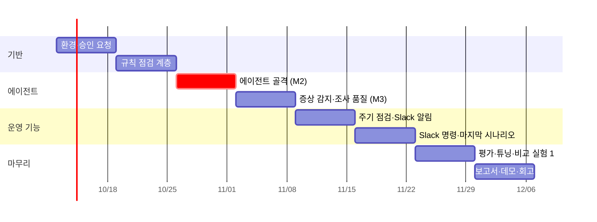

# KubeGuardian AI — 실행 계획서

> 기획서: [01-project-proposal.md](01-project-proposal.md) v3.0
> 1인 · 8주 · **주 10~15시간**. 각 주는 **종료 조건(Exit)** 을 만족해야 다음 주로 넘어간다.

## 0. 계획의 기준

### 0.1 시간 예산

| 항목 | 시간 |
|---|---|
| 쓸 수 있는 시간 | 8주 × 10~15시간 = 80~120시간 |
| **핵심 범위 배치** | **주 약 12시간, 총 약 96시간** |
| 버퍼 | 주 최대 3시간 (15시간까지). 지연 흡수가 먼저이고, 남으면 선택 비교 실험(§4)에 쓴다 |
| 매주 고정 | 학습 노트 0.5시간 (각 주 시간에 포함) |

- 주차 작업의 시간은 추정치다. 매주 금요일에 실제 사용 시간을 기록하고, 두 주 연속 15시간을 넘으면 §5의 축소 순서를 적용한다.
- 일정: W1 = 2026-10-12 주. 시작일이 바뀌면 주차만 밀린다.

### 0.2 계획의 원칙

1. **규칙 → 에이전트 → 주기 점검·Slack 순서로 쌓는다.** 진단이 맞아야 알림이 의미가 있으므로, Slack은 에이전트가 L1·L3에서 동작한 뒤(W5~)에 붙인다.
2. **에이전트를 늦게 붙이지 않는다.** W3에 L1 시나리오로 AI 조사가 끝까지 도는 상태를 만든다 (M2 체크포인트).
3. **시나리오가 곧 테스트다.** 기능을 만들 때마다 해당 시나리오로 채점한다. 시나리오는 `expected.yaml`부터 쓴다.
4. **승인이 필요한 것은 W1에 요청한다.** Slack 앱 생성, 사내망 통신(Azure OpenAI, Slack API)은 기다리는 시간이 길다.
5. **Slack 없이도 개발·평가가 돈다.** 알림·명령 기능은 CLI와 Chainlit의 "Slack 미리보기"로 먼저 확인하고, 평가 러너는 알림 이력(SQLite)으로 채점한다. Slack 승인이 늦어도 W5까지는 막히지 않는다.

---

## 1. 레포 구성

### 1.1 템플릿 포크

템플릿 조직의 앱 레포 6개와 `shared-infra`를 개인·PoC 조직으로 포크한다. 수정은 기획서 §5.2의 F1·F2·F5·F6·F7에 한정한다.

| 포크 레포 | 수정 |
|---|---|
| shared-infra | F1 서비스 주소, F6 `kubernetes/local/` overlay (postgres·redis·로컬 이미지) |
| backend-agent | F2 검색 선택화, F7 v2 이미지 (컬럼 추가) |
| backend-admin | F5 테스트 사용자 시드 |
| backend-gateway · backend-llm-gateway · frontend | 없음 (빌드만) |

### 1.2 KubeGuardian 레포

```text
KubeGuardian/
├── apps/diagnostic-agent/app/
│   ├── checks/                # ── 결정적 점검 계층 ──
│   │   ├── detectors/         #   장애 신호 10종 + 개선 권고 2종
│   │   ├── symptoms.py        #   API 시나리오 증상 감지
│   │   └── gate.py            #   경로 A / B / C 판정
│   ├── sensors/               # 사실 수집: collector, topology, probes, app_api
│   ├── tools/                 # 에이전트 도구 7종 (프레임워크 독립, sensors를 감쌈)
│   ├── agent/                 # 에이전트 코어
│   │   ├── interface.py       #   공통 입력·출력 스키마 (Issue, Hypothesis, Report)
│   │   ├── impl_langgraph/    #   기본 구현
│   │   └── impl_loop/         #   비교 실험 1: 직접 구현한 도구 호출 루프
│   ├── guard/                 # redact, validate, budget
│   ├── alerts/                # 문제 지문, 알림 상태 (열림/해결)
│   ├── notify/                # Slack 메시지 변환(M1~M8), 발송
│   ├── slack_app/             # Socket Mode 명령 수신 (/kg check·investigate·evidence)
│   ├── knowledge/             # 조사 지침, 환경 설명
│   ├── store/                 # SQLite (evidence, 보고서, 알림 이력)
│   ├── devui/                 # Chainlit 개발용 화면
│   └── cli.py                 # kg check / investigate / report / evidence / alerts
├── deploy/
│   ├── kubeguardian/          # SA·ClusterRole, PVC, CronJob, diagnostic-agent Deployment, Secret 예시
│   └── chaos-mesh/            # 평가 환경 전용
├── scenarios/                 # H0, A1, A3, A5, B1, C1, C2, C5, E1 (+ 확장 후보)
│   └── <ID>/{inject.sh, reset.sh, verify_symptom.sh, expected.yaml, README.md}
├── eval/                      # 평가 러너, 채점, 리포트
├── Makefile                   # up / down / inject S= / reset S= / eval S= / eval
└── docs/
    ├── adr/                   # 설계 결정 기록
    └── learning/              # 주간 학습 노트
```

## 2. 주차별 계획

각 주에 **학습 초점**을 함께 적었다. 학습 노트는 그 주의 시나리오를 중심으로 쓴다.

### W1 — 환경: 템플릿 포크를 minikube에 정상 기동 (약 12시간)

**학습 초점**: 컨테이너 이미지와 레지스트리, Deployment·Service·ConfigMap·Secret의 관계, CRD 기반 도구(Chaos Mesh)

| 작업 | 시간 | 산출물 |
|---|---|---|
| **Day 1 스파이크**: minikube Pod 안에서 Azure OpenAI 호출 (사내 SSL CA 주입 포함) | 2 | 연결 확인 스크립트 |
| **승인 요청**: Slack 앱 생성(메시지 발송·슬래시 명령·Socket Mode 권한), 사내망에서 slack.com 통신 확인 | 0.5 | 요청 기록 |
| 템플릿 포크, F1·F2·F6 적용, 선택 의존성(Milvus, MinIO 등) 없이 기동 확인 | 5 | 포크 브랜치, `make up` |
| F5 테스트 사용자 시드, 로그인 → 채팅 E2E 확인 | 2 | 스모크 스크립트 |
| metrics-server, Chaos Mesh, Phoenix 설치 | 1.5 | `deploy/chaos-mesh/` |
| H0 정의, A5(원본 템플릿 상태) 시나리오 스크립트 | 0.5 | `scenarios/H0`, `A5` |
| 학습 노트: "원본 템플릿은 왜 클러스터에서 동작하지 않았나" | 0.5 | `docs/learning/w1-*.md` |

**Exit**
- `make up` 후 전 Pod Ready, front-chat 경유 로그인 → 채팅이 실제 Azure OpenAI 응답으로 성공
- A5 inject 시 채팅 실패, reset 시 복구
- Slack 앱 승인 요청 완료

### W2 — 규칙 점검 계층 (약 12.5시간)

**학습 초점**: K8s API 객체 모델(spec/status, ownerReferences, selector, EndpointSlice), RBAC 최소 권한

| 작업 | 시간 | 산출물 |
|---|---|---|
| 수집기 (리소스, 로그 current/previous, 이벤트) + 정규화 | 2.5 | `sensors/collector` |
| Evidence 저장소 + id 발급 | 1 | `store/` |
| 토폴로지 (env URL 파싱 → declared/unresolved, 계층) | 2 | `sensors/topology` |
| 감지기 장애 신호 10종 + 개선 권고 2종, 단위 테스트 | 3.5 | `checks/detectors` |
| 게이트 v0 (경로 A·C) | 0.5 | `checks/gate.py` |
| 마스킹 (로그·이벤트·env) + 단위 테스트 | 1 | `guard/redact` |
| SA `kubeguardian` + 최소 권한 ClusterRole | 0.5 | `deploy/kubeguardian/rbac.yaml` |
| CLI `kg check` (규칙 결과·게이트 판정 출력) | 0.5 | `cli.py` |
| A1 시나리오 + 학습 노트 | 0.5 | `scenarios/A1` |
| ADR-001 도구 계층과 에이전트 코어의 경계 | 0.5 | `docs/adr/` |

**Exit**
- A1·A5에서 해당 감지기(S01·S02 / S04)가 장애 신호로 적발, 게이트가 경로 A
- H0에서 개선 권고만 나오고 게이트는 경로 C
- `kubectl auth can-i`로 쓰기 권한 없음 확인

### W3 — 에이전트 골격 (가장 중요한 주, 약 12시간)

**학습 초점**: 가설 → 도구 검증 → 판정 루프, 근거 인용 강제, 구조화 출력

| 작업 | 시간 | 산출물 |
|---|---|---|
| 에이전트 공통 인터페이스 (입력: 게이트 결과·신호판 / 출력: Issue·Hypothesis·Report) | 1 | `agent/interface.py` |
| 도구 7종 (get_topology, get_resource, get_pod_logs, get_events, probe, run_api_scenario, query_app_api) | 3 | `tools/` |
| LangGraph 구현: 선별 → 조사 → 보고서 작성 | 3.5 | `agent/impl_langgraph/` |
| 근거 검증기, 출력 파싱 방어, 호출·시간 상한 | 2 | `guard/` |
| Phoenix 추적 연동 (OpenTelemetry GenAI 속성) | 0.5 | 추적 설정 |
| 평가 러너 최소판: `make eval S=<ID>` = 주입 → 증상 확인 → 점검·게이트·AI → 채점 → 원복 | 1.5 | `eval/` |
| A3 시나리오 + 학습 노트 | 0.5 | `scenarios/A3` |

**Exit**
- `make eval S=A1`이 사람 개입 없이 끝까지 돌고 채점 결과를 출력
- L1 3개(A1·A3·A5)에서 **요약 1순위 = 주입 장애**가 3개 모두 (3회 반복 다수결)
- 모든 보고서가 근거 검증기 통과
- **조사 1회 실측 시간·토큰 기록** → 기획서 §9.2 잠정 목표 재설정

> **M2 체크포인트**: L1 선별이 3개 중 2개 이하면 W4 전에 신호판 구조와 프롬프트부터 고친다. 시간은 버퍼에서 쓰고, 부족하면 §5 축소 순서를 적용한다.

### W4 — 증상 감지(경로 B) + 조사 품질 (약 13시간)

**학습 초점**: Service 라우팅과 Pod 직접 호출, 서비스 간 통신 차단, 앱 층 장애가 K8s에서 어떻게 보이는가

| 작업 | 시간 | 산출물 |
|---|---|---|
| API 시나리오 증상 감지, 게이트 v1(경로 B), `kg investigate` | 2 | `checks/symptoms.py` |
| 가설 루프 + 보고서 섹션 완성 (배제 이유, 확인한 범위·확인하지 못한 것, 권장 조치, 재검증) | 3 | `agent/impl_langgraph/` |
| 조사 지침(장애 유형 단위)·환경 설명 문서 | 2 | `knowledge/` |
| C1(할당량), C2(Redis 차단) 시나리오 + `verify_symptom.sh` | 2.5 | `scenarios/` |
| B1(Pod 1개만 오류) 시나리오 | 1 | `scenarios/B1` |
| Chainlit 개발용 화면 (단계 펼침, 근거 원문) | 1.5 | `devui/` |
| 기준 조건(규칙만) 결과 기록 + 학습 노트 | 1 | `eval/history/` |

**Exit**
- C1·C2에서 규칙은 통과하고 증상 감지가 게이트를 경로 B로 엶
- L3 2개(C1·C2) 중 원인 1순위 정답 1개 이상
- 보고서만 보고 조치할 수 있는지 본인 확인 (확인한 범위·구체적 조치 포함)

> **M3 체크포인트**: C1·C2 모두 원인을 못 찾으면 W5 전에 지침·도구 출력을 보강한다. 이때는 W6의 E1을 확장 후보로 내린다.

### W5 — 주기 점검 + Slack 알림 (약 12시간)

**학습 초점**: CronJob(주기 실행, 중복 실행 방지), PVC 공유, 외부 API 연동

| 작업 | 시간 | 산출물 |
|---|---|---|
| CronJob 5분 주기, `concurrencyPolicy: Forbid`, Job과 PVC(SQLite) 공유 | 1.5 | `deploy/kubeguardian/cronjob.yaml` |
| 문제 지문 + 알림 상태(열림/해결) + 진행 중 문제는 AI·알림 생략 | 3 | `alerts/` |
| Slack 발송: M1 이상 알림, M2 전체 보고서(스레드, 길이 분할), M3 복구 알림 | 4 | `notify/` |
| 평가 러너에 장애 감지 시간 기록 (주입 시각 → 알림 이력의 발송 시각), 평가용 채널 | 1 | `eval/` |
| C5(스키마 드리프트) 시나리오: F7 v2 이미지 빌드 | 2 | `scenarios/C5` |
| 학습 노트 | 0.5 | |

**Exit**
- C1 주입 → 다음 주기 점검에서 Slack 알림(요약 + 스레드 보고서) 도착, **7분 이내**
- 장애가 이어지는 동안 같은 알림이 반복되지 않고, reset 후 복구 알림 1회
- Slack 승인이 안 났으면: 같은 흐름을 Chainlit "Slack 미리보기"와 알림 이력으로 확인

### W6 — Slack 명령 + 마지막 시나리오 (약 12시간)

**학습 초점**: 항상 떠 있는 프로세스(Deployment)와 CronJob의 역할 분리, 비동기 처리

| 작업 | 시간 | 산출물 |
|---|---|---|
| diagnostic-agent Deployment + Socket Mode 명령 수신 (`slack_bolt`) | 2 | `slack_app/`, `deploy/` |
| `/kg check`, `/kg investigate`, `/kg evidence`: 3초 내 접수, 비동기 실행, M4~M8, 허용 채널·사용자, 동시 실행 제한 | 3.5 | `slack_app/` |
| Slack 연동 테스트 (Slack API 모의 객체로 메시지 형식·스레드·오류 경로) | 1.5 | `tests/` |
| E1(미끼 신호) 시나리오 | 1.5 | `scenarios/E1` |
| H0 주기 점검 4시간(48회) 연속 실행, 기준 조정 | 2 | 기준값 기록 |
| ADR-002 문제 지문·알림 설계 + 학습 노트 | 1 | `docs/adr/` |

**Exit**
- Slack에서 `/kg investigate`로 B1을 조사하면 같은 스레드에 조사 계획 → 보고서가 올라옴
- H0 4시간 동안 잘못된 알림 0건
- E1에서 미끼(과거 재시작)를 1순위로 올리지 않음

### W7 — 평가 + 튜닝 + 비교 실험 1 (약 12시간)

**학습 초점**: 평가 설계, 결과 편차 다루기, 회귀 관리

| 작업 | 시간 | 산출물 |
|---|---|---|
| 평가 러너 확장: 전체 시나리오 × 2조건 × 3회, `eval/report.md` 자동 생성 | 3 | `eval/` |
| KPI 계산: 원인 규명 커버리지, 원인 정확도, 장애 감지 시간, 확인 항목 감소율, 조사 시간·비용 | 1 | `eval/report.md` |
| 근거 일치율: 보고서 10건 본인 검토 | 1.5 | 검토 기록 |
| 프롬프트·지침 튜닝 (**튜닝 후 전체 eval로 회귀 확인**) | 3 | — |
| **비교 실험 1**: 직접 구현한 도구 호출 루프로 같은 시나리오 실행 → LangGraph와 비교 | 3.5 | `agent/impl_loop/`, 비교표 |

**Exit**
- `make eval` 한 번으로 2조건 × 레벨별 × 경로별 결과표 생성
- KPI 전 항목에 측정값 기록
- 비교 실험 1 비교표 + ADR-003 에이전트 구현 방식

### W8 — 마무리: 보고서·데모·회고 (약 12시간)

| 작업 | 시간 | 산출물 |
|---|---|---|
| 지침 과적합 확인: 지침 작성 때 보지 않은 확장 후보 1~2개 실행 | 1 | 확인 기록 |
| 평가 결과 보고서 (KPI를 헤드라인으로, 기준 조건 대비) | 3 | `docs/05-evaluation-report.md` |
| 데모 3종 리허설: C1(주기 점검 → Slack 알림), A1(`/kg check`), B1(`/kg investigate`) | 2 | `docs/06-demo-script.md` |
| 학습 회고: 규칙이 통하지 않은 지점, 에이전트가 틀린 사례와 원인 | 1.5 | `docs/07-retrospective.md` |
| 설치·실행 README 정리 (`kubeguardian.yaml` 예시, Secret 등록) | 1.5 | `README.md`, `deploy/` |
| 버퍼 | 3 | — |

**Exit**
- 성공 기준 표 전 항목에 측정값, 미달 항목은 원인·후속안 기재
- 학습 노트 8건, ADR 3건 이상

## 3. 주차별 시간 요약

| 주차 | 내용 | 핵심 시간 |
|---|---|---|
| W1 | 환경, 승인 요청 | 12 |
| W2 | 규칙 점검 계층 | 12.5 |
| W3 | 에이전트 골격 (M2) | 12 |
| W4 | 증상 감지 + 조사 품질 (M3) | 13 |
| W5 | 주기 점검 + Slack 알림 | 12 |
| W6 | Slack 명령 + 마지막 시나리오 | 11.5 |
| W7 | 평가 + 튜닝 + 비교 실험 1 | 12 |
| W8 | 보고서·데모·회고 (버퍼 3 포함) | 12 |
| **합계** | | **약 97** |



| 체크포인트 | 시점 | 판단 |
|---|---|---|
| M1 환경 | W1 말 | Azure OpenAI 연결이 안 되면 사내 네트워크 담당과 협의. 그동안 W2(규칙 계층)는 LLM 없이 진행 |
| **M2 방향 검증** | W3 말 | L1 3개 모두 선별 성공. 미달 시 신호판·프롬프트 보강 |
| M3 AI 가치 | W4 말 | L3(C1·C2)에서 원인 1개 이상. 미달 시 지침·도구 출력 보강, E1을 확장 후보로 |
| M4 Slack | W5 초 | Slack 승인 여부. 미승인이면 알림·명령은 Chainlit 미리보기와 알림 이력으로 개발·평가하고, 데모는 승인 후 |
| M5 최종 | W8 말 | 성공 기준·학습 산출물 판정 |

## 4. 선택 비교 실험 (버퍼 사용)

핵심 범위가 일정대로 가면, 남는 버퍼(주 최대 3시간)로 아래를 순서대로 진행한다. 모두 평가 러너를 그대로 쓴다.

| # | 비교 실험 | 예상 시간 | 판단 |
|---|---|---|---|
| 2 | 조사 지침 전체 주입 vs 필요한 지침만 불러오기(Skills 방식) | 2 | 버퍼 있으면 진행 (W4 이후) |
| 3 | 함수 직접 호출 vs MCP 서버 경유 | 2 | 버퍼 있으면 진행 (W3 이후) |
| 4 | 본인 채점 vs LLM-as-judge | 2 | 버퍼 있으면 진행 (W7, 근거 일치율 검토와 함께) |
| 7 | CronJob + API 서버 vs kagent CRD 에이전트 (설계 비교 ADR) | 1.5 | 버퍼 있으면 진행 (W8) |
| 5 | 도구 개별 호출 vs Code Mode + Agent Sandbox | 8 이상 | **8주 안에는 어려움**. 후속 과제로 기록 |
| 6 | ITBench | 실행 가능성 확인 1 + 실행 6 이상 | **8주 안에는 어려움**. 실행 가능성만 확인하고 후속 과제로 기록 |

## 5. 일정이 밀릴 때 축소 순서

두 주 연속 15시간을 넘거나 체크포인트를 못 넘으면 아래 순서로 줄인다. 위에서부터 먼저 줄인다.

1. 선택 비교 실험(§4) 전부 보류
2. 비교 실험 1을 L1 시나리오 3개로만 축소
3. E1(미끼) → 확장 후보로
4. C5(스키마 드리프트, v2 이미지 빌드 필요) → 확장 후보로
5. Slack 명령 중 `/kg evidence` 제외 (근거 원문은 보고서에 발췌로 포함)
6. Chainlit 개발용 화면 → CLI 출력과 Phoenix 추적으로 대체

**줄이지 않는 것**: 규칙 점검, AI 조사·검증, 주기 점검 + Slack 알림, 근거 검증, L1·L3 시나리오(A1·A3·A5·C1·C2), 2조건 평가.

## 6. 주간 운영

- 매주 금요일
  - Exit 조건 점검, 실제 사용 시간 기록
  - 그 주까지의 시나리오로 `make eval` 실행 (W3부터), 결과를 `eval/history/`에 누적
  - 학습 노트 작성
- 프롬프트·지침을 바꾸면 반드시 전체 eval로 회귀 확인
- 시나리오 inject 후 `verify_symptom.sh`로 증상 발생을 확인한다. 증상이 안 나면 그 실행은 무효 처리

## 7. 착수 전 준비물

- [ ] 로컬 머신 여유 메모리 ≥ 12GB, minikube·kubectl·docker 설치
- [ ] Azure OpenAI 배포 2종 이상 (진단 에이전트용, 진단 대상 서비스용) 및 PoC 사용·비용 승인
- [ ] 사내 SSL 프록시 CA 인증서
- [ ] 템플릿 레포 포크 권한 (개인 또는 PoC 조직)
- [ ] **Slack 앱 생성 승인** (메시지 발송 `chat:write`, 슬래시 명령 `commands`, Socket Mode 앱 토큰) 및 알림·평가용 채널
- [ ] 사내망에서 Azure OpenAI·Slack API(slack.com) 통신 허용 여부
