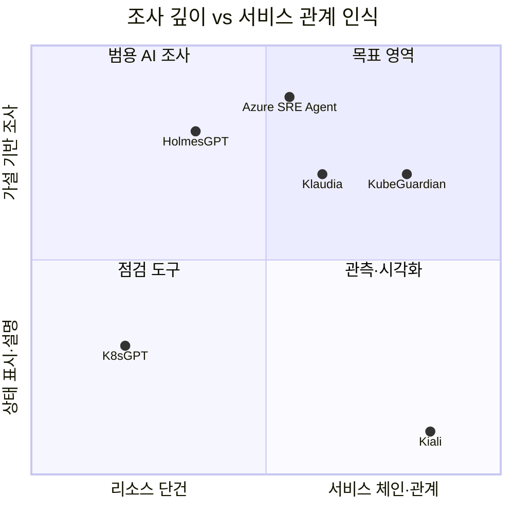

# KubeGuardian AI — 외부 서비스 분석

> 조사일: 2026-09-28 (웹 공개 자료 기준). 상용 서비스는 공개 문서·블로그 범위만 확인했고 직접 사용해 보지는 않았다.
> 대상: K8sGPT, HolmesGPT, Komodor(Klaudia), Azure SRE Agent, Kiali

---

## 1. 한눈에 비교

| 항목 | K8sGPT | HolmesGPT | Komodor Klaudia | Azure SRE Agent | Kiali | **KubeGuardian (PoC)** |
|---|---|---|---|---|---|---|
| 형태 | 오픈소스 CLI·Operator | 오픈소스 CLI·Operator | 상용 SaaS | Azure 관리형 서비스 | 오픈소스 (Istio 콘솔) | 사내 PoC |
| 성숙도 | CNCF Sandbox (2023-12) | CNCF Sandbox (2025-10) | 상용 | GA (2026-03) | Istio 공식 콘솔 | — |
| 문제 탐지 | 규칙 analyzer | 알림·질문을 받아 조사 | 이벤트·변경 상관 | 알림·예약 점검·질문 | 트래픽 기반 health | 규칙 + L7 프로브 |
| AI 역할 | analyzer 결과 **설명** | **에이전트형 조사**(ReAct) | 조사 + RCA + 채팅 | 조사 + 조치 제안·실행 | 없음 | 가설 기반 조사 + 근거 인용 보고서 |
| 서비스 간 관계 | 리소스 단건 위주 | 도구 조합으로 간접 | 관련 서비스 표시 | Azure 리소스 전반 | **트래픽 그래프** | env 선언 기반 토폴로지 |
| 변경 추적 | 없음 | 도구로 간접 | **변경 타임라인 + diff** | 배포 이벤트 상관 | 없음 | 스냅샷 diff + 영향 전파 |
| 조치 | 실험적 자동 조치 (Mutation CRD) | 제안 | 원클릭 조치(사람 승인) | Review / Autonomous 모드 | 설정 마법사 | **제안만** (비목표) |
| 근거 표시 | 없음 | 도구 결과 인용 | "evidence-based hypotheses" | "source-cited answers" | 메트릭 차트 | **evidence id 강제 인용** |
| 평가 체계 | 없음 | 커스텀 eval (성능·비용·지연) | 고객 사례 수치 | 공개 안 됨 | — | 장애 주입 + 정답 + 규칙만 vs AI 비교 |

## 2. 서비스별 분석

### 2.1 K8sGPT

**개요**: 규칙으로 문제를 찾고 LLM으로 설명하는 구조. Pod, Service, Deployment, PVC 등 기본 analyzer 12종 이상이 있고, HPA·NetworkPolicy 등은 선택 analyzer로 켠다. OpenAI, Azure OpenAI, Bedrock, 로컬 모델 등 15개 이상의 백엔드를 지원한다. MCP 서버 모드도 있다.

| 구분 | 내용 |
|---|---|
| 구조 | `analyzer(결정적) → 결과 → LLM 설명`. Operator 모드에서는 결과를 `Result` CRD로 저장 |
| 익명화 | 리소스 이름·라벨을 키로 치환해 전송하고 결과에서 복원. **단, Event 메시지는 마스킹되지 않음**(공식 README) |
| 자동 조치 | Operator의 auto-remediation이 `Mutation` CRD로 패치 적용·롤백. 공식 문서에서 **"highly experimental, 운영 환경 부적합"**으로 명시 |
| 한계 | 리소스 단위 설명에 그친다. 서비스 간 관계를 따라가는 조사, L7 검증, 변경 전후 비교는 없음 |

**가져올 점**
- "규칙 먼저, AI는 그다음" 구조가 CNCF 프로젝트에서 이미 검증된 방식이라는 근거로 쓸 수 있다 (기획서 §3).
- 익명화 방식(치환 후 복원)을 마스킹 설계에 참고한다. **Event 메시지 미마스킹이라는 K8sGPT의 공백은 우리 마스킹 대상에 명시적으로 포함**한다.
- 자동 조치가 실험 단계라는 점은 "조치는 비목표"라는 결정의 근거가 된다.

**우리의 차이**: 리소스 단건 설명이 아니라 **서비스 체인을 따라가는 조사**, 실제 요청(L7) 검증, 변경 영향 전파.

### 2.2 HolmesGPT

**개요**: Robusta가 만들고 Microsoft와 공동으로 유지하는 에이전트형 조사 도구. 2025년 10월 CNCF Sandbox. 50개 이상의 toolset(Kubernetes, Prometheus, Grafana, Datadog, 클라우드, DB)과 MCP 연동을 지원한다.

| 구분 | 내용 |
|---|---|
| 조사 루프 | 의도 파악 → **작업 목록 생성** → 데이터 소스 조회 → 상관 분석 → 설명·조치 제안 (ReAct) |
| Runbook | DNS 장애, PV 프로비저닝 같은 시나리오별 조사 지침을 문서로 주입 |
| 대용량 출력 | 서버 측 필터링, JSON 트리 탐색, 도구 출력 변환기로 컨텍스트 초과를 막음 |
| 안전 | 읽기 전용, RBAC 준수 |
| 인터페이스 | CLI, Operator(상시 실행), Slack·GitHub, AlertManager·PagerDuty 연동 |
| 평가 | 커스텀 eval로 모델별 성능·비용·지연을 비교 |

**운영 사례에서 나온 교훈** (CNCF 블로그, 2026-04-21, HolmesGPT로 알림 자동 진단):
- "조사 품질을 실제로 결정한 것은 runbook이었다", "runbook이 없으면 모델은 추측한다"
- 같은 알림에서 runbook이 있을 때 4.6/5, 없을 때 3.6/5
- "runbook에 적은 **배제 규칙**이 모델 교체보다 효과가 컸다"

**가져올 점**
- **조사 지침(runbook) 도입** — 규칙 ID별(S01, P07, C03 등)로 "확인할 것 / 배제 조건"을 짧은 문서로 두고, 해당 finding이 나오면 LLM 컨텍스트에 넣는다. → **반영 제안 A** (기획서 §7.7에 반영)
- **작업 목록 먼저 만들기** — 가설 수립 전에 조사 계획을 출력하게 하면 UI 타임라인에 그대로 쓸 수 있다.
- **도구 출력 축소** — `get_resource` 결과를 전부 보내지 말고 필드를 골라 보내는 변환기를 둔다 (토큰 목표: AI 조사 1회 100k 이하, 기획서 §10.2).
- **runbook 유무 비교를 평가 항목에 추가** — 규칙만 / 규칙+AI / 규칙+AI+runbook 3단 비교. → **반영 제안 B**

**우리의 차이**: 범용 조사 도구라 관측 스택(Prometheus 등)이 있어야 힘을 발휘한다. 우리는 관측 스택이 없는 환경에서도 **K8s API와 직접 프로브만으로** 동작하고, 장애 주입 기반 정답 평가를 갖춘다.

### 2.3 Komodor (Klaudia)

**개요**: K8s 운영 SaaS. 2026-02에 AI 에이전트 KlaudiaAI를 발표했고, 2026-07에 과거 조사를 학습하는 "Klaudia Memory"를 추가했다.

| 구분 | 내용 |
|---|---|
| 입력 | K8s 이벤트, 로그, **최근 변경**, 리소스 상태 |
| 출력 | "알림 요약이 아닌 **근거 기반 가설**", 조치 제안, 후속 질문용 채팅 |
| 조치 | 원클릭 조치. 단 사람이 승인하는 advisory 방식 |
| 지식 계층 | Knowledge Base 연동 + `Klaudia.md`(고객 환경 설명) + Memory(과거 조사 학습) |
| 정확도 | "95% 식별" 등은 **고객 인용 수치**로, 통제된 평가가 아님 |

**UI 패턴 (공개 리뷰·문서 기준)**
- **서비스 뷰 = 타임라인**: 서비스를 클릭하면 배포·설정 변경·이벤트·장애가 시간순으로 한 줄에 나열된다.
- **변경 이벤트 클릭 → diff 드로어**: 매니페스트 줄 단위 diff, 관련 코드 변경, 외부 링크.
- **관련 서비스**를 서비스 뷰 왼쪽에 표시한다.

**가져올 점**
- 변경 검증 화면을 **"타임라인 + diff 드로어"** 패턴으로 설계한다 (→ [04-ui-spec.md](04-ui-spec.md) 화면 3).
- `Klaudia.md`처럼 **환경 설명 문서**(Inc-PR 구조, 알려진 함정: 공유 ConfigMap, TCP probe 등)를 조사 컨텍스트로 넣는다. runbook(반영 제안 A)과 함께 관리한다.
- Memory(과거 조사 재사용)는 PoC 범위 밖. 후속 과제로 기록한다.

### 2.4 Azure SRE Agent

**개요**: Microsoft의 관리형 SRE 에이전트. 2026-03 GA, Build 2026에서 VNet 통합(Preview)·권한 모델 등을 발표했다. Azure 리소스·Azure Monitor·App Insights·GitHub·PagerDuty·ServiceNow와 연동한다.

| 구분 | 내용 |
|---|---|
| 작업 유형 | 알림 기반 사고 대응 / **예약 점검**(health check, 규정 점검) / 자연어 질문("최근 1시간 동안 뭐가 바뀌었나?") |
| 확장 | Skills, Custom agents, Python tools, MCP 서버, Agent hooks |
| 실행 모드 | **Review**(제안 후 관리자가 Approve/Deny) / **Autonomous**(즉시 실행 후 보고). 응답 계획·예약 작업별로 설정 |
| 권장 사용 | 운영 사고는 Review, dev·staging과 일일 점검은 Autonomous. "처음 2~4주는 Review로 관찰 후 반복 승인되는 패턴만 Autonomous로" |
| 도구 통제 | 도구별 allow / ask / deny 정책, 감사 로그 |
| 맥락 재사용 | 과거 조사에서 근본 원인·해결 절차·패턴을 보존해 재사용 |

**가져올 점**
- **실행 모드 개념**은 "조치 1~3단계" 로드맵(후속 과제)의 참조 모델로 쓴다. 조치를 도입할 때 "Review를 기본으로, 반복 승인 패턴만 자동화" 원칙을 그대로 채택한다.
- **"최근에 뭐가 바뀌었나"** 질의를 변경 검증 화면의 기본 진입점으로 둔다.
- **예약 점검** 패턴을 참고해 PoC의 트리거(온디맨드·배포 후)에 이후 주기 점검을 추가할 여지를 둔다.

**왜 이것을 도입하지 않고 자체 PoC를 하는가** (사내 환경이 Azure/AKS이므로 반드시 답해야 하는 질문)

| 관점 | Azure SRE Agent | KubeGuardian PoC |
|---|---|---|
| 강점 | Azure 전반, 관리형, 조치 실행, 사고 관리 연동 | Inc-PR 구조에 특화된 규칙(공유 ConfigMap, L4 probe, 고정 tag digest), L7 체인 프로브 |
| 입력 전제 | Azure Monitor·App Insights 등 관측 데이터가 있어야 효과적 | 관측 스택 없이 K8s API + 직접 프로브만으로 동작 |
| 검증 가능성 | 정확도 평가 방법이 공개되지 않음 | 장애 주입 + 정답 기반으로 정량 평가 |
| 로컬 재현 | 클라우드 리소스 필요 | minikube에서 완결 |

**결론**: 대체 관계가 아니라 **보완 관계**로 정리한다. PoC의 산출물(Inc-PR 특화 규칙, runbook, 장애 시나리오 세트)은 나중에 Azure SRE Agent를 도입하더라도 Skills·MCP 도구·평가 세트로 이식할 수 있다. 이것을 PoC의 추가 가치로 제시한다.

### 2.5 Kiali

**개요**: Istio 서비스 메시 콘솔. 사이드카 프록시가 보고하는 **실트래픽**으로 토폴로지 그래프를 그린다.

| 구분 | 내용 |
|---|---|
| 그래프 종류 | workload / app / **versioned app**(버전별 분리) / service |
| 상태 표현 | 노드·엣지 색 = health (빨강·주황 = 주의). 노드 모양 = 종류(service, workload, app) |
| 상호작용 | find/hide 필터, 일시정지·과거 구간 재생, 선택 요소의 **사이드 패널**(트래픽·응답시간·응답코드·trace) |
| 애니메이션 | HTTP 성공은 원, 오류는 빨간 마름모. 밀도는 요청량 |
| 상세 | 노드 더블클릭 → 해당 노드 관점의 상세 그래프 |

**가져올 점**
- **versioned app 그래프** → Deployment 아래에 ReplicaSet(버전)별로 Pod를 나눠 표시하는 방식에 그대로 적용한다. 신·구 RS 공존(B2), digest 불일치(B3)를 시각적으로 보여준다.
- **노드·엣지 색 = 상태, 모양 = 종류**, **클릭 → 사이드 패널** 패턴을 토폴로지 화면에 채택한다.
- **find/hide**: "문제 있는 경로만 보기" 토글.

**한계와 차이**: Kiali는 Istio가 있어야 하고, 트래픽이 흐른 엣지만 그린다. 우리는 메시가 없으므로 **env 선언으로 엣지를 만든다**. 대신 트래픽이 없어도 "선언됐는데 해석이 안 되는 엣지"(`unresolved`, 예: `localhost`)를 그릴 수 있다. A5처럼 **아직 트래픽이 가지 않은 잠복 장애**를 드러낼 수 있다는 점이 차별점이다.

## 3. 포지셔닝

> 좌표는 공개 자료를 바탕으로 한 정성적 배치다.

**KubeGuardian 차별점** (기획서 v2.1 기준)
1. **규칙 + 사각지대 탐색**: 규칙으로 확정되는 것은 규칙으로 처리하고, 규칙이 통과하는데 증상이 있을 때 AI가 원인을 탐색한다. 결과는 "지금 중요한 것" 순으로 제시한다.
2. **선언 기반 관계 검증**: 트래픽이 없어도 env·Service·port 선언의 불일치를 체인 단위로 잡는다 (Kiali·K8sGPT가 못 하는 영역).
3. **템플릿 동반 애드온**: agent-template-apps-lite 규약을 알고 들어가는 기본 조사 지침과 진단 친화 규약. 운영 사례(Inc-PR)에서 나온 함정을 기본 지식으로 담는다.
4. **정답 기반 정량 평가**: 비교 대상 대부분이 고객 사례나 관찰 수치에 의존한다. 우리는 난이도별 장애 주입과 3단 비교(규칙+증상 센서만 / +AI 조사 / +AI 조사+지침)로 효과를 수치로 보여준다.

## 4. 기획서·계획서 반영 제안

> **반영 현황 (기획서 v2.1)**: A~H 모두 반영했다.
> - A: 조사 지침 → 기획서 §7.7
> - B: 3단 비교 → §10.3
> - C: 조사 계획 선출력 → §7.3
> - D: 도구 출력 변환기 → §7.4
> - E: 이벤트 마스킹 → §7.6
> - F·G: UI → 04-ui-spec
> - H: 조치 도입 원칙 → 후속 과제
> - Memory: 계속 PoC 범위 밖

| ID | 제안 | 출처 | 반영 위치 | 일정 영향 |
|---|---|---|---|---|
| A | **조사 지침(runbook)**: 규칙 ID별 "확인할 것 / 배제 조건" md + 환경 설명 문서(`environment.md`) | HolmesGPT, Klaudia.md | 기획서 §7.7, 계획서 W5 | W5에 +1일 |
| B | **평가 3단 비교**: 규칙만 / +AI / +AI+runbook | HolmesGPT 사례 | 기획서 §10.3 | W7 eval 실행 시간 증가만 |
| C | **조사 계획 먼저 출력** (작업 목록) → UI 타임라인 | HolmesGPT | 기획서 §7.3, UI 화면 2 | 없음 |
| D | **도구 출력 변환기** (필드 선택·요약) | HolmesGPT | 기획서 §7.4, 계획서 W5 | 없음 (토큰 목표 달성용) |
| E | **Event 메시지 마스킹 명시** | K8sGPT의 공백 | 기획서 §7.6 | 없음 |
| F | **변경 타임라인 + diff 드로어**, "최근 뭐가 바뀌었나" 진입점 | Komodor, Azure SRE Agent | UI 화면 3 | 없음 |
| G | **versioned 토폴로지**, 색=상태·모양=종류, 사이드 패널 | Kiali | UI 화면 4 | 없음 |
| H | 조치 도입 시 **Review 기본 → 반복 승인만 자동화** 원칙 | Azure SRE Agent | 후속 과제 (기획서 §4.2 비목표) | 없음 (문서만) |
| — | 과거 조사 기억(Memory) | Klaudia, Azure SRE Agent | 후속 과제 | PoC 제외 |

## 5. 출처

- K8sGPT: [GitHub README](https://github.com/k8sgpt-ai/k8sgpt), [Operator Auto Remediation](https://github.com/k8sgpt-ai/k8sgpt-operator/blob/main/AUTO_REMEDIATION.md), [CNCF Sandbox 신청](https://github.com/cncf/sandbox/issues/38)
- HolmesGPT: [GitHub](https://github.com/HolmesGPT/holmesgpt), [CNCF 블로그 2026-01-07](https://www.cncf.io/blog/2026/01/07/holmesgpt-agentic-troubleshooting-built-for-the-cloud-native-era/), [CNCF 블로그 2026-04-21 알림 자동 진단 사례](https://www.cncf.io/blog/2026/04/21/auto-diagnosing-kubernetes-alerts-with-holmesgpt-and-cncf-tools/), [CNCF 프로젝트 페이지](https://www.cncf.io/projects/holmesgpt/)
- Komodor: [Klaudia 소개](https://komodor.com/platform/klaudia-ai-powered-troubleshooting/), [Klaudia Memory 발표](https://komodor.com/blog/klaudia-memory-launch/), [Palark의 Komodor UI 리뷰](https://palark.com/blog/komodor-ui-for-kubernetes-overview/), [Medium: 개발자 관점 Komodor](https://medium.com/containers-101/troubleshooting-kubernetes-clusters-as-a-developer-with-komodor-363e58f48a16)
- Azure SRE Agent: [Overview](https://learn.microsoft.com/en-us/azure/sre-agent/overview), [Run modes](https://learn.microsoft.com/en-us/azure/sre-agent/run-modes), [GA 발표](https://techcommunity.microsoft.com/blog/appsonazureblog/announcing-general-availability-for-the-azure-sre-agent/4500682), [Build 2026 발표](https://techcommunity.microsoft.com/blog/appsonazureblog/azure-sre-agent-at-microsoft-build-2026-bringing-agentic-operations-to-the-enter/4524669)
- Kiali: [Topology 문서](https://kiali.io/docs/features/topology/)
