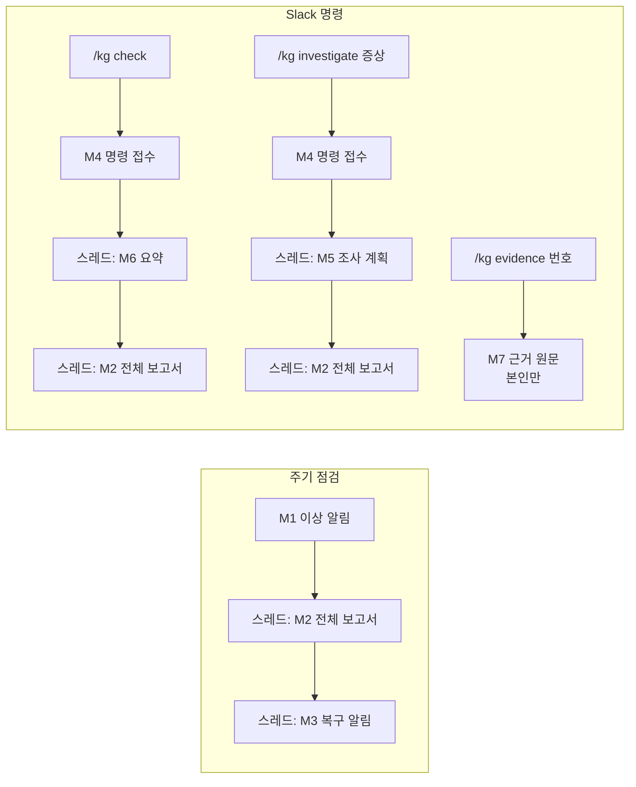

# KubeGuardian AI — UI 정의서

> [기획서](01-project-proposal.md) v3.0 기준. 운영자가 쓰는 화면은 **Slack 하나**이고, CLI와 Chainlit은 개발·디버깅용이다.
> 사용 흐름은 [시나리오 수립](산출물/03-시나리오수립.md)을 참고한다.

## 0. 원칙

- **운영자는 Slack 하나로 쓴다.** 알림을 받고, 점검·조사를 맡기고, 보고서를 읽는 일이 모두 Slack 안에서 끝난다. 제품용 웹 화면은 만들지 않는다.
- **사건 하나 = 스레드 하나.** 채널에는 짧은 메시지 하나만 올리고, 진행 상황·전체 보고서·복구 알림은 모두 그 메시지의 스레드 답글로 단다. 채널이 보고서로 도배되지 않게 한다.
- **정상이면 조용하다.** 주기 점검이 정상이면 아무것도 보내지 않는다. 같은 문제가 계속되는 동안에도 다시 보내지 않는다.
- **보고서 하나로 판단이 끝나야 한다.** 원인, 근거, 배제한 가설과 이유, 확인한 범위, 구체적인 조치, 재검증 방법을 한 번에 보여준다. 후속 질문 기능은 없다.
- **사실에는 근거 번호를 붙인다.** `[근거 14]`처럼 표시하고, 원문은 `/kg evidence 14`로 본인만 볼 수 있게 보여준다.

### 0.1 화면의 층

| 층 | 대상 | 용도 |
|---|---|---|
| **Slack** | 운영자 | 이상 알림, 복구 알림, 명령(`/kg check`, `/kg investigate`, `/kg evidence`), 보고서 |
| CLI | 개발자 | Slack 명령과 같은 기능을 터미널에서 실행. 개발·평가 러너에서 사용 |
| 개발용 화면 (Chainlit) | 개발자 | 에이전트가 무엇을 했는지 단계별로 확인. 도구 호출 원문, 프롬프트, 구현 방식 비교 |
| 실행 추적 (Phoenix) | 개발자 | LLM 호출·도구 호출·토큰 추적 |

## 1. Slack 구성

### 1.1 채널과 앱

| 항목 | 결정 |
|---|---|
| 알림 채널 | `#kubeguardian-alerts` — 주기 점검의 이상·복구 알림이 올라오는 곳 |
| 명령 허용 채널 | 알림 채널 + 설정한 운영 채널 (예: `#pr-service-ops`). 그 외 채널의 명령은 거절 |
| 명령 허용 사용자 | 설정 파일의 `allowed_users` |
| 평가용 채널 | `#kubeguardian-eval` — 평가 러너 실행 중 알림은 여기로 보냄 |
| Slack 앱 권한 | `chat:write`(메시지 발송), `commands`(슬래시 명령), Socket Mode 연결(앱 토큰, `connections:write`) |
| 수신 방식 | **Socket Mode** — 앱이 Slack 쪽으로 연결을 먼저 열어 명령을 받는다. 공개 URL이 없는 minikube에서도 동작 |

### 1.2 메시지 종류

| ID | 메시지 | 위치 | 언제 |
|---|---|---|---|
| M1 | 이상 알림 | 알림 채널 (부모 메시지) | 주기 점검에서 새 문제를 찾았을 때 |
| M2 | 전체 조사 보고서 | M1·M4의 스레드 | 조사가 끝났을 때 |
| M3 | 복구 알림 | M1의 스레드 + 채널에도 표시 | 열린 문제가 정상으로 돌아왔을 때 |
| M4 | 명령 접수 | 명령을 입력한 채널 (부모 메시지) | `/kg check`, `/kg investigate`를 받았을 때 |
| M5 | 조사 계획 | M4의 스레드 | `/kg investigate` 조사 시작 직후 |
| M6 | 점검 결과 요약 | M4의 스레드 | `/kg check`가 끝났을 때 |
| M7 | 근거 원문 | 본인에게만 보임 (ephemeral) | `/kg evidence <번호>` |
| M8 | 오류·거절 | 본인에게만 보임 (ephemeral) | 권한 없음, 잘못된 입력, 조사 실패 |



### 1.3 상태 표시

| 표시 | 뜻 |
|---|---|
| 🔴 | 핵심 경로 장애 — 채팅·로그인 등 주요 기능이 전부 실패 |
| 🟠 | 일부 사용자 영향 — 일부 요청·일부 기능만 실패 |
| 🟡 | 잠재 위험 — 지금은 영향이 없지만 곧 문제가 될 수 있음 |
| ⚪ | 개선 권고 — 지금 장애와 무관 |
| 🔍 | 점검·조사 진행 중 |
| ⚠️ | 조사 미완 — 도구 호출·시간 상한에 도달해 부분 결과만 있음 |
| ✅ | 복구됨 / 이상 없음 |

## 2. 메시지 정의

### M1 — 이상 알림

```text
🔴 [KubeGuardian] dev — 채팅이 실패하고 있습니다 (확신도 높음)
원인: llm-gateway LLM 할당량 소진 (오늘 사용량 100%)
영향: 채팅·보도자료 초안 생성 전체
조치: llm-gateway 관리 화면에서 할당량 상향 또는 초기화
감지: 14:05 점검 · 수집된 신호 47개 중 중요 문제 1건
전체 보고서는 스레드를 확인하세요.
```

| 필드 | 내용 |
|---|---|
| 제목 | 상태 표시 + 네임스페이스 + 1순위 문제 한 줄 + 확신도 |
| 원인 · 영향 · 조치 | 보고서의 결론·영향 범위·권장 조치 1순위를 각 한 줄로 |
| 감지 | 감지한 점검 시각, 원시 신호 수 → 중요 문제 수 |
| 중요 문제가 2건 이상 | 제목은 1순위, 본문 아래에 "그 밖의 중요 문제: 🟠 …" 한 줄씩 (최대 2건) |

### M2 — 전체 조사 보고서

보고서는 아래 순서의 섹션으로 구성한다. 섹션마다 Slack 블록 하나로 보낸다.

```text
[조사 보고서] 채팅 실패 — llm-gateway 할당량 소진          확신도: 높음

■ 결론
■ 근거                (사실마다 [근거 N])
■ 가설 판정            (지지 / 배제 / 판단 보류 + 이유)
■ 확인한 범위          (확인함 / 확인하지 못함)
■ 권장 조치 (자동 실행하지 않음)
■ 재검증 방법
───
조사 48초 · 도구 호출 9회 · 2.1만 토큰 · 참고한 지침: llm-quota.md
```

- 근거가 없는 문장은 끝에 _(추정)_ 을 붙인다 (근거 검증기 결과).
- 상한에 도달했으면 제목 앞에 `⚠️ 조사 미완`을 붙이고, "확인하지 못함"에 남은 가설을 적는다.
- 개선 권고는 보고서 맨 끝에 "참고 — 개선 권고 (지금 장애와 무관)"로 접어서 붙인다.
- 전체 예시는 [시나리오 수립 SC-001](산출물/03-시나리오수립.md)을 참고한다.

### M3 — 복구 알림

```text
✅ [KubeGuardian] dev — 채팅이 정상으로 돌아왔습니다 (14:25 점검, 장애 지속 약 20분)
```

- M1의 스레드에 답글로 달고, "채널에도 보내기" 옵션으로 채널에서도 보이게 한다.

### M4 — 명령 접수

```text
🔍 [KubeGuardian] 조사를 시작합니다 — 요청: @운영자
증상: "초안 생성이 세 번에 한 번꼴로 실패한다는 문의가 들어왔어요"
```

```text
🔍 [KubeGuardian] dev 점검을 시작합니다 — 요청: @운영자
```

- 명령을 받으면 3초 안에 접수해야 하므로, 이 메시지를 먼저 올리고 점검·조사는 비동기로 진행한다.

### M5 — 조사 계획

```text
조사 계획: 가설 ① 특정 Pod만 오류 ② 하위 서비스 응답 지연 ③ LLM 응답 간헐 실패.
채팅 API 반복 호출과 agent Pod별 직접 호출로 확인합니다.
```

- 조사가 진행 중임을 알리는 용도다. 보고서(M2)가 나오기 전에 한 번만 올린다.

### M6 — 점검 결과 요약 (`/kg check`)

```text
규칙 점검: 장애 1건, 개선 권고 3건 / 증상 감지: 채팅 API 실패
지금 중요한 것 1건 (수집된 신호 47개 중)
 1. 🔴 채팅이 전부 실패합니다 (확신도 높음)
    agent Service의 대상 Pod 조건이 app=agnet으로 되어 있어 연결된 Pod가 0개입니다 [근거 4].
    조치: Service의 대상 Pod 조건을 app=agent로 수정
참고 — 개선 권고 3건 (지금 장애와 무관)
전체 보고서는 이 스레드의 다음 답글을 확인하세요.
```

- 정상이면: `✅ 이상 없음 — 규칙 점검 통과, 증상 없음. 개선 권고 3건` 한 줄만 보내고 AI는 호출하지 않는다.
- 같은 문제가 이미 알림 채널에 열려 있으면 요약 끝에 "이미 14:05에 알린 문제입니다 (알림 링크)"를 붙인다.

### M7 — 근거 원문 (`/kg evidence 14`)

```text
[근거 14] log_excerpt · dev/Pod/agent-x2k · 14:05:12 수집
출처: GET /api/v1/namespaces/dev/pods/agent-x2k/log?tailLines=200
───
14:04:58 ERROR llm-gateway returned 429 Too Many Requests
14:05:01 ERROR llm-gateway returned 429 Too Many Requests
(마스킹 적용)
```

### M8 — 오류·거절

| 상황 | 메시지 |
|---|---|
| 허용되지 않은 채널 | 이 채널에서는 KubeGuardian 명령을 쓸 수 없습니다. #kubeguardian-alerts에서 실행해 주세요. |
| 허용되지 않은 사용자 | KubeGuardian 명령 권한이 없습니다. 관리자에게 요청해 주세요. |
| 증상이 비어 있음 | 증상을 함께 적어 주세요. 예) `/kg investigate 로그인이 안 돼요` |
| 이미 조사 중 | 진행 중인 조사가 있습니다 (스레드 링크). 끝난 뒤 다시 요청해 주세요. |
| 없는 근거 번호 | 근거 14를 찾을 수 없습니다. 보고서에 표시된 번호인지 확인해 주세요. |
| 조사 실패 (LLM 연결 오류 등) | 조사 중 오류가 발생했습니다: Azure OpenAI 응답 없음. 규칙 점검 결과만 아래에 첨부합니다. |

## 3. Slack 명령

| 명령 | 동작 | 결과 위치 |
|---|---|---|
| `/kg check` | 주기 점검과 같은 점검을 즉시 실행 | M4 → 스레드에 M6, M2 |
| `/kg investigate <증상>` | 증상을 경로 B로 조사 (규칙 결과와 관계없이 AI 조사) | M4 → 스레드에 M5, M2 |
| `/kg evidence <번호>` | 근거 원문 보기 | M7 (본인만) |
| `/kg help` | 명령 사용법 | 본인만 |

| 규칙 | 내용 |
|---|---|
| 접수 응답 | Slack은 3초 안에 응답을 요구하므로 즉시 접수하고 실행은 비동기 |
| 실행 권한 | 허용 채널·허용 사용자만 |
| 동시 실행 | 같은 사용자의 조사는 1건씩. 진행 중이면 M8로 안내 |
| 입력 | 증상은 500자 이내. LLM에 보내기 전에 마스킹 적용 |
| 클러스터 변경 | 어떤 명령도 클러스터를 바꾸지 않음 (도구가 모두 조회 전용) |

## 4. 공통 규칙

| 항목 | 규칙 |
|---|---|
| 언어 | 한국어 |
| 시각 | KST, `HH:MM` (날짜가 다르면 `MM-DD HH:MM`) |
| 근거 표기 | `[근거 N]`. 여러 개면 `[근거 14, 15]`, 연속이면 `[근거 22~25]` |
| 추정 표기 | 근거 없는 문장 끝에 _(추정)_ |
| 마스킹 | Slack으로 보내는 모든 내용(보고서, 근거 원문)에 도구 출력과 같은 마스킹 적용 |
| 길이 | Slack 섹션 블록 하나는 3,000자, 메시지 하나는 블록 50개까지라 보고서는 섹션별 블록으로 나누고, 넘치면 답글을 여러 개로 나눔 |
| 메시지 ID 저장 | 부모 메시지의 채널·`ts`를 알림 이력에 저장해 스레드 답글과 복구 알림에 사용 |

## 5. CLI (개발용)

| 명령 | 내용 |
|---|---|
| `kg check [--namespace dev] [--notify]` | 점검 실행. 터미널 출력, `--notify`면 Slack으로도 보냄 |
| `kg investigate "<증상>"` | 증상 조사. 조사 단계를 터미널에 실시간 출력 |
| `kg report <ID>` | 저장된 보고서 출력 |
| `kg evidence <ID>` | 근거 원문 출력 |
| `kg alerts` | 알림 이력 (지문, 열림/해결, 최초 감지 시각) |

평가 러너는 CLI를 호출한다.

## 6. 개발용 화면 (Chainlit)

에이전트 개발·디버깅에 쓴다. 보기 좋게 만드는 것보다 **에이전트가 무엇을 했는지 전부 보이는 것**이 목적이다.

```text
┌ KubeGuardian dev ───────────────────────────────────────────────┐
│ 👤 /check                                                        │
│ 🤖 ▸ 규칙 점검: 장애 신호 0 · 개선 권고 3                          │
│    ▸ 증상 감지: 채팅 API 시나리오 실패 (ev-10)                     │
│    ▸ 게이트: 경로 B · 문제 지문 새로 생성                          │
│    ▾ AI 조사 [impl: langgraph]  도구 9/20 · 48s · 21k tokens      │
│       ▸ 계획  1) 경로 구간 호출 2) llm-gateway 응답 3) 할당량       │
│       ▾ tool: query_app_api(llm-gateway, /quota)  → ev-15        │
│           {"used": 100000, "limit": 100000, ...}   (원문)          │
│       ▸ tool: probe(agent, /health, via=pod) → ev-8              │
│       ▸ 가설 ① 배제 · ② 지지 · ③ 배제                              │
│    결과: 원인 = llm-gateway 할당량 소진 [ev-15][ev-12]             │
│    Slack 미리보기 ▸   Phoenix 추적 열기 ↗                          │
└──────────────────────────────────────────────────────────────────┘
```

| 기능 | 내용 |
|---|---|
| 단계 표시 | 규칙 → 증상 → 게이트·지문 → AI 계획 → 도구 호출 → 가설 → 결과를 접이식 단계로 |
| 원문 확인 | 도구 결과(evidence) 원문을 그대로 펼쳐 봄 |
| Slack 미리보기 | 실제로 보내지 않고, Slack에 보낼 M1·M2 메시지를 미리 확인 |
| 구현 전환 | 설정으로 에이전트 구현(비교 실험 후보)을 바꿔 같은 입력으로 비교 |
| 추적 링크 | 실행마다 Phoenix 추적으로 이동 |
| 시나리오 실행 | `/scenario C1`로 주입 → 점검 → 원복 (평가 러너 호출) |

## 7. 모듈 대응

| 모듈 | 역할 |
|---|---|
| `notify/format.py` | 점검 결과·보고서를 M1~M8 Slack 블록으로 변환 (길이 분할, 마스킹 확인) |
| `notify/slack.py` | `chat.postMessage` 발송, 스레드 답글, 메시지 ID 저장 |
| `slack_app/` | Socket Mode 명령 수신(`slack_bolt`), 권한 확인, 접수 응답, 비동기 실행 |
| `store/alerts` | 문제 지문, 열림/해결, 최초 감지 시각, 부모 메시지 채널·`ts` |
| `cli.py` | 개발용 CLI |
| `devui/` | Chainlit 개발용 화면 |

구현 시점은 [실행 계획서](02-execution-plan.md)에서 정한다.
