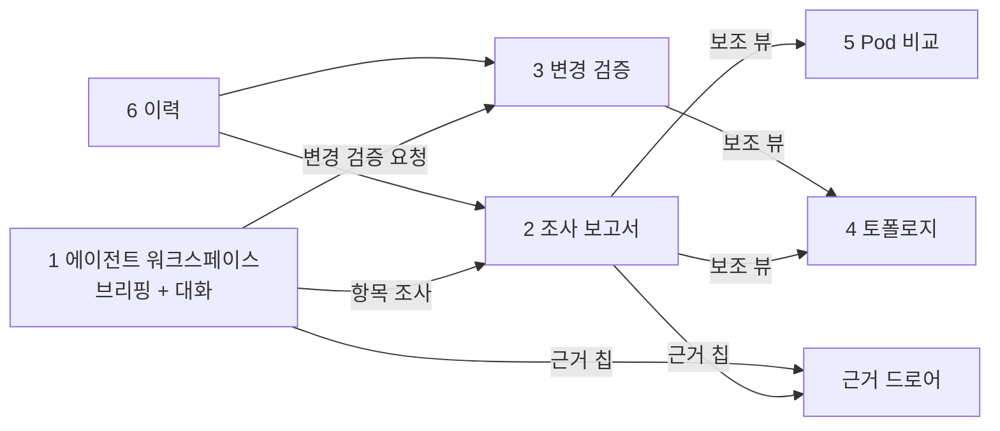

# KubeGuardian AI — UI 화면 정의서

> 기획서 v2.1 (규칙 우선 + AI 조사) 기준. 외부 서비스에서 차용한 패턴은 [03-market-analysis.md](03-market-analysis.md) §4의 제안 ID로 표시한다.

## 0. 원칙

- **첫 화면은 점검 결과와 입력창이다.** 정상이면 규칙 점검 요약만 보인다. 이상이 있으면 **게이트가 열린 이유**와 AI 브리핑이 이어서 나온다.
- 사용자가 증상을 입력하면 규칙 결과와 관계없이 AI 조사가 시작된다 (경로 B).
- 토폴로지·Pod 비교·변경 타임라인은 **보조 뷰**다. AI 답변 안의 링크나 우측 패널로 연다.
- AI가 말한 사실은 모두 **근거 칩**으로 원문까지 따라갈 수 있어야 한다.

### 0.1 화면의 두 층

| 층 | 용도 | 스택 | 시점 |
|---|---|---|---|
| **개발용 화면** | 에이전트 개발·디버깅. 도구 호출 단계, 원시 evidence, 프롬프트 확인 | **Chainlit** (Python, 에이전트 앱 안에 포함) | W3~ |
| **제품 화면** | 운영자가 쓰는 최종 화면 (이 문서의 화면 1~6) | **React 18 · TypeScript · Vite · Tailwind · shadcn/ui · TanStack Query** | W5~ |
| (보조) 실행 추적 | LLM 호출·도구 호출·토큰 추적 | Phoenix (템플릿 `infra-phoenix`) | W1~ |
| (보조) CLI | `kg check` / `kg investigate` / `kg verify` | Python | W2~ |

**제품 화면 스택의 이유**: 템플릿 `frontend`(admin·chat)와 같은 스택이다. 애드온을 도입하는 팀이 이미 아는 스택이고, 템플릿의 공용 컴포넌트·설정을 재사용할 수 있다. 템플릿 front-admin 안에 넣지 않고 **별도 앱**(`apps/diagnostic-ui`)으로 둔다. front-admin은 진단 대상 쪽이라, 대상이 고장 나면 진단 화면도 같이 죽기 때문이다.

**개발용 화면의 이유**: 대화·단계 표시·스트리밍을 수십 줄로 붙일 수 있고, 에이전트 프레임워크와 무관하다. 그래서 W3 스파이크의 후보들을 같은 화면에서 비교할 수 있다. 제품 화면이 완성된 뒤에도 디버깅용으로 유지한다.

### 0.2 제품 화면 공통

| 항목 | 결정 |
|---|---|
| 배포 | nginx 정적 서빙 (템플릿 frontend Dockerfile·nginx 설정 방식), `kubeguardian` 네임스페이스 |
| 실시간 | 모든 에이전트 실행은 SSE로 단계·도구 호출을 실시간 표시 |
| 그래프 | Cytoscape.js (`react-cytoscapejs`, `dagre` 레이아웃) |
| 상태 색 | 핵심 경로 장애=빨강 / 일부 사용자 영향=주황 / 잠재 위험=노랑 / 개선 권고=회색 |
| 근거 칩 | `[ev-42]` → 우측 드로어에 원문(마스킹 후), 수집 시각, 출처 API |

## 1. 화면 구성



## 2. 화면별 정의

### 화면 1 — 워크스페이스 (첫 화면)

**정상 (경로 C)**

```text
┌ KubeGuardian · dev ──────────────────────────────── 마지막 점검 10:05 [다시 점검] ┐
│ ✅ 이상 없음 — 규칙 26개 통과 · 증상 센서 6종 정상 · AI 조사 수행 안 함               │
│  ▸ 개선 권고 3건  readinessProbe가 포트 연결만 확인 (6개 서비스) …                   │
├────────────────────────────────────────────────────────────────────────────────┤
│ [ 문제가 있나요? 증상을 적어 주세요. 예) gateway에서 502가 나        ]  [조사 요청]   │
└────────────────────────────────────────────────────────────────────────────────┘
```

**이상 (경로 A 또는 B)** — 게이트가 열린 이유를 먼저 보여주고 AI 브리핑이 이어진다.

```text
┌ KubeGuardian · dev ──────────────────────────────── 마지막 점검 10:05 [다시 점검] ┐
│ ⚠ 규칙 26개 통과 · 증상 1건: 채팅 API 시나리오 실패 → AI 조사 시작 (경로 B)          │
│                                                                                │
│ 🤖 지금 중요한 것 2건 (신호 47개 중)                                               │
│                                                                                │
│  🔴 1. 채팅이 실패하고 있습니다                                    확신도 높음      │
│     llm-gateway가 429를 반환합니다 [ev-12]. 할당량 API 기준 오늘                   │
│     사용량이 한도의 100%입니다 [ev-15]. Pod는 모두 정상입니다 [ev-3].               │
│     영향: 로그인 후 모든 채팅                   [자세히 조사] [경로 보기]            │
│                                                                                │
│  🟠 2. agent Pod 1개가 10분마다 재시작합니다                        확신도 중간      │
│     메모리가 계속 증가하다 OOMKilled됩니다 [ev-21][ev-22]         [자세히 조사]      │
│                                                                                │
│  ▸ 개선 권고 3건 (지금 장애와 무관)                                                │
│    readinessProbe가 포트 연결만 확인 — 6개 서비스 …                                 │
│                                                                                │
├────────────────────────────────────────────────────────────────────────────────┤
│ 👤 1번 할당량은 언제부터 찼어?                                                     │
│ 🤖 audit log 기준 09:41부터 429가 시작됐습니다 [ev-31]. …                          │
├────────────────────────────────────────────────────────────────────────────────┤
│ [ 무엇이 궁금하세요? 예) gateway에서 502가 나 / 방금 배포 괜찮아?     ]  [보내기]    │
│  빠른 실행: [지금 상태 브리핑] [변경 검증] [이전 조사 이어서]                          │
└────────────────────────────────────────────────────────────────────────────────┘
```

- 진행 스트림: `✔ 규칙 점검 → ✔ 증상 센서 → ✔ 게이트: 경로 B → ◐ AI 선별 → ◐ 1번 항목 조사 (도구 4/8)`
- 입력은 모드 라우터가 해석해 조사·변경 검증·대화로 보낸다.
- 개선 권고는 접힌 상태로 둔다. 소음을 분리했다는 것 자체가 에이전트의 가치이므로, 숨기지 않고 한 줄로 보인다.

### 화면 2 — 조사 보고서 (C: 조사 계획 선출력)

```text
┌ 조사 #37 · "채팅이 실패" · 48초 · 21k tokens ────────────────────────────────┐
│ 🔴 원인: llm-gateway 할당량 소진 (확신도 높음)                                  │
├───────────────────────────────────────┬─────────────────────────────────────┤
│ ① 확인된 현상  채팅 API 502 [ev-10]       │ 조사 계획                              │
│ ② 영향  front-chat→gateway→agent→       │  1. 채팅 경로 구간별 프로브   ✔          │
│         llm-gateway 경로 전체            │  2. llm-gateway 응답 코드    ✔          │
│ ③ 원인  할당량 100% [ev-15] → 429 [ev-12]│  3. 할당량·health API 조회   ✔          │
│ ④ 근거 …                               │                                     │
│ ⑤ 배제한 원인                            │ 가설                                  │
│   Azure OpenAI 장애 — health 정상 [ev-16]│  H1 할당량 소진        ✔ 지지            │
│   agent 장애 — Pod 직접 호출 200 [ev-8]   │  H2 Azure OpenAI 장애  ✘ 배제            │
│ ⑥ 추가 확인 필요 …                       │  H3 agent 자체 장애    ✘ 배제            │
│ ⑦ 권장 조치  할당량 상향 또는 …            │                                     │
│ ⑧ 재검증  [▶ 채팅 시나리오 재실행]          │ 도구 호출 9/20  ▸ 펼치기                 │
├───────────────────────────────────────┴─────────────────────────────────────┤
│ [ 이 조사에 대해 질문하기…                                               ]      │
└──────────────────────────────────────────────────────────────────────────────┘
```

- 근거가 없는 문장은 `추정` 라벨로 흐리게 표시한다 (근거 검증기 결과).
- 상한에 도달했으면 상단에 `조사 미완 — 도구 상한 도달` 배너를 띄운다.
- 사용한 조사 지침을 표시한다: `참고한 지침: llm-quota.md`

### 화면 3 — 변경 검증 (F: 타임라인 + diff 드로어)

```text
 🤖 판정: 위험 — 이 변경 이후 gateway가 agent를 호출하지 못합니다.

 before 10:02 ─────────────────────────────────────────── after 10:20
   │ 10:07 ConfigMap infra-config 변경
   │ 10:08 Deployment gateway 재시작
   │ 10:09 ✘ gateway → agent 호출 실패 시작
   ▼
 ┌ diff: ConfigMap infra-config ───────────┐  ┌ 영향 범위 ───────────────┐
 │ - AGENT_SERVICE_URL: http://agent:8006   │  │ infra-config             │
 │                                          │  │  └▶ gateway (재시작됨 ✘)  │
 │ 🤖 서비스 주소가 삭제되어 gateway가 기본값  │  │      └▶ front-chat ✘     │
 │    localhost로 호출합니다 [ev-40][ev-41]  │  │  └▶ agent·admin          │
 └──────────────────────────────────────────┘  │     (재시작 안 됨 ⚠ 잠복)  │
                                               └──────────────────────────┘
 재검증: 채팅 시나리오 ✘ · 로그인 ✔                        [조사 보고서로]
```

- diff마다 에이전트의 해석을 붙인다.
- 재시작된 Pod(이미 반영)와 재시작 안 된 Pod(설정 잠복)를 구분해 표시한다.

### 화면 4 — 토폴로지 (보조 뷰, G: Kiali 패턴)

| 요소 | 표현 |
|---|---|
| 노드 색 | 에이전트가 판정한 영향 등급 |
| 노드 모양 | 둥근 사각=앱, 원통=데이터 저장소, 육각=외부(Azure OpenAI) |
| 엣지 | 실선=declared, 빨간 점선=unresolved(가상 노드), 회색 점선=inferred |
| 엣지 라벨 | 최근 프로브 결과 `200 · 45ms` / `timeout` |
| 강조 | 현재 조사 중인 경로를 굵게 표시 |
| 토글 | 버전별 보기(ReplicaSet별로 펼침), 문제 경로만 보기 |

### 화면 5 — Pod 비교 (보조 뷰)

```text
 agent · 3 Pod
 Pod        이미지 digest  버전   설정해시  재시작  lastState   직접호출
 agent-a1b  sha256:3f2e…   1.0.0  9c1a      0      —          200
 agent-k7m  sha256:3f2e…   1.0.0  9c1a      0      —          200
 agent-x2k  sha256:3f2e…   1.0.0  9c1a      7      OOMKilled  refused  ◀ 다름
 🤖 x2k만 메모리가 15분간 선형 증가했습니다 [ev-22]   [메모리 추세 보기]
```

### 화면 6 — 이력

| 열 | 내용 |
|---|---|
| 시각 · 유형 | 브리핑 / 조사 / 변경 검증 |
| 1순위 | 브리핑 1순위 문제 또는 조사 원인 |
| 확신도 · 비용 | 확신도, 소요 시간, 토큰 |
| 태그 | 평가 실행분은 `eval:<시나리오ID>` |

## 3. API 대응

| 화면 | API |
|---|---|
| 1 | `POST /checks` + `GET /checks/{id}/stream` (점검 → 게이트 → AI 브리핑), `POST /chat` (SSE) |
| 2 | `POST /investigations` + stream, `GET /investigations/{id}` |
| 3 | `GET /snapshots`, `POST /snapshots`, `POST /changes` + stream |
| 4 | `GET /topology?versioned=` |
| 5 | `GET /pods/compare?service=` |
| 근거 | `GET /evidence/{id}` |
| 6 | `GET /history?limit=&offset=` |

## 4. 개발용 화면 (Chainlit)

제품 화면이 나오기 전까지 에이전트 개발·테스트에 쓰는 화면이다. 보기 좋게 만드는 것보다 **에이전트가 무엇을 했는지 전부 보이는 것**이 목적이다.

```text
┌ KubeGuardian dev ───────────────────────────────────────────────┐
│ 👤 점검                                                          │
│ 🤖 ▸ 규칙 점검: 장애 신호 0 · 개선 권고 3                          │
│    ▸ 증상 센서: 채팅 API 시나리오 실패 (ev-10)                     │
│    ▸ 게이트: 경로 B                                               │
│    ▾ AI 조사 [impl: 선택안]  도구 9/20 · 48s · 21k tokens         │
│       ▸ 계획  1) 경로 구간 프로브 2) llm-gateway 응답 3) quota     │
│       ▾ tool: query_app_api(llm-gateway, /quota)  → ev-15        │
│           {"used": 100000, "limit": 100000, ...}   (원문)          │
│       ▸ tool: probe(agent, /health/ready, via=pod) → ev-8        │
│       ▸ 가설 H1 지지 · H2 배제 · H3 배제                           │
│    결과: 원인 = llm-gateway 할당량 소진 [ev-15][ev-12]             │
│    Phoenix 추적 열기 ↗                                            │
│ 👤 할당량은 언제부터 찼어?                                          │
└──────────────────────────────────────────────────────────────────┘
```

| 기능 | 내용 |
|---|---|
| 단계 표시 | 규칙 → 증상 → 게이트 → AI 계획 → 도구 호출 → 가설 → 결과를 접이식 단계로 |
| 원문 확인 | 도구 결과(evidence) 원문을 그대로 펼쳐 봄 |
| 구현 전환 | 설정으로 에이전트 구현(스파이크 후보)을 바꿔 같은 질문으로 비교 |
| 추적 링크 | 실행마다 Phoenix 추적으로 이동 |
| 시나리오 실행 | `/scenario A1` 명령으로 주입 → 점검 → 원복 (평가 러너 호출) |

## 5. 구현 일정

| 주차 | 개발용 화면 · CLI · 추적 | 제품 화면 (React) |
|---|---|---|
| W1 | Phoenix 설치 | — |
| W2 | CLI `kg check` | — |
| W3 | Chainlit 개발용 화면, CLI `kg investigate`, Phoenix 연동 | — |
| W4 | 개발용 화면에 증상 센서·게이트 경로 표시 | 프로젝트 셋업 (템플릿 frontend 설정·공용 컴포넌트, API 클라이언트) |
| W5 | — | 화면 1(워크스페이스), 화면 2(조사 보고서 + 대화) |
| W6 | CLI `kg verify` | 화면 3(변경 검증) |
| W7 | — | 화면 4·5·6, 전체 다듬기 |
