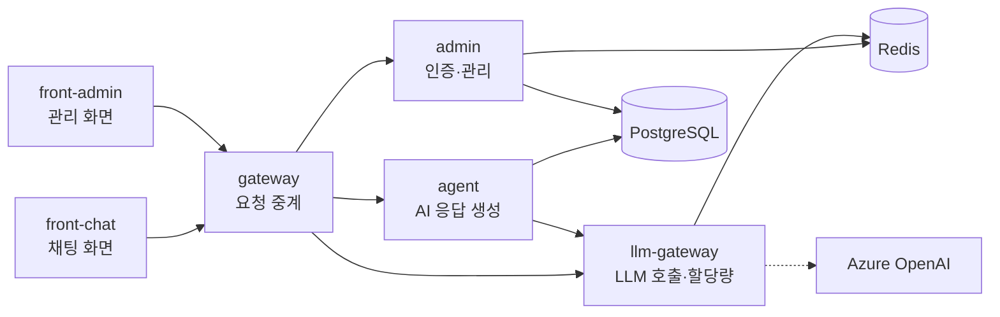
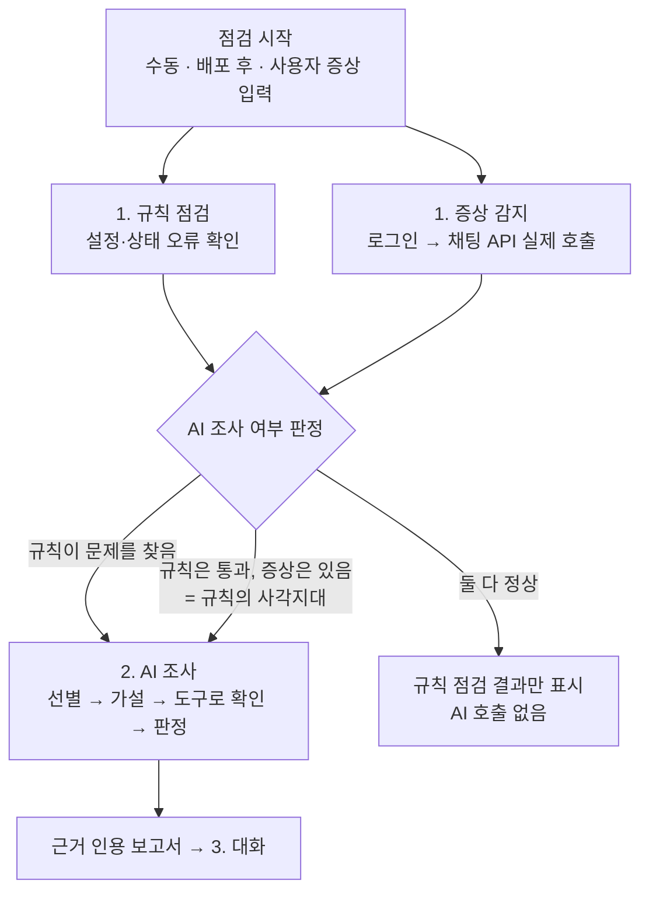

# 2. 문제 정의 및 서비스 기획

> 작성일: 2026-10-04 · 투입: 1인 · 8주 · 주 10~15시간
> 상세: [기획서](../01-project-proposal.md), [외부 서비스 분석](../03-market-analysis.md)

---

## 프로젝트 명

**KubeGuardian AI** — AI 기반 Kubernetes 서비스 환경 진단 Agent

> Kubernetes 위에서 돌아가는 AI 서비스를 **규칙으로 먼저 점검**하고, 규칙이 문제를 찾았거나 **규칙은 통과했는데 실제로는 서비스가 안 될 때** AI 에이전트가 조사에 들어가 **무엇이 중요한지 골라내고 원인을 근거와 함께 설명**하는 진단 에이전트

---

## 배경 및 문제 정의

### 현재 상황 (As-Is)

**MSA 구조에서는 서비스 하나가 여러 조각으로 나뉜다.** 요즘 서비스는 화면, 요청 중계, 핵심 로직, 인증, 외부 연동을 각각 독립된 서비스로 나누는 MSA(마이크로서비스 아키텍처)로 개발하는 것이 일반적이다. 그래서 서비스 하나를 운영하려면 보통 다음을 함께 관리해야 한다.

- 서비스 조각마다 따로 있는 **여러 개의 코드 레포와 컨테이너 이미지**
- Kubernetes 위에서 조각마다 따로 뜨는 **여러 개의 Pod**(앱 실행 단위)와 이들을 잇는 Service(내부 주소)
- 여러 조각이 함께 쓰는 **공유 설정**(ConfigMap·Secret), DB, 캐시

조각끼리 네트워크로 서로 호출하기 때문에, 한 곳의 문제가 호출 경로를 타고 **다른 곳의 증상으로** 나타난다.

**우리 팀의 예: AI 서비스 템플릿.** 우리 팀은 AI 서비스를 빠르게 시작하기 위해 MSA 구조의 템플릿(agent-template-apps-lite)을 직접 만들어 사용하고 있다. 앱 6개가 각각 별도 레포로 나뉘어 있고, Kubernetes 배포 설정은 공용 레포(shared-infra)에서 관리한다. 새 AI 서비스는 이 템플릿을 복제해서 시작하며, 직접 구축·운영한 **SK Inc. PR 보도자료 자동화 서비스**도 이 템플릿에서 출발해 Kubernetes(AWS EKS)에서 운영되고 있다.

이처럼 서비스 하나가 앱 6개와 DB·캐시로 나뉘어 있어서, 장애가 나면 운영자가 `kubectl get / describe / logs`와 대시보드를 오가며 **앱마다 하나씩 수작업으로** 원인을 찾는다.

### Pain Point

| 구분 | 고통점 |
|---|---|
| **보이지 않음** | Pod(앱 실행 단위)가 모두 Running·Ready로 정상 표시되는데 서비스는 안 된다. Kubernetes 상태만 봐서는 장애가 보이지 않는다 |
| **멀리 있음** | 증상이 나타난 곳과 원인이 있는 곳이 다르다. 사용자는 gateway에서 502 오류를 보지만, 원인은 llm-gateway의 LLM 할당량 소진이나 admin과 Redis 사이의 연결 끊김이다 |
| **너무 많음** | 경고·이벤트·재시작 기록이 쌓여 있지만 대부분 지금 장애와 무관하다. 무엇이 중요한지 고르는 일이 숙련자의 경험에 의존한다 |
| **시간** | 위 세 가지 때문에 원인 파악이 오래 걸린다. PR 업무는 보도 시점과 위기 대응처럼 시간에 민감해서, 서비스 중단이 곧 업무 중단이다 |

> 실제 운영 사례: 여러 레포가 공유 설정(ConfigMap)을 덮어써서 생긴 장애, agent 메모리 부족으로 인한 강제 종료, gateway 응답 시간 초과(504), DB 스키마 불일치. 모두 **kubectl 한 번으로는 원인이 보이지 않았던** 장애다.
>
> 참고: 원본 템플릿에는 클러스터에 그대로 배포하면 gateway가 하위 서비스를 찾지 못하는 설정 누락도 있다. 이는 템플릿을 고쳐서 해결할 문제라 문제 정의의 중심에서는 제외하고, 데모 시나리오로만 사용한다.

### 기회 요인

- **규칙으로 풀 수 있는 것은 규칙으로**: 서비스와 Pod의 연결 불일치, 포트 불일치, 이미지 받기 실패처럼 조건이 명확한 문제는 코드로 확정할 수 있다.
- **규칙이 못 하는 것은 AI로**: 여러 신호를 연결하고, 증상에서 원인을 거슬러 올라가고, 소음 속에서 중요한 것을 고르는 일은 LLM 에이전트의 **추론 + 도구 호출**로 자동화할 수 있다.
- **검증된 구조**: 룰로 먼저 거르고 필요할 때만 LLM을 쓰는 구조는 BeingAX 뉴스 판정에서 비용·일관성 효과를 이미 확인했다.
- **재사용**: 같은 템플릿에서 출발한 서비스가 여럿이라, 템플릿 구조를 아는 진단 도구는 여러 서비스에 적용할 수 있다.

---

## 목표 사용자 (Target User)

| 사용자 | 역할·업무 특성 | 주요 사용 방식 |
|---|---|---|
| **템플릿 기반 AI 서비스의 개발·운영 담당자** (주 사용자) | 서비스 코드를 개발·배포하고 운영까지 맡는다. Kubernetes 배포는 할 줄 알지만 장애 원인 분석 경험은 많지 않다 | 증상을 입력해 원인 조사 보고서를 받음, 배포 직후 점검 |
| **장애 1차 대응 담당자** | 장애 알림을 받고 가장 먼저 상황을 파악해야 한다. 쌓인 신호 중 무엇부터 볼지 판단이 필요하다 | 점검 결과의 "지금 중요한 것" 요약 확인 |

---

## 프로젝트 목표

### 정성적 목표

- **목표 1: 반복 진단 업무 자동화** — 운영자가 kubectl로 하던 확인(상태·이벤트·로그·호출 경로)을 규칙 점검과 에이전트 도구로 자동 수행한다
- **목표 2: 의사결정 지원** — 수십 개 신호 중 "지금 중요한 것"을 사용자 영향 순으로 고르고, 원인을 **근거(도구가 수집한 원본 데이터) 인용**과 함께 설명해 조치 판단을 돕는다
- **목표 3: 정량 평가 체계 구축** — 원인을 미리 아는 장애를 일부러 만들어 넣고 정답과 비교하는 방식으로, 에이전트의 효과를 숫자로 증명한다

### 정량적 목표 (KPI)

모든 지표는 **같은 장애 시나리오를 두 조건으로 실행해 비교**한다.
- **기준 조건**: 규칙 점검만 실행 (AI 없음)
- **비교 조건**: 규칙 점검 + AI 조사

| **성과 지표** | **목표 수치** | **측정 방법** | **현재 수준** |
|---|---|---|---|
| **원인 규명 커버리지** (헤드라인) | 60% 이상 | Kubernetes 상태 조회(`kubectl get·describe`, 이벤트)만으로는 원인이 드러나지 않는 시나리오 중, 원인을 맞힌 비율 | 기준 조건 측정값 (규칙은 이런 장애의 원인을 짚지 못하므로 0%에 가까울 것으로 예상) |
| 원인 정확도 | 전체 시나리오 70% 이상 | 조사 보고서의 1순위 원인이 미리 정해 둔 정답과 일치하는 비율. 시나리오마다 3회 반복 | 기준 조건 측정값 |
| 신호 압축률 | 90% 이상 | 1 − (보고서의 중요 문제 수 / 수집된 원시 신호 수). 예: 신호 47개를 중요 문제 2건으로 줄이면 95.7% | 0% (원시 신호 전부를 사람이 확인) |
| 정상 시 AI 미호출 | 100% | 장애가 없는 정상 환경에서 AI 조사가 시작되지 않은 비율 | — |
| 근거 인용률 | 100% | 보고서의 사실 문장 중 수집 데이터를 인용한 비율 (검증 코드가 강제) | — |
| AI 조사 시간·비용 | 중앙값 120초 이내, 1회 10만 토큰 이하 | 평가 러너가 자동 기록 | 수동 진단 수십 분 이상 |

> **사람의 진단 시간은 직접 측정하지 않는다.** 장애 시나리오를 설계한 본인이 진단하면 증상만 보고도 어떤 시나리오인지 알아보게 되어, 측정값이 진단 능력이 아니라 기억을 반영하기 때문이다. 대신 "사람이 하던 일 중 얼마나 대신했나"를 원인 규명 커버리지(대신 찾아준 원인)와 신호 압축률(대신 걸러준 신호)로 측정한다.

---

## 핵심 기능 정의

1. **규칙 점검 + 증상 감지**
   - Kubernetes 리소스를 읽기 전용으로 수집해, 서비스·Pod 연결, 포트, 설정 참조, Pod 기동 상태 같은 **명확한 오류를 규칙 약 10종으로 확정**한다.
   - 동시에 **로그인 → 채팅 API를 실제로 호출**해 "Kubernetes는 정상인데 서비스가 안 되는" 증상을 잡는다. 사용자가 증상을 직접 입력할 수도 있다.
   - 결과를 보고 AI 조사 여부를 코드로 판정한다. 정상이면 LLM을 호출하지 않는다.

2. **AI 조사 에이전트**
   - 원시 신호 수십 개에서 **사용자 영향 순으로 중요한 문제를 골라내고**, 원인 가설(최대 3개)을 세운다.
   - 읽기 전용 도구 약 7종(서비스 호출 관계 조회, 로그 조회, 이벤트 조회, API 직접 호출, 앱 상태 조회 등)으로 가설을 하나씩 확인하고 지지 / 배제 / 판단 보류로 판정한다.
   - 보고서의 모든 사실 문장은 도구가 수집한 데이터(근거)를 인용해야 하며, 검증 코드가 이를 강제한다. 인용이 없는 문장은 "추정"으로 표시한다.

3. **근거 기반 대화**
   - 보고서를 받은 뒤 "왜 Redis라고 판단했어?", "재검증은 어떻게 해?" 같은 후속 질문에 기존 근거를 재사용하고, 필요하면 도구를 추가로 호출해 근거를 인용해 답한다.

4. **정답 기반 평가 체계**
   - 원인을 미리 아는 장애 시나리오 8개와 정상 환경 1개를 장애 주입 도구(Chaos Mesh 등)로 재현하고, 정답 파일과 비교해 자동 채점한다.
   - 시나리오는 난이도별로 구성한다: 신호 하나로 원인이 확정되는 것, 여러 신호를 연결해야 하는 것, **증상과 원인이 다른 서비스에 있고 Kubernetes 상태는 정상인 것**(핵심), 무관한 신호가 섞여 헷갈리게 만드는 것.

---

## 비교 실험

기능과 별도로, 에이전트 기술을 **같은 시나리오·같은 지표로 비교**해 효과를 숫자로 남긴다. 위 평가 체계를 그대로 사용하므로 추가 비용은 구현 부분에 한정된다. 일정 여유에 따라 위에서부터 진행한다.

| 순서 | 비교 대상 | 비교 내용 | 비용 |
|---|---|---|---|
| 1 | 에이전트 구현 방식 | LangGraph vs 직접 구현한 도구 호출 루프 — 정확도, 토큰, 코드량 | 중 |
| 2 | 조사 지침 주입 방식 | 지침 전체를 프롬프트에 넣기 vs 필요한 지침만 불러오기(Skills 방식) — 정확도, 토큰 | 하 |
| 3 | 도구 연결 방식 | 함수 직접 호출 vs MCP 서버 경유 — 외부 에이전트(Claude Code 등)에서 같은 도구 재사용 확인 | 하 |
| 4 | 보고서 채점 방식 | 본인 채점 vs LLM 채점(LLM-as-judge) — 일치도 | 하 |
| 5 | 도구 호출 방식 | 도구를 하나씩 호출 vs 코드를 써서 한 번에 실행(Code Mode, Agent Sandbox 격리) — 정확도, 토큰, 호출 수 | 상 |
| 6 | 외부 벤치마크 | 자체 시나리오 vs 공개 SRE 벤치마크(ITBench) 방식 채점 | 상 (실행 가능성 확인 후) |
| 7 | 에이전트 운영 방식 | API 서버 배포 vs Kubernetes CRD 기반 에이전트(kagent) — 설계 비교 문서로만 | 하 |

---

## 기대 효과

- **업무 효율화**
  - 사람이 확인해야 할 신호를 **90% 이상 압축** (예: 47개 → 2건)
  - 원인 조사를 **2분 안에** 1차 보고서로 받음 (수동 진단은 수십 분 이상)
- **품질 향상**
  - 규칙만으로는 원인을 짚지 못하는 장애(증상과 원인이 다른 서비스에 있는 경우)에서 **원인 규명 60% 이상**
  - 모든 판단에 근거 원문이 연결되어 **검증 가능한 진단**
- **비용 절감**
  - 숙련자에게 집중되던 원인 분석을 서비스 개발·운영 담당자가 1차로 수행
  - 정상일 때 LLM을 호출하지 않는 구조로 **평상시 LLM 비용 0**, 조사 1회 10만 토큰 이하

---

## 범위 및 제약사항

### In Scope

- 진단 대상: 템플릿 앱 6개(front-chat, front-admin, gateway, agent, admin, llm-gateway) + PostgreSQL·Redis를 minikube(로컬 단일 노드 Kubernetes)에 올린 **단일 네임스페이스**
- 규칙 점검(약 10종), 증상 감지(로그인 → 채팅 API 호출, 사용자 증상 입력), AI 조사 여부 판정
- AI 조사 에이전트, 후속 대화
- 읽기 전용 도구 계층, 민감정보 마스킹·근거 검증·호출 횟수 상한
- 장애 시나리오 8개 + 정상 환경 1개, 자동 평가 러너
- CLI, 개발용 화면(Chainlit)
- 비교 실험 (일정 여유에 따라 우선순위순)

### Out of Scope

- **자동 조치** — 원인과 권장 조치·재검증 방법만 제시하고, 클러스터를 변경하지 않음
- **변경 검증** (배포 전후 비교·영향 범위 재검증)
- 제품용 웹 화면(React)
- 부하나 시간이 지나야 나타나는 장애 (CPU 제한에 따른 연쇄 타임아웃, 점진적 메모리 증가)
- 멀티 클러스터, 실제 운영 클러스터(AKS·EKS) 적용
- Prometheus·서비스 메시 등 별도 관측 스택 구축
- 다른 서비스에 바로 붙이는 범용 애드온 배포, 원본 템플릿 기여
- 과거 조사 기억(Memory)

### 제약사항

| 구분 | 제약 |
|---|---|
| 인력·기간 | 1인 · 8주 · **주 10~15시간** |
| 실행 환경 | 로컬 minikube 단일 노드 (CPU 4, 메모리 10GB) |
| LLM | Azure OpenAI만 사용. 사내 SSL 프록시 때문에 클러스터 안에 CA 인증서 주입 필요 |
| 보안 | 에이전트 권한은 조회(get/list/watch)만 허용, Secret 값은 수집하지 않음, 로그·이벤트는 마스킹 후 LLM에 전송 |
| 결과 편차 | LLM 응답이 매번 달라질 수 있어 temperature 0, 시나리오당 3회 반복으로 평가 |
| 과거 데이터 | 과거 장애의 진단 시간 기록이 없음 → 사람의 진단 시간 대신 기준 조건(규칙만) 대비로 효과를 측정 |
