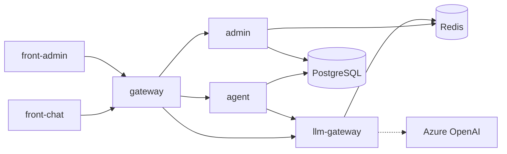
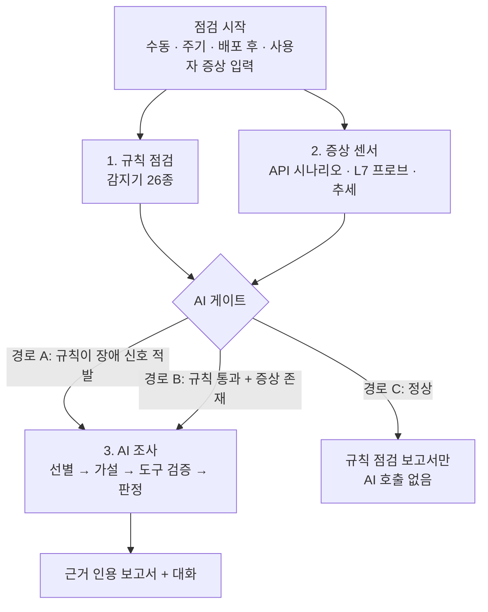

# 2. 문제 정의 및 서비스 기획

> 작성일: 2026-09-29 · 상세: [기획서](../01-project-proposal.md), [외부 서비스 분석](../03-market-analysis.md)

---

## 프로젝트 명

**KubeGuardian AI** — AI 기반 Kubernetes 서비스 환경 진단 Agent

> 템플릿 기반 AI 서비스가 올라간 Kubernetes 환경을 **규칙으로 먼저 점검**하고, 규칙이 문제를 찾았거나 **규칙은 통과했는데 실제로는 문제가 있을 때** AI 에이전트가 조사에 들어가 **무엇이 중요한지 골라내고 원인을 근거와 함께 설명**하는 진단 에이전트

---

## 배경 및 문제 정의

### 현재 상황 (As-Is)

사내 AI 서비스 템플릿(agent-template-apps-lite)은 아래 구조로, 여러 서비스(Inc-PR 등)가 이 템플릿에서 출발해 Kubernetes에서 운영된다.

장애가 나면 운영자가 `kubectl get / describe / logs`와 대시보드를 오가며 **수작업으로** 원인을 찾는다.

### Pain Point

| 구분 | 고통점 |
|---|---|
| **시간** | 증상(gateway 502)과 원인(llm-gateway 할당량, Redis 연결 차단)이 **서로 다른 서비스**에 있어, 호출 경로를 따라가며 확인하는 데 오래 걸린다 |
| **품질** | **Pod는 모두 Running·Ready인데 서비스가 안 된다.** 템플릿의 readinessProbe가 포트 연결만 확인해, K8s 상태로는 장애가 보이지 않는다 |
| **소음** | 경고·이벤트·재시작 기록은 많지만 대부분 지금 장애와 무관하다. **무엇이 중요한지 고르는 일**이 숙련자에게 의존한다 |
| **구조적 결함** | 원본 템플릿 매니페스트에 서비스 주소 설정이 없어 그대로 배포하면 gateway가 `localhost`를 호출하는 등, 템플릿 자체의 함정이 반복된다 |

> 실제 운영 사례(Inc-PR): 공유 ConfigMap 덮어쓰기, agent OOMKilled, gateway 504 타임아웃, 스키마 드리프트 — 모두 **kubectl 한 번으로 원인이 보이지 않았던** 장애다.

### 기회 요인

- **규칙으로 풀 수 있는 것은 규칙으로**: selector 불일치, 포트 불일치, 이미지 실패 등은 결정적 코드로 확정할 수 있다.
- **규칙이 못 하는 것은 AI로**: 여러 신호를 연결하고, 증상에서 원인을 역추적하고, 소음 속에서 중요한 것을 고르는 일은 LLM 에이전트의 **추론 + 도구 호출** 능력으로 자동화할 수 있다.
- **도구 호출 기반 에이전트의 성숙**: 구조화 출력, MCP 등으로 "사실은 도구에서만, 판단은 AI가" 구조를 안정적으로 만들 수 있다.
- **템플릿 재사용**: 같은 템플릿의 서비스가 많아, 템플릿 구조를 아는 진단 지침을 한 번 만들면 여러 서비스에 적용된다.

---

## 목표 사용자 (Target User)

| 사용자 | 역할·업무 특성 | 주요 사용 방식 |
|---|---|---|
| **템플릿 기반 서비스 개발자** (주 사용자) | 서비스 코드를 개발·배포하지만 K8s 운영 숙련도는 높지 않음. 배포 후 문제가 생기면 원인 파악에 시간이 오래 걸림 | 증상 입력 → AI 조사 보고서, 배포 후 변경 검증 |
| **서비스 운영 담당자** | 여러 서비스 환경을 점검하고 장애에 1차 대응. 많은 신호 중 우선순위 판단이 필요 | 주기 점검 결과, "지금 중요한 것" 브리핑 |
| **플랫폼(템플릿) 관리자** | 템플릿을 유지보수하고 신규 서비스에 배포. 반복되는 템플릿 결함을 개선하고 싶음 | 개선 권고 확인, 템플릿 개선 근거 |

---

## 프로젝트 목표

### 정성적 목표

- **목표 1: 반복 진단 업무 자동화** — 운영자가 kubectl로 하던 확인(상태·이벤트·로그·호출 경로)을 규칙 점검과 에이전트 도구로 자동 수행
- **목표 2: 의사결정 지원** — 수십 개 신호 중 "지금 중요한 것"을 영향 순으로 선별하고, 원인을 **근거(evidence) 인용**과 함께 설명해 조치 판단을 돕는다
- **목표 3: AI 기술 내재화** — 도구 호출 에이전트 설계, 평가 체계, K8s 운영 지식을 직접 구현하며 역량 확보

### 정량적 목표 (KPI)

| **성과 지표** | **목표 수치** | **측정 방법** | **현재 수준** |
|---|---|---|---|
| 원인 도달 시간 단축률 | 50% 이상 단축 (레벨별 중앙값) | 블라인드 자가 진단: 무작위 주입 장애를 수동(kubectl) vs KubeGuardian으로 진단해 시간 비교 (약 10건) | 수동 진단만 가능 (L3 이상은 30분 내 미해결 다수 예상) |
| 제한 시간(30분) 내 해결률 | 수동 대비 향상 | 위 블라인드 진단에서 30분 내 정답 원인 도달 비율 | 측정 전 (W7 기준선 측정) |
| 신호 압축률 | 90% 이상 | 1 − (브리핑 중요 이슈 수 / 원시 신호 수). 예: 47개 → 2건 = 95.7% | 원시 신호 전부를 사람이 확인 (0%) |
| 선별 정확도 | L1–L2 ≥ 90%, L3 ≥ 70% | AI 브리핑 1순위 = 주입한 장애 (eval 자동, 3회 반복) | 없음 |
| 원인 정확도 (Top-1 / Top-3) | ≥ 70% / ≥ 85% | 조사 보고서 1순위 원인 / 상위 3개 가설에 정답 포함 | 없음 |
| 게이트 정확도 | 정상 시 AI 미호출 100% | 정상 환경(H0)에서 AI 호출 여부 | 없음 |
| 근거 인용률 | 100% | 사실 문장 중 유효 evidence id 인용 비율 (검증기 강제) | 없음 |
| AI 조사 응답 시간 | p50 ≤ 120초 | eval 러너 자동 측정 | 수동 진단 수십 분 |

---

## 핵심 기능 정의

1. **규칙 점검 + 증상 감지**: Kubernetes 리소스를 읽기 전용으로 수집해 감지기 26종(노드·Pod 기동·워크로드·서비스 연결·설정 일관성·모범 사례)으로 구성 오류를 확정한다. 동시에 핵심 API 시나리오(로그인 → 채팅), L7 프로브, 메트릭 추세로 **"K8s는 정상인데 서비스가 안 되는"** 증상을 잡는다. 결과를 보고 **AI 게이트**가 AI 조사 여부를 결정한다 (정상이면 LLM을 호출하지 않음).

2. **AI 조사 에이전트**: 게이트가 열리면 에이전트가 신호판(원시 신호 수십 개)에서 **사용자 영향 순으로 중요한 문제를 선별**하고, 원인 가설(최대 3개)을 세워 읽기 전용 도구(`get_topology`, `get_pod_logs`, `probe`, `query_app_api` 등 13종, MCP 서버로 노출)로 검증한다. 모든 사실 문장은 도구 결과(evidence id)를 인용해야 하며, 근거 검증기가 코드로 강제한다.

3. **근거 기반 대화**: 조사 보고서에 대해 후속 질문("왜 Redis라고 판단했어?", "재검증은 어떻게 해?")을 하면 기존 근거를 재사용하고, 필요하면 도구를 추가 호출해 근거를 인용해 답한다.

4. **변경 검증**: 배포 전후 스냅샷을 비교하고 토폴로지 기반 영향 범위를 재검증한다. 이상이 있으면 diff와 실패 결과를 AI 조사로 넘겨 변경의 의미("포트가 바뀌었는데 호출하는 쪽 주소는 그대로")를 해석하고 안전 / 주의 / 위험을 판정한다.

5. **정답 기반 평가 체계**: 난이도 L1~L5의 장애 시나리오 16개를 Chaos Mesh 등으로 주입하고, 정답 파일(`expected.yaml`)과 비교해 선별·원인 정확도를 자동 채점한다. 규칙만 / +AI / +AI+조사 지침 3단 비교로 AI의 가치를 수치로 보여준다.

---

## 기대 효과

- **업무 효율화**: 증상 입력부터 원인 제시까지 **원인 도달 시간 50% 이상 단축**, 사람이 확인할 신호를 **90% 이상 압축** (예: 47개 → 2건)
- **품질 향상**:
  - K8s 상태만으로 원인이 보이지 않는 장애(L3 이상)도 원인 Top-1 정확도 70% 목표
  - 모든 판단에 근거 원문이 연결되어 **검증 가능한 진단**
  - 템플릿 구조적 결함(서비스 주소 누락, tcpSocket probe 등)을 개선 권고로 조기 발견
- **비용 절감**:
  - 숙련자에게 집중되던 장애 원인 분석 투입 감소 (서비스 개발자가 1차 진단 가능)
  - 정상일 때 LLM을 호출하지 않는 게이트 구조로 **LLM 비용 최소화** (AI 조사 1회 ≤ 100k 토큰)

---

## 범위 및 제약사항

### In Scope

- 템플릿 앱 6개(front-chat, front-admin, gateway, agent, admin, llm-gateway) + PostgreSQL·Redis를 minikube에 올린 **단일 네임스페이스** 진단
- 규칙 점검(감지기 26종), 증상 센서, AI 게이트
- AI 조사 에이전트(선별·가설·근거 인용 보고서), 후속 대화, 변경 검증
- 읽기 전용 도구 계층(MCP 서버), 마스킹·근거 검증·호출 상한 가드레일
- 장애 시나리오 16개 + 자동 평가(eval) + 블라인드 자가 진단
- CLI(`kg check / investigate / verify`), 개발용 화면(Chainlit), 최소 범위 제품 화면

### Out of Scope

- **자동 조치** — 원인과 권장 조치·재검증 방법만 제시, 클러스터를 변경하지 않음
- 멀티 클러스터, 실제 AKS 운영 클러스터 적용
- Prometheus·서비스 메시 등 별도 관측 스택 구축 (경량 자체 수집으로 대체)
- Azure AI Search 관련 장애 (미사용)
- 과거 조사 기억(Memory), 진단 에이전트 다중 replica 운영

### 제약사항

| 구분 | 제약 |
|---|---|
| 인력·기간 | 1인 · 8주 |
| 실행 환경 | 로컬 minikube 단일 노드 (CPU 4, 메모리 10GB) — 부하 시나리오는 단독 실행 |
| LLM | Azure OpenAI만 사용. 사내 SSL 프록시로 인해 클러스터 내 CA 인증서 주입 필요 |
| 보안 | 에이전트 권한은 `get/list/watch`만 (RBAC), Secret 값 미수집, 로그·이벤트 마스킹 후 LLM 전송 |
| 결과 편차 | LLM 비결정성 → temperature 0, 3회 반복 다수결로 평가 |
| 평가 한계 | 1인 과제로 수동 기준선을 본인(시나리오 설계자)이 측정 → 시간 단축률은 보수적 하한값 |
